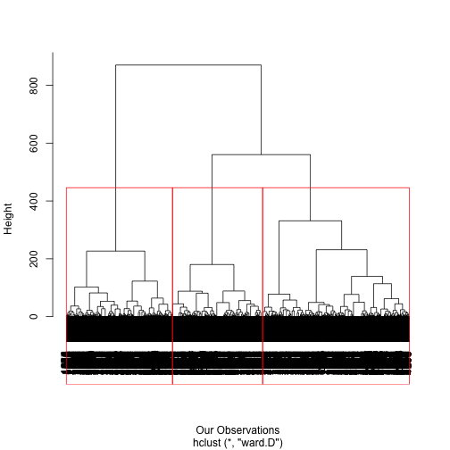

<br>

The purpose of this session is to become familiar with:

1. Some visualization tools;
2. Principal Component Analysis and Factor Analysis;
3. Clustering Methods;
4. Introduction to machine learning methods;
5. A market segmentation case study.

As always, before starting, make sure you have pulled the [session 3-4 files](https://github.com/InseadDataAnalytics/INSEADAnalytics/tree/master/CourseSessions/Sessions23)  (yes, I know, it says session 2, but it is 3-4 - need to update all filenames some time, but till then we use common sense and ignore a bit the filenames) on your github repository (if you pull the course github repository you also get the session files automatically). Moreover, make sure you are in the directory of this exercise. Directory paths may be complicated, and sometimes a frustrating source of problems, so it is recommended that you use these R commands to find out your current working directory and, if needed, set it where you have the main files for the specific exercise/project (there are other ways, but for now just be aware of this path issue). For example, assuming we are now in the "MYDIRECTORY/INSEADAnalytics" directory, we can do these: 


```r
getwd()
setwd("CourseSessions/Sessions23")
list.files()
rm(list = ls())  # Clean up the memory, if we want to rerun from scratch
```
As always, you can use the `help` command in Rstudio to find out about any R function (e.g. type `help(list.files)` to learn what the R function `list.files` does).

Let's start.

<hr>
<hr>

### Survey Data for Market Segmentation

We will be using the [boats case study](http://inseaddataanalytics.github.io/INSEADAnalytics/Boats-A-prerelease.pdf) as an example. At the end of this class we will be able to develop (from scratch) the readings of sessions 3-4 as well as understand the tools used and the interpretation of the results in practice - in order to make business decisions. The code used here is along the lines of the code in the session directory, e.g. in the [RunStudy.R](https://github.com/InseadDataAnalytics/INSEADAnalytics/blob/master/CourseSessions/Sessions23/RunStudy.R) file and the report [doc/Report_s23.Rmd.](https://github.com/InseadDataAnalytics/INSEADAnalytics/blob/master/CourseSessions/Sessions23/doc/Report_s23.Rmd) There may be a few differences, as there are many ways to write code to do the same thing. 

Let's load the data: 


```
## Warning: package 'devtools' was built under R version 3.2.5
```

```
## Warning: package 'Hmisc' was built under R version 3.2.5
```

```
## Warning: package 'FactoMineR' was built under R version 3.2.5
```

```
## Warning: package 'psych' was built under R version 3.2.5
```


```r
ProjectData <- read.csv("data/Boats.csv", sep = ";", dec = ",")  # this contains only the matrix ProjectData
ProjectData = data.matrix(ProjectData)
colnames(ProjectData) <- gsub("\\.", " ", colnames(ProjectData))
ProjectDataFactor = ProjectData[, c(2:30)]
```
<br>
and do some basic visual exploration of the first 50 respondents first (always necessary to see the data first):
<br>

<!-- Table generated in R 3.2.4 by googleVis 0.5.10 package -->
<!-- Tue Jun 14 11:22:17 2016 -->


<!-- jsHeader -->
<script type="text/javascript">
 
// jsData 
function gvisDataTableID406a5ccf69fd () {
var data = new google.visualization.DataTable();
var datajson =
[
 [
 23822,
5,
1,
5,
5,
5,
5,
5,
3,
5,
4,
2,
1,
5,
5,
5,
4,
4,
5,
5,
4,
5,
5,
5,
5,
5,
5,
3,
4,
5,
1,
1,
4,
11,
6,
90,
2,
3,
3,
3,
3,
3,
4,
4,
4,
4,
100,
2,
19,
5,
1,
2,
28,
3,
4,
4,
3,
4,
4,
4,
4,
4,
4,
4,
4,
4,
4,
4,
4,
4,
4,
4,
4,
4,
4,
4,
5,
4,
4,
4,
0,
1,
"1" 
],
[
 224795,
3,
2,
4,
4,
4,
4,
5,
3,
4,
4,
3,
2,
4,
4,
5,
3,
3,
5,
4,
3,
4,
4,
3,
4,
4,
4,
4,
4,
4,
1,
1,
4,
3,
8,
25,
2,
5,
4,
5,
2,
3,
4,
4,
5,
4,
30,
2,
17,
5,
1,
1,
28,
3,
3,
4,
3,
3,
3,
4,
4,
5,
4,
4,
3,
4,
4,
4,
4,
4,
4,
3,
4,
3,
3,
4,
3,
3,
3,
3,
1,
1,
"2" 
],
[
 20952,
3,
1,
4,
4,
5,
4,
4,
2,
4,
3,
2,
2,
5,
5,
5,
4,
4,
4,
4,
3,
3,
5,
4,
4,
4,
5,
3,
3,
4,
1,
1,
5,
5,
8,
21,
1,
2,
4,
4,
3,
3,
4,
4,
4,
4,
30,
1,
14,
5,
1,
1,
48,
4,
4,
3,
4,
3,
5,
5,
4,
5,
5,
4,
3,
4,
4,
5,
4,
5,
4,
5,
5,
3,
3,
5,
2,
4,
3,
5,
1,
0,
"3" 
],
[
 5612,
5,
2,
3,
4,
5,
5,
3,
3,
3,
4,
4,
2,
5,
5,
5,
4,
3,
5,
4,
3,
5,
4,
5,
3,
5,
4,
3,
3,
5,
1,
1,
4,
6,
8,
22,
3,
4,
3,
4,
2,
4,
2,
4,
3,
2,
30,
1,
13,
5,
1,
1,
40,
4,
4,
4,
4,
5,
4,
5,
4,
5,
5,
4,
4,
5,
4,
5,
4,
5,
5,
4,
4,
4,
4,
4,
2,
5,
5,
4,
1,
0,
"4" 
],
[
 15016,
4,
2,
4,
5,
5,
4,
5,
4,
5,
4,
5,
1,
5,
4,
5,
5,
5,
5,
5,
4,
4,
4,
5,
4,
4,
5,
4,
4,
4,
1,
1,
4,
5,
8,
24,
1,
4,
3,
3,
2,
3,
3,
3,
3,
3,
30,
1,
13,
5,
1,
1,
19,
5,
5,
5,
5,
5,
4,
1,
5,
5,
4,
5,
4,
4,
4,
4,
4,
5,
4,
4,
4,
4,
5,
5,
3,
4,
5,
4,
0,
0,
"5" 
],
[
 14856,
4,
2,
2,
4,
5,
5,
4,
3,
2,
4,
2,
2,
3,
4,
4,
4,
4,
4,
5,
3,
5,
5,
4,
5,
4,
4,
4,
4,
4,
1,
1,
4,
2,
8,
18,
3,
5,
3,
3,
4,
3,
4,
4,
4,
4,
60,
2,
16,
6,
2,
3,
10,
4,
4,
4,
4,
4,
4,
4,
4,
4,
4,
4,
4,
4,
4,
4,
4,
4,
4,
4,
4,
4,
4,
4,
3,
4,
4,
4,
0,
0,
"6" 
],
[
 11445,
4,
3,
4,
4,
5,
5,
5,
5,
3,
1,
5,
3,
4,
4,
5,
4,
5,
4,
5,
4,
5,
5,
5,
5,
5,
5,
5,
5,
5,
1,
1,
3,
5,
8,
20,
2,
4,
4,
4,
3,
3,
2,
4,
5,
4,
30,
1,
19,
1,
1,
2,
3,
4,
4,
3,
3,
3,
3,
4,
4,
3,
3,
4,
4,
3,
4,
3,
3,
3,
3,
3,
3,
3,
3,
3,
3,
4,
3,
3,
0,
0,
"7" 
],
[
 12342,
4,
3,
4,
4,
4,
5,
4,
4,
5,
3,
4,
1,
4,
4,
3,
3,
4,
4,
4,
3,
4,
4,
3,
5,
4,
5,
3,
3,
4,
0,
0,
4,
4,
8,
24,
3,
5,
5,
5,
3,
3,
5,
4,
5,
5,
50,
1,
13,
5,
1,
1,
8,
2,
3,
4,
4,
4,
4,
3,
4,
4,
5,
2,
5,
3,
4,
5,
4,
5,
5,
5,
4,
4,
4,
4,
4,
3,
4,
3,
0,
0,
"8" 
],
[
 235043,
4,
3,
4,
4,
4,
4,
4,
3,
4,
3,
5,
1,
4,
4,
5,
4,
4,
4,
4,
4,
4,
4,
4,
4,
4,
5,
5,
5,
3,
1,
1,
5,
8,
8,
99,
3,
5,
4,
5,
4,
2,
4,
3,
3,
4,
80,
1,
19,
1,
1,
3,
39,
4,
3,
3,
3,
3,
3,
3,
4,
4,
3,
3,
3,
3,
4,
4,
4,
3,
4,
3,
4,
4,
4,
4,
3,
3,
3,
3,
0,
0,
"9" 
],
[
 231122,
2,
5,
3,
2,
1,
3,
5,
4,
3,
4,
1,
3,
1,
4,
3,
2,
3,
5,
5,
4,
5,
4,
5,
4,
5,
4,
4,
4,
5,
2,
1,
5,
5,
8,
15,
4,
3,
5,
5,
2,
5,
5,
5,
2,
2,
20,
1,
15,
1,
1,
1,
11,
4,
2,
4,
4,
4,
4,
5,
3,
3,
5,
5,
3,
4,
3,
4,
5,
2,
3,
2,
2,
1,
4,
4,
4,
5,
5,
3,
1,
0,
"10" 
],
[
 479709,
5,
5,
5,
5,
5,
4,
5,
4,
3,
5,
1,
5,
4,
3,
4,
5,
4,
5,
4,
5,
4,
4,
5,
5,
5,
5,
4,
4,
5,
2,
1,
5,
10,
8,
99,
1,
5,
5,
5,
3,
5,
5,
5,
5,
5,
100,
1,
19,
1,
4,
3,
39,
5,
5,
5,
5,
5,
5,
5,
5,
5,
5,
5,
5,
5,
5,
5,
5,
5,
5,
5,
5,
5,
5,
5,
5,
3,
5,
5,
1,
1,
"11" 
],
[
 489191,
5,
5,
4,
4,
5,
4,
4,
4,
5,
5,
4,
3,
3,
5,
5,
4,
3,
4,
3,
4,
4,
5,
5,
3,
5,
5,
5,
4,
5,
0,
0,
5,
8,
8,
60,
5,
5,
3,
3,
2,
4,
2,
4,
2,
4,
150,
2,
19,
5,
2,
3,
30,
4,
5,
4,
5,
4,
5,
3,
4,
5,
5,
4,
4,
4,
4,
5,
5,
5,
4,
4,
5,
4,
5,
4,
5,
4,
4,
4,
0,
1,
"12" 
],
[
 226965,
4,
3,
4,
4,
3,
3,
4,
5,
3,
4,
4,
4,
3,
4,
4,
3,
3,
3,
4,
4,
5,
4,
4,
4,
3,
4,
3,
2,
4,
1,
1,
4,
7,
8,
20,
3,
4,
3,
3,
2,
3,
4,
3,
4,
4,
25,
1,
19,
1,
2,
1,
5,
4,
5,
4,
4,
4,
5,
4,
4,
5,
4,
4,
4,
4,
3,
4,
3,
3,
3,
4,
3,
3,
4,
3,
3,
4,
3,
4,
0,
1,
"13" 
],
[
 229147,
4,
4,
3,
4,
4,
4,
4,
3,
3,
3,
3,
1,
3,
4,
4,
2,
3,
4,
4,
3,
4,
3,
4,
3,
4,
4,
4,
3,
4,
1,
1,
5,
4,
8,
18,
1,
5,
3,
3,
1,
5,
2,
3,
3,
2,
21,
2,
16,
1,
1,
3,
50,
2,
4,
4,
4,
3,
4,
4,
4,
4,
4,
4,
3,
4,
4,
4,
3,
4,
4,
4,
4,
4,
4,
4,
4,
3,
4,
4,
0,
1,
"14" 
],
[
 16919,
4,
5,
4,
4,
4,
4,
5,
4,
5,
4,
4,
4,
5,
4,
4,
4,
5,
4,
4,
4,
5,
4,
4,
5,
5,
5,
4,
5,
5,
10,
1,
5,
6,
8,
89,
5,
4,
5,
4,
3,
5,
4,
4,
4,
4,
200,
1,
13,
1,
1,
1,
24,
5,
4,
4,
5,
5,
5,
5,
5,
5,
2,
5,
5,
5,
4,
5,
5,
5,
5,
4,
5,
4,
5,
4,
4,
4,
5,
5,
1,
0,
"15" 
],
[
 422979,
5,
5,
4,
3,
4,
4,
5,
4,
4,
4,
3,
4,
2,
5,
4,
4,
3,
5,
4,
5,
5,
4,
4,
4,
5,
4,
4,
4,
5,
6,
1,
2,
4,
8,
90,
2,
4,
3,
3,
1,
3,
5,
3,
3,
4,
12,
1,
11,
3,
2,
2,
3,
4,
4,
4,
4,
4,
3,
4,
4,
3,
5,
5,
4,
4,
4,
5,
4,
4,
4,
4,
4,
4,
5,
5,
5,
4,
5,
5,
0,
0,
"16" 
],
[
 2404,
4,
3,
4,
2,
3,
4,
3,
3,
3,
4,
4,
3,
3,
3,
4,
3,
3,
3,
3,
4,
4,
2,
2,
4,
3,
4,
5,
4,
3,
2,
1,
5,
10,
8,
5,
4,
4,
3,
5,
3,
4,
3,
3,
4,
3,
5,
1,
16,
5,
1,
1,
9,
5,
4,
4,
4,
4,
5,
3,
5,
3,
4,
4,
3,
3,
3,
5,
3,
5,
5,
4,
4,
5,
3,
5,
3,
4,
5,
5,
0,
0,
"17" 
],
[
 19244,
3,
5,
3,
5,
4,
4,
3,
3,
1,
3,
3,
4,
5,
3,
3,
4,
4,
3,
3,
4,
4,
4,
5,
3,
3,
5,
4,
3,
4,
0,
0,
5,
7,
8,
90,
2,
5,
5,
3,
1,
5,
5,
5,
5,
5,
250,
1,
18,
1,
1,
2,
10,
4,
5,
5,
4,
5,
5,
5,
5,
4,
4,
4,
2,
5,
3,
4,
5,
4,
5,
5,
4,
5,
4,
5,
4,
5,
4,
4,
1,
0,
"18" 
],
[
 21508,
4,
4,
5,
4,
5,
5,
4,
5,
4,
4,
4,
4,
4,
5,
4,
5,
5,
5,
5,
5,
4,
4,
4,
5,
4,
5,
5,
5,
4,
1,
1,
5,
5,
8,
24,
4,
4,
4,
4,
3,
1,
4,
4,
4,
4,
20,
1,
18,
1,
1,
1,
5,
4,
4,
5,
4,
5,
5,
5,
4,
5,
4,
5,
4,
4,
4,
5,
5,
4,
5,
5,
4,
4,
4,
4,
4,
5,
4,
4,
0,
0,
"19" 
],
[
 12142,
5,
2,
3,
5,
5,
5,
4,
4,
4,
4,
3,
4,
5,
5,
5,
4,
5,
4,
3,
5,
4,
4,
5,
5,
4,
5,
5,
3,
5,
2,
1,
4,
9,
8,
57,
1,
2,
5,
3,
4,
3,
5,
5,
4,
4,
27,
2,
19,
1,
1,
2,
39,
4,
5,
4,
3,
4,
4,
3,
5,
4,
5,
3,
5,
5,
3,
5,
3,
5,
5,
4,
5,
4,
5,
5,
4,
4,
3,
4,
1,
0,
"20" 
],
[
 18540,
4,
3,
5,
4,
5,
5,
4,
4,
4,
5,
4,
4,
3,
4,
4,
4,
3,
5,
4,
4,
5,
4,
5,
4,
5,
5,
4,
4,
4,
1,
1,
4,
7,
8,
24,
1,
5,
5,
3,
2,
3,
3,
2,
3,
4,
30,
2,
17,
1,
1,
1,
1,
3,
4,
4,
4,
4,
4,
4,
4,
4,
4,
4,
4,
4,
4,
4,
4,
4,
4,
4,
4,
4,
4,
4,
3,
3,
4,
4,
0,
0,
"21" 
],
[
 9947,
4,
2,
2,
4,
3,
4,
4,
4,
1,
2,
4,
3,
4,
2,
3,
4,
4,
2,
4,
4,
5,
4,
3,
4,
4,
5,
3,
5,
4,
1,
1,
4,
4,
8,
24,
2,
4,
5,
4,
3,
4,
3,
4,
3,
4,
30,
2,
16,
3,
1,
4,
3,
5,
4,
4,
4,
4,
4,
4,
5,
3,
4,
5,
2,
5,
3,
3,
3,
4,
4,
4,
5,
4,
5,
4,
3,
4,
3,
3,
1,
0,
"22" 
],
[
 9830,
5,
5,
4,
5,
5,
4,
4,
4,
5,
5,
5,
5,
5,
5,
4,
4,
4,
4,
4,
4,
4,
4,
5,
4,
4,
4,
4,
4,
5,
1,
1,
4,
4,
8,
22,
1,
3,
3,
4,
2,
4,
4,
4,
3,
4,
20,
2,
17,
1,
1,
1,
9,
3,
3,
4,
3,
3,
4,
3,
3,
3,
4,
3,
3,
3,
4,
4,
4,
3,
3,
3,
3,
3,
4,
3,
4,
4,
3,
3,
0,
0,
"23" 
],
[
 225890,
5,
2,
5,
4,
5,
5,
5,
2,
5,
5,
4,
2,
4,
5,
5,
5,
4,
5,
4,
4,
5,
5,
5,
4,
5,
5,
5,
5,
5,
4,
1,
5,
7,
7,
20,
1,
5,
5,
5,
3,
3,
4,
5,
5,
4,
60,
1,
16,
1,
1,
3,
13,
4,
3,
5,
4,
5,
5,
5,
5,
4,
5,
3,
5,
5,
5,
5,
4,
5,
4,
4,
5,
5,
5,
5,
5,
5,
5,
5,
1,
1,
"24" 
],
[
 232633,
4,
2,
5,
4,
3,
5,
5,
4,
5,
5,
4,
2,
3,
4,
4,
4,
3,
5,
5,
3,
5,
5,
4,
4,
5,
5,
5,
5,
5,
1,
1,
5,
3,
7,
19,
2,
5,
5,
4,
3,
3,
5,
5,
5,
5,
22,
2,
18,
1,
1,
2,
54,
5,
5,
4,
5,
5,
5,
5,
5,
5,
5,
5,
5,
5,
5,
5,
5,
4,
5,
5,
5,
5,
5,
5,
5,
5,
5,
5,
0,
1,
"25" 
],
[
 226124,
5,
1,
3,
4,
4,
5,
4,
4,
3,
4,
3,
2,
3,
4,
4,
2,
4,
4,
5,
4,
5,
5,
5,
4,
4,
3,
5,
5,
5,
1,
1,
4,
5,
7,
32,
1,
5,
4,
3,
4,
3,
3,
3,
4,
4,
110,
2,
14,
3,
1,
4,
39,
2,
5,
5,
5,
5,
5,
5,
5,
5,
5,
3,
4,
5,
5,
5,
3,
4,
5,
5,
5,
5,
3,
5,
5,
5,
5,
5,
1,
1,
"26" 
],
[
 225038,
4,
3,
3,
4,
4,
4,
4,
3,
3,
4,
3,
2,
4,
4,
4,
3,
3,
4,
4,
3,
4,
3,
4,
4,
4,
3,
3,
3,
4,
1,
1,
4,
6,
7,
32,
2,
4,
4,
4,
3,
2,
4,
4,
3,
4,
100,
1,
17,
1,
1,
2,
39,
3,
3,
4,
3,
4,
4,
3,
3,
3,
4,
3,
3,
4,
4,
4,
4,
4,
4,
4,
3,
4,
4,
4,
3,
3,
4,
4,
0,
1,
"27" 
],
[
 15078,
5,
3,
5,
5,
5,
5,
5,
3,
5,
3,
3,
2,
5,
5,
4,
5,
4,
5,
5,
3,
5,
4,
5,
4,
4,
4,
5,
5,
4,
3,
1,
5,
6,
7,
37,
2,
5,
5,
3,
3,
3,
4,
5,
4,
5,
80,
1,
16,
1,
1,
1,
39,
5,
4,
5,
5,
5,
5,
5,
5,
5,
5,
3,
5,
4,
5,
5,
5,
5,
5,
5,
5,
5,
5,
5,
4,
5,
5,
3,
0,
0,
"28" 
],
[
 20229,
5,
3,
4,
4,
5,
5,
5,
4,
3,
4,
5,
2,
3,
4,
5,
3,
3,
4,
5,
4,
5,
5,
5,
5,
5,
4,
4,
5,
4,
1,
1,
4,
6,
7,
38,
2,
5,
5,
4,
2,
5,
4,
5,
3,
5,
150,
1,
13,
1,
1,
1,
18,
5,
3,
4,
4,
4,
4,
5,
3,
5,
5,
3,
3,
4,
4,
5,
5,
5,
5,
4,
4,
4,
4,
4,
2,
5,
5,
5,
1,
0,
"29" 
],
[
 5671,
4,
3,
4,
4,
4,
5,
5,
3,
4,
3,
5,
2,
4,
4,
5,
4,
4,
5,
5,
4,
5,
5,
5,
5,
5,
5,
5,
5,
4,
1,
1,
4,
4,
7,
20,
2,
4,
5,
3,
3,
3,
5,
4,
4,
5,
45,
1,
15,
1,
1,
2,
44,
3,
3,
4,
4,
4,
4,
5,
5,
4,
3,
4,
4,
5,
4,
5,
4,
4,
4,
5,
5,
4,
5,
4,
4,
4,
4,
5,
1,
0,
"30" 
],
[
 1238,
5,
4,
5,
4,
5,
5,
5,
4,
4,
3,
5,
2,
5,
4,
4,
4,
5,
5,
5,
5,
4,
5,
5,
5,
5,
4,
5,
4,
4,
2,
1,
5,
4,
7,
40,
3,
3,
5,
4,
3,
4,
5,
5,
4,
4,
30,
1,
12,
5,
1,
1,
18,
4,
5,
4,
5,
4,
4,
3,
5,
5,
4,
4,
4,
4,
5,
4,
5,
4,
5,
5,
5,
5,
5,
4,
4,
5,
4,
4,
0,
0,
"31" 
],
[
 3404,
5,
3,
3,
4,
4,
4,
4,
3,
3,
4,
2,
4,
4,
5,
4,
3,
4,
4,
5,
3,
4,
4,
4,
4,
4,
4,
4,
4,
4,
1,
1,
4,
4,
7,
38,
2,
5,
3,
4,
2,
4,
4,
3,
3,
3,
60,
2,
14,
6,
1,
1,
39,
4,
4,
4,
4,
4,
4,
4,
4,
4,
4,
4,
4,
4,
4,
4,
4,
4,
4,
4,
4,
4,
5,
5,
3,
5,
4,
4,
0,
0,
"32" 
],
[
 8527,
5,
2,
4,
5,
4,
4,
4,
3,
3,
3,
5,
2,
4,
4,
4,
4,
5,
5,
5,
4,
5,
4,
3,
5,
5,
4,
4,
4,
5,
1,
1,
4,
6,
7,
36,
1,
5,
4,
4,
3,
4,
3,
5,
2,
4,
45,
1,
15,
1,
2,
3,
24,
5,
4,
5,
4,
4,
4,
5,
3,
5,
5,
4,
3,
4,
5,
4,
4,
4,
5,
5,
4,
4,
4,
4,
2,
4,
4,
4,
0,
0,
"33" 
],
[
 463,
4,
3,
4,
3,
4,
5,
5,
4,
4,
4,
4,
2,
4,
4,
5,
4,
4,
5,
4,
4,
5,
4,
5,
5,
5,
4,
4,
4,
4,
0,
0,
4,
8,
7,
36,
3,
5,
5,
4,
4,
5,
4,
5,
4,
5,
50,
1,
19,
1,
1,
3,
10,
2,
3,
4,
4,
4,
4,
4,
4,
3,
4,
4,
4,
4,
4,
4,
4,
4,
3,
4,
4,
4,
3,
4,
3,
3,
4,
4,
0,
0,
"34" 
],
[
 4502,
5,
4,
5,
3,
4,
5,
5,
4,
4,
5,
3,
1,
5,
5,
5,
4,
4,
5,
5,
4,
5,
5,
5,
5,
5,
5,
5,
5,
5,
1,
1,
5,
5,
7,
20,
2,
5,
5,
4,
3,
4,
5,
5,
5,
5,
42,
2,
13,
1,
1,
2,
5,
5,
5,
5,
5,
5,
5,
5,
5,
5,
5,
5,
4,
4,
5,
4,
5,
4,
5,
5,
5,
5,
5,
5,
5,
5,
5,
3,
0,
0,
"35" 
],
[
 233106,
4,
2,
3,
4,
4,
4,
3,
4,
3,
1,
5,
2,
2,
3,
4,
4,
3,
4,
3,
4,
5,
5,
4,
5,
5,
5,
3,
3,
4,
1,
1,
4,
4,
7,
20,
1,
3,
3,
5,
4,
1,
2,
2,
5,
2,
40,
1,
14,
1,
5,
4,
26,
5,
3,
3,
3,
3,
3,
3,
4,
4,
3,
3,
4,
3,
3,
3,
3,
4,
4,
3,
4,
4,
4,
4,
4,
3,
4,
2,
0,
0,
"36" 
],
[
 473192,
4,
4,
3,
4,
3,
4,
4,
4,
3,
3,
4,
2,
3,
3,
4,
3,
3,
4,
4,
3,
4,
4,
3,
4,
3,
3,
3,
3,
4,
1,
1,
3,
4,
7,
32,
3,
4,
4,
4,
2,
3,
3,
4,
4,
4,
40,
1,
13,
1,
4,
4,
3,
4,
3,
4,
4,
4,
4,
4,
4,
4,
4,
3,
4,
4,
4,
4,
4,
4,
4,
4,
4,
4,
4,
4,
4,
4,
4,
4,
0,
1,
"37" 
],
[
 421922,
3,
5,
3,
3,
3,
3,
5,
3,
3,
3,
3,
3,
3,
3,
3,
3,
3,
5,
5,
3,
5,
4,
4,
4,
3,
3,
4,
4,
4,
1,
1,
3,
6,
7,
20,
1,
5,
5,
2,
3,
5,
3,
4,
3,
3,
23,
1,
16,
1,
4,
4,
3,
4,
3,
3,
3,
4,
3,
4,
3,
3,
3,
3,
3,
3,
3,
3,
3,
4,
3,
3,
4,
4,
3,
4,
4,
3,
4,
3,
0,
1,
"38" 
],
[
 21898,
4,
5,
4,
5,
4,
5,
4,
4,
5,
4,
5,
5,
4,
5,
4,
4,
4,
5,
5,
5,
5,
4,
4,
5,
4,
4,
4,
4,
5,
0,
0,
4,
3,
7,
40,
1,
5,
2,
5,
3,
4,
4,
4,
4,
4,
90,
2,
13,
1,
1,
1,
23,
4,
4,
3,
3,
4,
3,
3,
4,
4,
3,
5,
4,
4,
5,
4,
4,
4,
3,
4,
4,
3,
4,
5,
4,
4,
3,
4,
0,
0,
"39" 
],
[
 220191,
4,
3,
3,
4,
3,
4,
4,
4,
3,
3,
2,
2,
3,
3,
4,
3,
3,
4,
4,
3,
4,
4,
4,
4,
4,
4,
3,
3,
4,
1,
1,
4,
6,
7,
8,
2,
4,
4,
3,
2,
3,
4,
4,
4,
4,
40,
2,
13,
1,
1,
3,
3,
3,
4,
4,
4,
4,
4,
4,
3,
4,
4,
4,
4,
4,
4,
4,
4,
4,
4,
4,
4,
4,
4,
3,
4,
4,
4,
3,
0,
1,
"40" 
],
[
 239673,
5,
3,
3,
4,
4,
3,
4,
3,
4,
2,
2,
3,
3,
4,
3,
2,
3,
4,
4,
3,
4,
4,
4,
4,
3,
4,
3,
4,
4,
1,
1,
4,
5,
7,
40,
2,
4,
4,
4,
2,
3,
3,
3,
3,
4,
90,
2,
19,
1,
1,
3,
28,
2,
4,
4,
4,
4,
4,
4,
3,
3,
4,
3,
4,
3,
3,
3,
3,
4,
4,
3,
4,
4,
4,
4,
2,
4,
3,
3,
0,
1,
"41" 
],
[
 7162,
5,
3,
3,
5,
5,
3,
5,
2,
4,
5,
3,
4,
4,
5,
5,
4,
5,
5,
5,
5,
5,
5,
3,
5,
5,
3,
2,
4,
5,
1,
1,
5,
6,
7,
15,
5,
4,
5,
5,
1,
4,
3,
4,
4,
5,
60,
2,
16,
1,
1,
1,
26,
3,
4,
3,
4,
4,
4,
5,
5,
4,
4,
4,
4,
3,
4,
3,
3,
3,
4,
3,
5,
2,
3,
4,
5,
3,
4,
5,
1,
0,
"42" 
],
[
 225761,
4,
4,
3,
4,
2,
4,
4,
4,
3,
3,
5,
2,
2,
4,
4,
3,
3,
3,
4,
4,
4,
4,
4,
4,
4,
3,
3,
3,
4,
3,
1,
5,
6,
7,
31,
2,
5,
3,
4,
4,
4,
3,
2,
2,
4,
30,
1,
17,
1,
5,
4,
18,
4,
4,
4,
4,
4,
4,
4,
4,
4,
4,
4,
3,
3,
3,
4,
3,
5,
5,
3,
4,
3,
3,
3,
3,
3,
3,
4,
0,
1,
"43" 
],
[
 228711,
4,
2,
2,
4,
4,
3,
3,
4,
2,
4,
4,
2,
2,
2,
4,
3,
3,
4,
4,
3,
4,
4,
3,
4,
3,
3,
3,
2,
4,
1,
1,
4,
4,
7,
24,
1,
4,
4,
3,
3,
3,
4,
4,
3,
3,
22,
1,
13,
1,
1,
4,
3,
2,
3,
4,
4,
2,
3,
2,
4,
4,
4,
2,
4,
4,
3,
4,
3,
4,
4,
4,
4,
4,
4,
4,
5,
3,
4,
4,
0,
1,
"44" 
],
[
 225948,
5,
3,
3,
4,
3,
4,
4,
5,
2,
3,
4,
2,
3,
3,
4,
4,
4,
5,
4,
5,
5,
5,
3,
5,
4,
3,
4,
4,
5,
0,
0,
4,
4,
7,
32,
2,
5,
3,
4,
3,
2,
3,
5,
5,
4,
100,
2,
19,
1,
1,
3,
39,
4,
4,
3,
4,
4,
4,
4,
4,
5,
4,
3,
4,
4,
4,
3,
4,
4,
4,
5,
4,
4,
5,
4,
3,
4,
4,
3,
0,
1,
"45" 
],
[
 1613,
5,
3,
3,
4,
4,
5,
5,
4,
2,
4,
4,
3,
2,
2,
3,
5,
4,
5,
5,
4,
5,
4,
4,
4,
5,
2,
2,
3,
4,
1,
1,
3,
4,
7,
35,
4,
4,
1,
3,
3,
5,
3,
4,
3,
3,
20,
1,
19,
1,
1,
1,
31,
3,
3,
3,
3,
3,
3,
4,
3,
3,
3,
3,
3,
3,
3,
3,
4,
3,
3,
3,
3,
3,
3,
3,
3,
3,
3,
3,
0,
0,
"46" 
],
[
 7903,
4,
4,
5,
4,
4,
5,
5,
5,
4,
5,
4,
4,
4,
4,
4,
4,
5,
4,
4,
3,
4,
4,
3,
4,
3,
4,
4,
4,
5,
1,
1,
5,
1,
7,
60,
4,
5,
5,
5,
2,
5,
5,
5,
5,
3,
6,
2,
1,
1,
2,
2,
6,
4,
5,
4,
5,
5,
4,
5,
4,
4,
5,
5,
4,
5,
5,
5,
5,
5,
4,
4,
5,
4,
4,
4,
5,
5,
5,
5,
1,
0,
"47" 
],
[
 10465,
4,
5,
4,
4,
5,
5,
5,
4,
5,
5,
5,
5,
5,
5,
5,
4,
4,
4,
4,
5,
4,
4,
5,
5,
5,
5,
5,
5,
4,
10,
1,
5,
5,
7,
20,
5,
5,
4,
5,
2,
4,
5,
3,
4,
4,
5,
1,
13,
5,
1,
1,
7,
5,
5,
4,
4,
4,
5,
5,
4,
5,
5,
4,
2,
5,
5,
4,
4,
4,
5,
4,
4,
5,
4,
4,
5,
4,
4,
5,
1,
0,
"48" 
],
[
 4594,
5,
5,
4,
4,
5,
5,
5,
5,
4,
5,
5,
5,
4,
5,
5,
5,
4,
4,
4,
5,
5,
4,
4,
4,
5,
4,
4,
5,
5,
2,
1,
4,
2,
7,
6,
1,
5,
5,
4,
3,
5,
5,
5,
5,
5,
200,
2,
18,
1,
2,
1,
3,
4,
4,
4,
4,
5,
4,
5,
5,
4,
5,
5,
4,
5,
5,
5,
5,
5,
5,
4,
5,
4,
4,
4,
4,
5,
4,
4,
0,
0,
"49" 
],
[
 145,
4,
5,
2,
1,
3,
2,
3,
4,
2,
1,
5,
2,
3,
4,
5,
1,
3,
3,
5,
4,
2,
2,
2,
2,
4,
4,
4,
2,
4,
1,
1,
5,
6,
7,
36,
5,
1,
1,
3,
4,
4,
4,
4,
4,
3,
25,
1,
13,
5,
2,
3,
3,
5,
5,
5,
5,
5,
5,
5,
5,
5,
5,
4,
3,
4,
4,
4,
4,
4,
4,
4,
4,
3,
4,
4,
3,
4,
4,
4,
1,
0,
"50" 
] 
];
data.addColumn('number','RESPID');
data.addColumn('number','Q1_1_When.buying.a.boat..I.do.a.lot.of.shopping.around.and.visit.multiple.dealers');
data.addColumn('number','Q1_2_When.buying.a.boat..getting.the.lowest.price.is.more.important.than.the.boat.brand');
data.addColumn('number','Q1_3_The.brand.of.boat.I.buy.says.a.lot.about.who.I.am');
data.addColumn('number','Q1_4_I.only.consider.buying.a.boat.from.a.reputable.brand');
data.addColumn('number','Q1_5_I.am.willing.to.pay.a.premium.for.a.brand.with.a.reputation.for.high.quality');
data.addColumn('number','Q1_6_Owning.a.boat.is.a.way.of.rewarding.myself.for.my.hard.work');
data.addColumn('number','Q1_7_Owning.a.boat.gives.me.a.sense.of.achievement');
data.addColumn({type: 'number', role: 'style'});
data.addColumn('number','Q1_9_I.see.my.boat.as.a.status.symbol');
data.addColumn('number','Q1_10_When.buying.a.boat..I.rely.more.on.expert.opinion.than.my.own..e.g..consumer.reports..salespeople.');
data.addColumn('number','Q1_11_I.tend.to.perform.minor.boat.repairs.and.maintenance.on.my.own');
data.addColumn('number','Q1_12_When.it.comes.to.boating..I.tend.to.prefer.a.basic.boat.with.little.to.no.frills');
data.addColumn('number','Q1_13_When.buying.a.boat..I.tend.to.buy.the.latest.and.greatest');
data.addColumn('number','Q1_14_When.buying.accessories.for.my.boat..I.tend.to.buy.the.latest.and.greatest');
data.addColumn('number','Q1_15_I.am.serious.about.the.technology.on.my.boat');
data.addColumn('number','Q1_16_People.tend.to.come.to.me.for.advice.about.boating');
data.addColumn('number','Q1_17_I.consider.myself.more.knowledgeable.about.boating.than.the.rest.of.my.boating.peers');
data.addColumn('number','Q1_18_Boating.gives.me.a.feeling.of.adventure');
data.addColumn('number','Q1_19_Boating.allows.me.to.experience.nature');
data.addColumn('number','Q1_20_When.not.on.my.boat..I.often.find.myself.doing.boating.related.activities');
data.addColumn('number','Q1_21_Boating.helps.me.escape.from.everyday.life.and.relax');
data.addColumn('number','Q1_22_Boating.helps.me.stay.active');
data.addColumn('number','Q1_23_Boating.allows.me.to.excel.in.the.sports.that.I.am.passionate.about...e.g..fishing..racing..water.sports.');
data.addColumn('number','Q1_24_Boating.gives.me.an.outlet.to.socialize.with.family.and.or.friends');
data.addColumn('number','Q1_25_Being.in.charge.of.my.boat.is.very.important.to.me');
data.addColumn('number','Q1_26_Having.a.powerful.boat.is.what.is.most.important.to.me');
data.addColumn('number','Q1_27_Boating.is.the.number.one.thing.I.do.with.my.spare.time');
data.addColumn('number','Q1_28_Boating.is.my.true.passion.in.life');
data.addColumn('number','Q1_29_Boating.is.one.of.many.things.I.do.in.my.spare.time');
data.addColumn('number','Q2_How.many.powerboats.do.you.currently.own.');
data.addColumn('number','Q2_Cluster_Own.a.boat.');
data.addColumn('number','Q3_How.likely.would.you.be.to.purchase.a.new.boat.in.the.future.');
data.addColumn('number','Q4_Approximately.how.much.did.you.pay.for.your.current.Boat.');
data.addColumn('number','Q5_What.is.the.horse.power.of.your.engine.brand.current.boat.engine...the.boat.you.want.to.buy.');
data.addColumn('number','Q6_Length.of.Boat..in.Feet.');
data.addColumn('number','Q7_1_I.normally.boat.alone');
data.addColumn('number','Q7_2_I.boat.with.my.spouse.or.significant.other');
data.addColumn('number','Q7_3_I.boat.with.my.family..including.kids');
data.addColumn('number','Q7_4_I.boat.with.my.friends');
data.addColumn('number','Q8_How.would.you.rate.your.experience.regarding.boating.');
data.addColumn('number','Q9_1_Fishing...Below.is.a.list.of.activities.that.may.or.may.not.do.while.boating..Please.indicate.how.often.you.engage.in.each.of.these.activities');
data.addColumn('number','Q9_2_Swimming...Below.is.a.list.of.activities.that.may.or.may.not.do.while.boating..Please.indicate.how.often.you.engage.in.each.of.these.activities');
data.addColumn('number','Q9_3_Cruising...Below.is.a.list.of.activities.that.may.or.may.not.do.while.boating..Please.indicate.how.often.you.engage.in.each.of.these.activities');
data.addColumn('number','Q9_4_Water.Sports...Below.is.a.list.of.activities.that.may.or.may.not.do.while.boating..Please.indicate.how.often.you.engage.in.each.of.these.activities');
data.addColumn('number','Q9_5_Entertaining.socializing...Below.is.a.list.of.activities.that.may.or.may.not.do.while.boating..Please.indicate.how.often.you.engage.in.each.of.these.activities');
data.addColumn('number','Q10_During.your.boating.season..how.many.days.out.of.the.year.do.you.typically.use.your.boat');
data.addColumn('number','Q11_Gender');
data.addColumn('number','Q12_HOUSEHOLD.income');
data.addColumn('number','Q13_Are.you.now.married..widowed..divorced..separated..never.married..or.living.with.a.partner.');
data.addColumn('number','Q14_Current.Employment.Status');
data.addColumn('number','Q15_Age.in.cluster');
data.addColumn('number','Q16_Name.of.the.Brand.rated');
data.addColumn('number','Q16_1_Is.a.brand.that.has.been.around.for.a.long.time');
data.addColumn('number','Q16_2_Has.best.in.class.customer.service');
data.addColumn('number','Q16_3_Has.a.strong.dealer.network');
data.addColumn('number','Q16_4_Is.a.leader.in.cutting.edge.technology');
data.addColumn('number','Q16_5_Is.a.leader.in.safety');
data.addColumn('number','Q16_6_Is.known.for.its.innovative.products');
data.addColumn('number','Q16_7_Is.a.brand.for.people.who.are.serious.about.boating');
data.addColumn('number','Q16_8_Is.a.good.brand.for.people.that.are.new.to.boating');
data.addColumn('number','Q16_9_Is.a.brand.I.see.in.the.water.all.the.time');
data.addColumn('number','Q16_10_Offers.boats.that.provide.a.fast.and.powerful.boating.experience');
data.addColumn('number','Q16_11_Offers.the.best.boats.for.socializing');
data.addColumn('number','Q16_12_Offers.the.best.boats.for.water.sports..e.g...tubing..ski..wakeboard.');
data.addColumn({type: 'number', role: 'style'});
data.addColumn({type: 'number', role: 'style'});
data.addColumn('number','Q16_15_Offers.boats.that.stand.out.from.the.crowd');
data.addColumn('number','Q16_16_Offers.boats.that.look.cool');
data.addColumn('number','Q16_17_Offers.boats.that.can.handle.rough.weather.or.choppy.water');
data.addColumn('number','Q16_18_Offers.boats.that.can.handle.frequent.and.heavy.usage');
data.addColumn('number','Q16_19_Offers.a.wide.breadth.of.product.offerings.and.accessories');
data.addColumn('number','Q16_20_Offers.boats.that.I.can.move.around.safely');
data.addColumn('number','Q16_21_Offers.boats.that.are.easy.to.maintain.and.or.repair');
data.addColumn('number','Q16_22_Offers.boats.that.are.easy.to.use');
data.addColumn('number','Q16_23_Offers.boats.that.are.easy.to.clean.up');
data.addColumn('number','Q16_24_Has.low.prices');
data.addColumn('number','Q16_25_Is.a.brand.that.gives.me.peace.of.mind');
data.addColumn('number','Q16_26_Makes.me.feel.I.made.a.smart.decision');
data.addColumn('number','Q16_27_Is.a.brand.that.impresses.others');
data.addColumn('number','Q17_Recommend');
data.addColumn('number','Q18_PurchaseFuture');
data.addColumn('string','Variables');
data.addRows(datajson);
return(data);
}
 
// jsDrawChart
function drawChartTableID406a5ccf69fd() {
var data = gvisDataTableID406a5ccf69fd();
var options = {};
options["allowHtml"] = true;
options["showRowNumber"] = true;
options["width"] =   1220;
options["height"] =    400;
options["allowHTML"] = true;
options["page"] = "disable";

    var chart = new google.visualization.Table(
    document.getElementById('TableID406a5ccf69fd')
    );
    chart.draw(data,options);
    

}
  
 
// jsDisplayChart
(function() {
var pkgs = window.__gvisPackages = window.__gvisPackages || [];
var callbacks = window.__gvisCallbacks = window.__gvisCallbacks || [];
var chartid = "table";
  
// Manually see if chartid is in pkgs (not all browsers support Array.indexOf)
var i, newPackage = true;
for (i = 0; newPackage && i < pkgs.length; i++) {
if (pkgs[i] === chartid)
newPackage = false;
}
if (newPackage)
  pkgs.push(chartid);
  
// Add the drawChart function to the global list of callbacks
callbacks.push(drawChartTableID406a5ccf69fd);
})();
function displayChartTableID406a5ccf69fd() {
  var pkgs = window.__gvisPackages = window.__gvisPackages || [];
  var callbacks = window.__gvisCallbacks = window.__gvisCallbacks || [];
  window.clearTimeout(window.__gvisLoad);
  // The timeout is set to 100 because otherwise the container div we are
  // targeting might not be part of the document yet
  window.__gvisLoad = setTimeout(function() {
  var pkgCount = pkgs.length;
  google.load("visualization", "1", { packages:pkgs, callback: function() {
  if (pkgCount != pkgs.length) {
  // Race condition where another setTimeout call snuck in after us; if
  // that call added a package, we must not shift its callback
  return;
}
while (callbacks.length > 0)
callbacks.shift()();
} });
}, 100);
}
 
// jsFooter
</script>
 
<!-- jsChart -->  
<script type="text/javascript" src="https://www.google.com/jsapi?callback=displayChartTableID406a5ccf69fd"></script>
 
<!-- divChart -->
  
<div id="TableID406a5ccf69fd" 
  style="width: 1220; height: 400;">
</div>
<br>

This is the correlation matrix of the customer responses to the 29 attitude questions - which are the only questions that we will use for the segmentation (see the case):
<br>

<!-- Table generated in R 3.2.4 by googleVis 0.5.10 package -->
<!-- Tue Jun 14 11:22:17 2016 -->


<!-- jsHeader -->
<script type="text/javascript">
 
// jsData 
function gvisDataTableID406a52f95bee () {
var data = new google.visualization.DataTable();
var datajson =
[
 [
 "Q1_1_When buying a boat  I do a lot of shopping around and visit multiple dealers",
"1",
"0.01",
"0.11",
"0.2",
"0.18",
"0.27",
"0.18",
"0.09",
"0.08",
"0.11",
"0.14",
"-0.05",
"0.12",
"0.18",
"0.26",
"0.16",
"0.15",
"0.25",
"0.27",
"0.19",
"0.24",
"0.23",
"0.19",
"0.21",
"0.23",
"0.1",
"0.13",
"0.18",
"0.2" 
],
[
 "Q1_2_When buying a boat  getting the lowest price is more important than the boat brand",
"0.01",
"1",
"-0.03",
"-0.21",
"-0.21",
"-0.04",
"0.02",
"0.2",
"0.09",
"0.16",
"0.04",
"0.37",
"0.01",
"-0.03",
"-0.08",
"-0.02",
"0.04",
"-0.04",
"-0.04",
"0.05",
"-0.1",
"-0.08",
"0",
"-0.08",
"0.01",
"0.07",
"0.05",
"0.02",
"-0.03" 
],
[
 "Q1_3_The brand of boat I buy says a lot about who I am",
"0.11",
"-0.03",
"1",
"0.26",
"0.4",
"0.34",
"0.44",
"-0.05",
"0.58",
"0.14",
"0.1",
"-0.09",
"0.48",
"0.46",
"0.38",
"0.39",
"0.38",
"0.24",
"0.14",
"0.39",
"0.18",
"0.28",
"0.34",
"0.23",
"0.36",
"0.47",
"0.4",
"0.43",
"0.17" 
],
[
 "Q1_4_I only consider buying a boat from a reputable brand",
"0.2",
"-0.21",
"0.26",
"1",
"0.37",
"0.2",
"0.18",
"0",
"0.17",
"0.1",
"0.06",
"-0.16",
"0.27",
"0.29",
"0.3",
"0.18",
"0.17",
"0.18",
"0.19",
"0.18",
"0.18",
"0.23",
"0.16",
"0.23",
"0.22",
"0.19",
"0.17",
"0.21",
"0.19" 
],
[
 "Q1_5_I am willing to pay a premium for a brand with a reputation for high quality",
"0.18",
"-0.21",
"0.4",
"0.37",
"1",
"0.29",
"0.29",
"-0.03",
"0.33",
"0.14",
"0.07",
"-0.17",
"0.45",
"0.46",
"0.42",
"0.36",
"0.32",
"0.23",
"0.18",
"0.32",
"0.19",
"0.27",
"0.29",
"0.25",
"0.29",
"0.34",
"0.29",
"0.33",
"0.18" 
],
[
 "Q1_6_Owning a boat is a way of rewarding myself for my hard work",
"0.27",
"-0.04",
"0.34",
"0.2",
"0.29",
"1",
"0.55",
"0.04",
"0.35",
"0.12",
"0.15",
"-0.12",
"0.29",
"0.31",
"0.31",
"0.27",
"0.24",
"0.44",
"0.36",
"0.35",
"0.42",
"0.41",
"0.32",
"0.37",
"0.42",
"0.31",
"0.34",
"0.39",
"0.27" 
],
[
 "Q1_7_Owning a boat gives me a sense of achievement",
"0.18",
"0.02",
"0.44",
"0.18",
"0.29",
"0.55",
"1",
"-0.01",
"0.49",
"0.12",
"0.12",
"-0.11",
"0.35",
"0.36",
"0.34",
"0.31",
"0.29",
"0.4",
"0.28",
"0.36",
"0.33",
"0.39",
"0.3",
"0.33",
"0.42",
"0.39",
"0.37",
"0.4",
"0.24" 
],
[
 "Q1_8_When buying a boat  functionality is more important than style",
"0.09",
"0.2",
"-0.05",
"0",
"-0.03",
"0.04",
"-0.01",
"1",
"-0.09",
"0.09",
"0.14",
"0.24",
"-0.05",
"-0.02",
"0.06",
"0.02",
"0.05",
"0.07",
"0.09",
"0.04",
"0.06",
"0.05",
"0.1",
"0.02",
"0.1",
"-0.04",
"0.03",
"0.05",
"0.1" 
],
[
 "Q1_9_I see my boat as a status symbol",
"0.08",
"0.09",
"0.58",
"0.17",
"0.33",
"0.35",
"0.49",
"-0.09",
"1",
"0.14",
"0.06",
"-0.04",
"0.48",
"0.43",
"0.33",
"0.39",
"0.37",
"0.22",
"0.07",
"0.37",
"0.14",
"0.23",
"0.29",
"0.23",
"0.32",
"0.5",
"0.4",
"0.4",
"0.11" 
],
[
 "Q1_10_When buying a boat  I rely more on expert opinion than my own  e g  consumer reports  salespeople ",
"0.11",
"0.16",
"0.14",
"0.1",
"0.14",
"0.12",
"0.12",
"0.09",
"0.14",
"1",
"-0.09",
"0.12",
"0.16",
"0.11",
"0.11",
"-0.03",
"-0.03",
"0.14",
"0.09",
"0.1",
"0.08",
"0.09",
"0.07",
"0.13",
"0.08",
"0.13",
"0.08",
"0.07",
"0.05" 
],
[
 "Q1_11_I tend to perform minor boat repairs and maintenance on my own",
"0.14",
"0.04",
"0.1",
"0.06",
"0.07",
"0.15",
"0.12",
"0.14",
"0.06",
"-0.09",
"1",
"0.09",
"0.08",
"0.13",
"0.2",
"0.32",
"0.31",
"0.11",
"0.12",
"0.25",
"0.13",
"0.17",
"0.19",
"0.08",
"0.25",
"0.09",
"0.16",
"0.18",
"0.17" 
],
[
 "Q1_12_When it comes to boating  I tend to prefer a basic boat with little to no frills",
"-0.05",
"0.37",
"-0.09",
"-0.16",
"-0.17",
"-0.12",
"-0.11",
"0.24",
"-0.04",
"0.12",
"0.09",
"1",
"-0.11",
"-0.17",
"-0.17",
"-0.02",
"0.02",
"-0.12",
"-0.09",
"0.01",
"-0.17",
"-0.11",
"-0.03",
"-0.17",
"-0.05",
"-0.06",
"0",
"-0.01",
"-0.04" 
],
[
 "Q1_13_When buying a boat  I tend to buy the latest and greatest",
"0.12",
"0.01",
"0.48",
"0.27",
"0.45",
"0.29",
"0.35",
"-0.05",
"0.48",
"0.16",
"0.08",
"-0.11",
"1",
"0.64",
"0.46",
"0.43",
"0.43",
"0.2",
"0.11",
"0.39",
"0.14",
"0.23",
"0.32",
"0.2",
"0.32",
"0.48",
"0.4",
"0.4",
"0.19" 
],
[
 "Q1_14_When buying accessories for my boat  I tend to buy the latest and greatest",
"0.18",
"-0.03",
"0.46",
"0.29",
"0.46",
"0.31",
"0.36",
"-0.02",
"0.43",
"0.11",
"0.13",
"-0.17",
"0.64",
"1",
"0.5",
"0.43",
"0.4",
"0.25",
"0.18",
"0.41",
"0.21",
"0.29",
"0.36",
"0.21",
"0.35",
"0.46",
"0.39",
"0.4",
"0.21" 
],
[
 "Q1_15_I am serious about the technology on my boat",
"0.26",
"-0.08",
"0.38",
"0.3",
"0.42",
"0.31",
"0.34",
"0.06",
"0.33",
"0.11",
"0.2",
"-0.17",
"0.46",
"0.5",
"1",
"0.41",
"0.39",
"0.32",
"0.26",
"0.41",
"0.21",
"0.33",
"0.35",
"0.27",
"0.43",
"0.37",
"0.35",
"0.38",
"0.24" 
],
[
 "Q1_16_People tend to come to me for advice about boating",
"0.16",
"-0.02",
"0.39",
"0.18",
"0.36",
"0.27",
"0.31",
"0.02",
"0.39",
"-0.03",
"0.32",
"-0.02",
"0.43",
"0.43",
"0.41",
"1",
"0.63",
"0.2",
"0.14",
"0.52",
"0.16",
"0.3",
"0.4",
"0.19",
"0.39",
"0.4",
"0.48",
"0.5",
"0.2" 
],
[
 "Q1_17_I consider myself more knowledgeable about boating than the rest of my boating peers",
"0.15",
"0.04",
"0.38",
"0.17",
"0.32",
"0.24",
"0.29",
"0.05",
"0.37",
"-0.03",
"0.31",
"0.02",
"0.43",
"0.4",
"0.39",
"0.63",
"1",
"0.17",
"0.12",
"0.45",
"0.13",
"0.26",
"0.36",
"0.15",
"0.36",
"0.4",
"0.44",
"0.46",
"0.21" 
],
[
 "Q1_18_Boating gives me a feeling of adventure",
"0.25",
"-0.04",
"0.24",
"0.18",
"0.23",
"0.44",
"0.4",
"0.07",
"0.22",
"0.14",
"0.11",
"-0.12",
"0.2",
"0.25",
"0.32",
"0.2",
"0.17",
"1",
"0.49",
"0.28",
"0.47",
"0.44",
"0.29",
"0.42",
"0.37",
"0.24",
"0.25",
"0.31",
"0.3" 
],
[
 "Q1_19_Boating allows me to experience nature",
"0.27",
"-0.04",
"0.14",
"0.19",
"0.18",
"0.36",
"0.28",
"0.09",
"0.07",
"0.09",
"0.12",
"-0.09",
"0.11",
"0.18",
"0.26",
"0.14",
"0.12",
"0.49",
"1",
"0.21",
"0.44",
"0.38",
"0.24",
"0.37",
"0.32",
"0.14",
"0.18",
"0.23",
"0.28" 
],
[
 "Q1_20_When not on my boat  I often find myself doing boating related activities",
"0.19",
"0.05",
"0.39",
"0.18",
"0.32",
"0.35",
"0.36",
"0.04",
"0.37",
"0.1",
"0.25",
"0.01",
"0.39",
"0.41",
"0.41",
"0.52",
"0.45",
"0.28",
"0.21",
"1",
"0.23",
"0.33",
"0.4",
"0.24",
"0.41",
"0.4",
"0.5",
"0.52",
"0.25" 
],
[
 "Q1_21_Boating helps me escape from everyday life and relax",
"0.24",
"-0.1",
"0.18",
"0.18",
"0.19",
"0.42",
"0.33",
"0.06",
"0.14",
"0.08",
"0.13",
"-0.17",
"0.14",
"0.21",
"0.21",
"0.16",
"0.13",
"0.47",
"0.44",
"0.23",
"1",
"0.42",
"0.24",
"0.42",
"0.3",
"0.15",
"0.24",
"0.26",
"0.29" 
],
[
 "Q1_22_Boating helps me stay active",
"0.23",
"-0.08",
"0.28",
"0.23",
"0.27",
"0.41",
"0.39",
"0.05",
"0.23",
"0.09",
"0.17",
"-0.11",
"0.23",
"0.29",
"0.33",
"0.3",
"0.26",
"0.44",
"0.38",
"0.33",
"0.42",
"1",
"0.34",
"0.38",
"0.37",
"0.23",
"0.35",
"0.38",
"0.34" 
],
[
 "Q1_23_Boating allows me to excel in the sports that I am passionate about   e g  fishing  racing  water sports ",
"0.19",
"0",
"0.34",
"0.16",
"0.29",
"0.32",
"0.3",
"0.1",
"0.29",
"0.07",
"0.19",
"-0.03",
"0.32",
"0.36",
"0.35",
"0.4",
"0.36",
"0.29",
"0.24",
"0.4",
"0.24",
"0.34",
"1",
"0.23",
"0.32",
"0.33",
"0.39",
"0.44",
"0.23" 
],
[
 "Q1_24_Boating gives me an outlet to socialize with family and or friends",
"0.21",
"-0.08",
"0.23",
"0.23",
"0.25",
"0.37",
"0.33",
"0.02",
"0.23",
"0.13",
"0.08",
"-0.17",
"0.2",
"0.21",
"0.27",
"0.19",
"0.15",
"0.42",
"0.37",
"0.24",
"0.42",
"0.38",
"0.23",
"1",
"0.31",
"0.21",
"0.24",
"0.25",
"0.27" 
],
[
 "Q1_25_Being in charge of my boat is very important to me",
"0.23",
"0.01",
"0.36",
"0.22",
"0.29",
"0.42",
"0.42",
"0.1",
"0.32",
"0.08",
"0.25",
"-0.05",
"0.32",
"0.35",
"0.43",
"0.39",
"0.36",
"0.37",
"0.32",
"0.41",
"0.3",
"0.37",
"0.32",
"0.31",
"1",
"0.34",
"0.35",
"0.4",
"0.23" 
],
[
 "Q1_26_Having a powerful boat is what is most important to me",
"0.1",
"0.07",
"0.47",
"0.19",
"0.34",
"0.31",
"0.39",
"-0.04",
"0.5",
"0.13",
"0.09",
"-0.06",
"0.48",
"0.46",
"0.37",
"0.4",
"0.4",
"0.24",
"0.14",
"0.4",
"0.15",
"0.23",
"0.33",
"0.21",
"0.34",
"1",
"0.45",
"0.47",
"0.15" 
],
[
 "Q1_27_Boating is the number one thing I do with my spare time",
"0.13",
"0.05",
"0.4",
"0.17",
"0.29",
"0.34",
"0.37",
"0.03",
"0.4",
"0.08",
"0.16",
"0",
"0.4",
"0.39",
"0.35",
"0.48",
"0.44",
"0.25",
"0.18",
"0.5",
"0.24",
"0.35",
"0.39",
"0.24",
"0.35",
"0.45",
"1",
"0.62",
"0.23" 
],
[
 "Q1_28_Boating is my true passion in life",
"0.18",
"0.02",
"0.43",
"0.21",
"0.33",
"0.39",
"0.4",
"0.05",
"0.4",
"0.07",
"0.18",
"-0.01",
"0.4",
"0.4",
"0.38",
"0.5",
"0.46",
"0.31",
"0.23",
"0.52",
"0.26",
"0.38",
"0.44",
"0.25",
"0.4",
"0.47",
"0.62",
"1",
"0.26" 
],
[
 "Q1_29_Boating is one of many things I do in my spare time",
"0.2",
"-0.03",
"0.17",
"0.19",
"0.18",
"0.27",
"0.24",
"0.1",
"0.11",
"0.05",
"0.17",
"-0.04",
"0.19",
"0.21",
"0.24",
"0.2",
"0.21",
"0.3",
"0.28",
"0.25",
"0.29",
"0.34",
"0.23",
"0.27",
"0.23",
"0.15",
"0.23",
"0.26",
"1" 
] 
];
data.addColumn('string','V1');
data.addColumn('string','Q1_1_When.buying.a.boat..I.do.a.lot.of.shopping.around.and.visit.multiple.dealers');
data.addColumn('string','Q1_2_When.buying.a.boat..getting.the.lowest.price.is.more.important.than.the.boat.brand');
data.addColumn('string','Q1_3_The.brand.of.boat.I.buy.says.a.lot.about.who.I.am');
data.addColumn('string','Q1_4_I.only.consider.buying.a.boat.from.a.reputable.brand');
data.addColumn('string','Q1_5_I.am.willing.to.pay.a.premium.for.a.brand.with.a.reputation.for.high.quality');
data.addColumn('string','Q1_6_Owning.a.boat.is.a.way.of.rewarding.myself.for.my.hard.work');
data.addColumn('string','Q1_7_Owning.a.boat.gives.me.a.sense.of.achievement');
data.addColumn({type: 'string', role: 'style'});
data.addColumn('string','Q1_9_I.see.my.boat.as.a.status.symbol');
data.addColumn('string','Q1_10_When.buying.a.boat..I.rely.more.on.expert.opinion.than.my.own..e.g..consumer.reports..salespeople.');
data.addColumn('string','Q1_11_I.tend.to.perform.minor.boat.repairs.and.maintenance.on.my.own');
data.addColumn('string','Q1_12_When.it.comes.to.boating..I.tend.to.prefer.a.basic.boat.with.little.to.no.frills');
data.addColumn('string','Q1_13_When.buying.a.boat..I.tend.to.buy.the.latest.and.greatest');
data.addColumn('string','Q1_14_When.buying.accessories.for.my.boat..I.tend.to.buy.the.latest.and.greatest');
data.addColumn('string','Q1_15_I.am.serious.about.the.technology.on.my.boat');
data.addColumn('string','Q1_16_People.tend.to.come.to.me.for.advice.about.boating');
data.addColumn('string','Q1_17_I.consider.myself.more.knowledgeable.about.boating.than.the.rest.of.my.boating.peers');
data.addColumn('string','Q1_18_Boating.gives.me.a.feeling.of.adventure');
data.addColumn('string','Q1_19_Boating.allows.me.to.experience.nature');
data.addColumn('string','Q1_20_When.not.on.my.boat..I.often.find.myself.doing.boating.related.activities');
data.addColumn('string','Q1_21_Boating.helps.me.escape.from.everyday.life.and.relax');
data.addColumn('string','Q1_22_Boating.helps.me.stay.active');
data.addColumn('string','Q1_23_Boating.allows.me.to.excel.in.the.sports.that.I.am.passionate.about...e.g..fishing..racing..water.sports.');
data.addColumn('string','Q1_24_Boating.gives.me.an.outlet.to.socialize.with.family.and.or.friends');
data.addColumn('string','Q1_25_Being.in.charge.of.my.boat.is.very.important.to.me');
data.addColumn('string','Q1_26_Having.a.powerful.boat.is.what.is.most.important.to.me');
data.addColumn('string','Q1_27_Boating.is.the.number.one.thing.I.do.with.my.spare.time');
data.addColumn('string','Q1_28_Boating.is.my.true.passion.in.life');
data.addColumn('string','Q1_29_Boating.is.one.of.many.things.I.do.in.my.spare.time');
data.addRows(datajson);
return(data);
}
 
// jsDrawChart
function drawChartTableID406a52f95bee() {
var data = gvisDataTableID406a52f95bee();
var options = {};
options["allowHtml"] = true;
options["width"] =   1920;
options["height"] =    400;
options["allowHTML"] = true;

    var chart = new google.visualization.Table(
    document.getElementById('TableID406a52f95bee')
    );
    chart.draw(data,options);
    

}
  
 
// jsDisplayChart
(function() {
var pkgs = window.__gvisPackages = window.__gvisPackages || [];
var callbacks = window.__gvisCallbacks = window.__gvisCallbacks || [];
var chartid = "table";
  
// Manually see if chartid is in pkgs (not all browsers support Array.indexOf)
var i, newPackage = true;
for (i = 0; newPackage && i < pkgs.length; i++) {
if (pkgs[i] === chartid)
newPackage = false;
}
if (newPackage)
  pkgs.push(chartid);
  
// Add the drawChart function to the global list of callbacks
callbacks.push(drawChartTableID406a52f95bee);
})();
function displayChartTableID406a52f95bee() {
  var pkgs = window.__gvisPackages = window.__gvisPackages || [];
  var callbacks = window.__gvisCallbacks = window.__gvisCallbacks || [];
  window.clearTimeout(window.__gvisLoad);
  // The timeout is set to 100 because otherwise the container div we are
  // targeting might not be part of the document yet
  window.__gvisLoad = setTimeout(function() {
  var pkgCount = pkgs.length;
  google.load("visualization", "1", { packages:pkgs, callback: function() {
  if (pkgCount != pkgs.length) {
  // Race condition where another setTimeout call snuck in after us; if
  // that call added a package, we must not shift its callback
  return;
}
while (callbacks.length > 0)
callbacks.shift()();
} });
}, 100);
}
 
// jsFooter
</script>
 
<!-- jsChart -->  
<script type="text/javascript" src="https://www.google.com/jsapi?callback=displayChartTableID406a52f95bee"></script>
 
<!-- divChart -->
  
<div id="TableID406a52f95bee" 
  style="width: 1920; height: 400;">
</div>
<br>

#### Questions

1. Do you see any high correlations between the responses? Do they make sense? 
2. What do these correlations imply?

##### Answers:
<br>
<br>
<br>
<br>

<hr>

### Key Customer Attitudes

Clearly the survey asked many reduntant questions (can you think some reasons why?), so we may be able to actually "group" these 29 attitude questions into only a few "key factors". This not only will simplify the data, but will also greatly facilitate our understanding of the customers.

To do so, we use methods called [Principal Component Analysis](https://en.wikipedia.org/wiki/Principal_component_analysis) and [factor analysis](https://en.wikipedia.org/wiki/Factor_analysis) as discussed in the [session readings](http://inseaddataanalytics.github.io/INSEADAnalytics/Report_s23.html). We can use two different R commands for this (they make slightly different information easily available as output): the command `principal` (check `help(principal)` from R package [psych](http://personality-project.org/r/psych/)), and the command `PCA` from R package [FactoMineR](http://factominer.free.fr) - there are more packages and commands for this, as these methods are very widely used.  

Here is how the `principal` function is used:
<br>

```r
UnRotated_Results <- principal(ProjectDataFactor, nfactors = ncol(ProjectDataFactor), 
    rotate = "none", score = TRUE)
UnRotated_Factors <- round(UnRotated_Results$loadings, 2)
UnRotated_Factors <- as.data.frame(unclass(UnRotated_Factors))
colnames(UnRotated_Factors) <- paste("Component", 1:ncol(UnRotated_Factors), 
    sep = " ")
```

<br>
<br>

Here is how we use `PCA` one is used:
<br>


```r
Variance_Explained_Table_results <- PCA(ProjectDataFactor, graph = FALSE)
Variance_Explained_Table <- Variance_Explained_Table_results$eig
Variance_Explained_Table_copy <- Variance_Explained_Table
row = 1:nrow(Variance_Explained_Table)
name <- paste("Component No:", row, sep = "")
Variance_Explained_Table <- cbind(name, Variance_Explained_Table)
Variance_Explained_Table <- as.data.frame(Variance_Explained_Table)
colnames(Variance_Explained_Table) <- c("Components", "Eigenvalue", "Percentage_of_explained_variance", 
    "Cumulative_percentage_of_explained_variance")

eigenvalues <- Variance_Explained_Table[, 2]
```

<br>
Let's look at the **variance explained** as well as the **eigenvalues** (see session readings):
<br>
<br>

<!-- Table generated in R 3.2.4 by googleVis 0.5.10 package -->
<!-- Tue Jun 14 11:22:17 2016 -->


<!-- jsHeader -->
<script type="text/javascript">
 
// jsData 
function gvisDataTableID406a5e8c9732 () {
var data = new google.visualization.DataTable();
var datajson =
[
 [
 "Component No:1",
8.432587556,
29.07788813,
29.07788813 
],
[
 "Component No:2",
2.33361054,
8.046932896,
37.12482102 
],
[
 "Component No:3",
1.862761596,
6.423315849,
43.54813687 
],
[
 "Component No:4",
1.45760376,
5.026219862,
48.57435673 
],
[
 "Component No:5",
1.207369537,
4.163343232,
52.73769996 
],
[
 "Component No:6",
0.8983140044,
3.097634498,
55.83533446 
],
[
 "Component No:7",
0.8167722721,
2.816456111,
58.65179057 
],
[
 "Component No:8",
0.7863380392,
2.71151048,
61.36330105 
],
[
 "Component No:9",
0.7804456033,
2.691191736,
64.05449279 
],
[
 "Component No:10",
0.74132309,
2.556286517,
66.61077931 
],
[
 "Component No:11",
0.6866324826,
2.367698216,
68.97847752 
],
[
 "Component No:12",
0.653629767,
2.253895748,
71.23237327 
],
[
 "Component No:13",
0.6479403874,
2.234277198,
73.46665047 
],
[
 "Component No:14",
0.6179773183,
2.13095627,
75.59760674 
],
[
 "Component No:15",
0.6090752632,
2.100259528,
77.69786627 
],
[
 "Component No:16",
0.5764801971,
1.987862749,
79.68572902 
],
[
 "Component No:17",
0.5616946604,
1.936878139,
81.62260715 
],
[
 "Component No:18",
0.5365101454,
1.850034984,
83.47264214 
],
[
 "Component No:19",
0.5241194143,
1.807308325,
85.27995046 
],
[
 "Component No:20",
0.5112100198,
1.762793172,
87.04274364 
],
[
 "Component No:21",
0.4995010415,
1.722417384,
88.76516102 
],
[
 "Component No:22",
0.489037857,
1.686337438,
90.45149846 
],
[
 "Component No:23",
0.4606701064,
1.588517608,
92.04001607 
],
[
 "Component No:24",
0.4559647353,
1.572292191,
93.61230826 
],
[
 "Component No:25",
0.4118909643,
1.42031367,
95.03262193 
],
[
 "Component No:26",
0.3836136381,
1.322805649,
96.35542758 
],
[
 "Component No:27",
0.3699973413,
1.275852901,
97.63128048 
],
[
 "Component No:28",
0.3524242857,
1.215256157,
98.84653663 
],
[
 "Component No:29",
0.3345043762,
1.153463366,
100 
] 
];
data.addColumn('string','Components');
data.addColumn('number','Eigenvalue');
data.addColumn('number','Percentage_of_explained_variance');
data.addColumn('number','Cumulative_percentage_of_explained_variance');
data.addRows(datajson);
return(data);
}
 
// jsDrawChart
function drawChartTableID406a5e8c9732() {
var data = gvisDataTableID406a5e8c9732();
var options = {};
options["allowHtml"] = true;
options["width"] =   1200;
options["height"] =    400;
options["allowHTML"] = true;
options["page"] = "disable";

  var dataFormat1 = new google.visualization.NumberFormat({pattern:"#.##"});
  dataFormat1.format(data, 1);
  var dataFormat2 = new google.visualization.NumberFormat({pattern:"#.##"});
  dataFormat2.format(data, 2);
  var dataFormat3 = new google.visualization.NumberFormat({pattern:"#.##"});
  dataFormat3.format(data, 3);

    var chart = new google.visualization.Table(
    document.getElementById('TableID406a5e8c9732')
    );
    chart.draw(data,options);
    

}
  
 
// jsDisplayChart
(function() {
var pkgs = window.__gvisPackages = window.__gvisPackages || [];
var callbacks = window.__gvisCallbacks = window.__gvisCallbacks || [];
var chartid = "table";
  
// Manually see if chartid is in pkgs (not all browsers support Array.indexOf)
var i, newPackage = true;
for (i = 0; newPackage && i < pkgs.length; i++) {
if (pkgs[i] === chartid)
newPackage = false;
}
if (newPackage)
  pkgs.push(chartid);
  
// Add the drawChart function to the global list of callbacks
callbacks.push(drawChartTableID406a5e8c9732);
})();
function displayChartTableID406a5e8c9732() {
  var pkgs = window.__gvisPackages = window.__gvisPackages || [];
  var callbacks = window.__gvisCallbacks = window.__gvisCallbacks || [];
  window.clearTimeout(window.__gvisLoad);
  // The timeout is set to 100 because otherwise the container div we are
  // targeting might not be part of the document yet
  window.__gvisLoad = setTimeout(function() {
  var pkgCount = pkgs.length;
  google.load("visualization", "1", { packages:pkgs, callback: function() {
  if (pkgCount != pkgs.length) {
  // Race condition where another setTimeout call snuck in after us; if
  // that call added a package, we must not shift its callback
  return;
}
while (callbacks.length > 0)
callbacks.shift()();
} });
}, 100);
}
 
// jsFooter
</script>
 
<!-- jsChart -->  
<script type="text/javascript" src="https://www.google.com/jsapi?callback=displayChartTableID406a5e8c9732"></script>
 
<!-- divChart -->
  
<div id="TableID406a5e8c9732" 
  style="width: 1200; height: 400;">
</div>
<br> 

<!-- LineChart generated in R 3.2.4 by googleVis 0.5.10 package -->
<!-- Tue Jun 14 11:22:17 2016 -->


<!-- jsHeader -->
<script type="text/javascript">
 
// jsData 
function gvisDataLineChartID406a6cd77b8e () {
var data = new google.visualization.DataTable();
var datajson =
[
 [
 "1",
8.432587556,
1 
],
[
 "2",
2.33361054,
1 
],
[
 "3",
1.862761596,
1 
],
[
 "4",
1.45760376,
1 
],
[
 "5",
1.207369537,
1 
],
[
 "6",
0.8983140044,
1 
],
[
 "7",
0.8167722721,
1 
],
[
 "8",
0.7863380392,
1 
],
[
 "9",
0.7804456033,
1 
],
[
 "10",
0.74132309,
1 
],
[
 "11",
0.6866324826,
1 
],
[
 "12",
0.653629767,
1 
],
[
 "13",
0.6479403874,
1 
],
[
 "14",
0.6179773183,
1 
],
[
 "15",
0.6090752632,
1 
],
[
 "16",
0.5764801971,
1 
],
[
 "17",
0.5616946604,
1 
],
[
 "18",
0.5365101454,
1 
],
[
 "19",
0.5241194143,
1 
],
[
 "20",
0.5112100198,
1 
],
[
 "21",
0.4995010415,
1 
],
[
 "22",
0.489037857,
1 
],
[
 "23",
0.4606701064,
1 
],
[
 "24",
0.4559647353,
1 
],
[
 "25",
0.4118909643,
1 
],
[
 "26",
0.3836136381,
1 
],
[
 "27",
0.3699973413,
1 
],
[
 "28",
0.3524242857,
1 
],
[
 "29",
0.3345043762,
1 
] 
];
data.addColumn('string','components');
data.addColumn('number','eigenvalues');
data.addColumn('number','abline');
data.addRows(datajson);
return(data);
}
 
// jsDrawChart
function drawChartLineChartID406a6cd77b8e() {
var data = gvisDataLineChartID406a6cd77b8e();
var options = {};
options["allowHtml"] = true;
options["title"] = "Scree plot";
options["legend"] = "right";
options["width"] =    900;
options["height"] =    600;
options["hAxis"] = {title:'Number of Components', titleTextStyle:{color:'black'}};
options["vAxes"] = [{title:'Eigenvalues'}];
options["series"] = [{color:'green',pointSize:3, targetAxisIndex: 0}];

    var chart = new google.visualization.LineChart(
    document.getElementById('LineChartID406a6cd77b8e')
    );
    chart.draw(data,options);
    

}
  
 
// jsDisplayChart
(function() {
var pkgs = window.__gvisPackages = window.__gvisPackages || [];
var callbacks = window.__gvisCallbacks = window.__gvisCallbacks || [];
var chartid = "corechart";
  
// Manually see if chartid is in pkgs (not all browsers support Array.indexOf)
var i, newPackage = true;
for (i = 0; newPackage && i < pkgs.length; i++) {
if (pkgs[i] === chartid)
newPackage = false;
}
if (newPackage)
  pkgs.push(chartid);
  
// Add the drawChart function to the global list of callbacks
callbacks.push(drawChartLineChartID406a6cd77b8e);
})();
function displayChartLineChartID406a6cd77b8e() {
  var pkgs = window.__gvisPackages = window.__gvisPackages || [];
  var callbacks = window.__gvisCallbacks = window.__gvisCallbacks || [];
  window.clearTimeout(window.__gvisLoad);
  // The timeout is set to 100 because otherwise the container div we are
  // targeting might not be part of the document yet
  window.__gvisLoad = setTimeout(function() {
  var pkgCount = pkgs.length;
  google.load("visualization", "1", { packages:pkgs, callback: function() {
  if (pkgCount != pkgs.length) {
  // Race condition where another setTimeout call snuck in after us; if
  // that call added a package, we must not shift its callback
  return;
}
while (callbacks.length > 0)
callbacks.shift()();
} });
}, 100);
}
 
// jsFooter
</script>
 
<!-- jsChart -->  
<script type="text/javascript" src="https://www.google.com/jsapi?callback=displayChartLineChartID406a6cd77b8e"></script>
 
<!-- divChart -->
  
<div id="LineChartID406a6cd77b8e" 
  style="width: 900; height: 600;">
</div>
<br>

#### Questions:

1. Can you explain what this table and the plot are? What do they indicate? What can we learn from these?
2. Why does the plot have this specific shape? Could the plotted line be increasing? 
3. What characteristics of these results would we prefer to see? Why?

**Your Answers here:**
<br>
<br>
<br>
<br>

#### Visualization and Interpretation

Let's now see how the "top factors" look like. 
<br>


```r
# Choose one of these options:
factors_selected = sum(Variance_Explained_Table_copy[, 1] >= 1)
# minimum_variance_explained = 0.5; factors_selected =
# 1:head(which(Variance_Explained_Table_copy[,'cumulative percentage of
# variance']>= minimum_variance_explained),1) factors_selected = 10
```
<br>

To better visualise them, we will use what is called a "rotation". There are many rotations methods, we use what is called the [varimax](http://stats.stackexchange.com/questions/612/is-pca-followed-by-a-rotation-such-as-varimax-still-pca) rotation:
<br>


```r
# Please ENTER the rotation eventually used (e.g. 'none', 'varimax',
# 'quatimax', 'promax', 'oblimin', 'simplimax', and 'cluster' - see
# help(principal)). Defauls is 'varimax'
rotation_used = "varimax"
```


```r
Rotated_Results <- principal(ProjectDataFactor, nfactors = max(factors_selected), 
    rotate = rotation_used, score = TRUE)
Rotated_Factors <- round(Rotated_Results$loadings, 2)
Rotated_Factors <- as.data.frame(unclass(Rotated_Factors))
colnames(Rotated_Factors) <- paste("Component", 1:ncol(Rotated_Factors), sep = " ")
sorted_rows <- sort(Rotated_Factors[, 1], decreasing = TRUE, index.return = TRUE)$ix
Rotated_Factors <- Rotated_Factors[sorted_rows, ]
```

<!-- Table generated in R 3.2.4 by googleVis 0.5.10 package -->
<!-- Tue Jun 14 11:22:17 2016 -->


<!-- jsHeader -->
<script type="text/javascript">
 
// jsData 
function gvisDataTableID406a66ea0047 () {
var data = new google.visualization.DataTable();
var datajson =
[
 [
 0.78,
0.12,
0,
-0.12,
-0.01,
"Q1_9_I see my boat as a status symbol" 
],
[
 0.72,
0.11,
0.1,
0.01,
0.02,
"Q1_26_Having a powerful boat is what is most important to me" 
],
[
 0.71,
0.15,
0.17,
-0.04,
-0.06,
"Q1_3_The brand of boat I buy says a lot about who I am" 
],
[
 0.68,
0.02,
0.4,
0.01,
-0.03,
"Q1_13_When buying a boat  I tend to buy the latest and greatest" 
],
[
 0.63,
0.24,
-0.02,
0.28,
0.05,
"Q1_27_Boating is the number one thing I do with my spare time" 
],
[
 0.62,
0.3,
0.03,
0.31,
0.04,
"Q1_28_Boating is my true passion in life" 
],
[
 0.61,
0.11,
0.44,
0.09,
-0.07,
"Q1_14_When buying accessories for my boat  I tend to buy the latest and greatest" 
],
[
 0.57,
0.09,
0.14,
0.55,
-0.03,
"Q1_16_People tend to come to me for advice about boating" 
],
[
 0.56,
0.5,
-0.05,
-0.07,
-0.03,
"Q1_7_Owning a boat gives me a sense of achievement" 
],
[
 0.55,
0.04,
0.15,
0.54,
0.03,
"Q1_17_I consider myself more knowledgeable about boating than the rest of my boating peers" 
],
[
 0.55,
0.25,
0.11,
0.36,
0.1,
"Q1_20_When not on my boat  I often find myself doing boating related activities" 
],
[
 0.42,
0.14,
0.58,
0.03,
-0.18,
"Q1_5_I am willing to pay a premium for a brand with a reputation for high quality" 
],
[
 0.42,
0.24,
0.5,
0.22,
-0.03,
"Q1_15_I am serious about the technology on my boat" 
],
[
 0.41,
0.29,
0.15,
0.31,
0.07,
"Q1_23_Boating allows me to excel in the sports that I am passionate about   e g  fishing  racing  water sports " 
],
[
 0.39,
0.43,
0.15,
0.25,
0.06,
"Q1_25_Being in charge of my boat is very important to me" 
],
[
 0.38,
0.62,
0.02,
0,
-0.02,
"Q1_6_Owning a boat is a way of rewarding myself for my hard work" 
],
[
 0.24,
0.62,
0.11,
0.18,
-0.05,
"Q1_22_Boating helps me stay active" 
],
[
 0.18,
0.73,
0.09,
0,
0.01,
"Q1_18_Boating gives me a feeling of adventure" 
],
[
 0.17,
0.14,
0.31,
-0.48,
0.47,
"Q1_10_When buying a boat  I rely more on expert opinion than my own  e g  consumer reports  salespeople " 
],
[
 0.17,
0.63,
0.12,
-0.06,
-0.09,
"Q1_24_Boating gives me an outlet to socialize with family and or friends" 
],
[
 0.15,
-0.07,
-0.27,
-0.07,
0.71,
"Q1_2_When buying a boat  getting the lowest price is more important than the boat brand" 
],
[
 0.13,
0.17,
0.65,
0.01,
-0.15,
"Q1_4_I only consider buying a boat from a reputable brand" 
],
[
 0.08,
0.45,
0.19,
0.24,
0.06,
"Q1_29_Boating is one of many things I do in my spare time" 
],
[
 0.07,
0.73,
0.04,
0.05,
-0.1,
"Q1_21_Boating helps me escape from everyday life and relax" 
],
[
 0.04,
0.13,
0.06,
0.66,
0.14,
"Q1_11_I tend to perform minor boat repairs and maintenance on my own" 
],
[
 0,
0.7,
0.15,
0.07,
0.04,
"Q1_19_Boating allows me to experience nature" 
],
[
 -0.02,
0.37,
0.41,
0.14,
0.16,
"Q1_1_When buying a boat  I do a lot of shopping around and visit multiple dealers" 
],
[
 -0.02,
-0.17,
-0.18,
0.09,
0.7,
"Q1_12_When it comes to boating  I tend to prefer a basic boat with little to no frills" 
],
[
 -0.18,
0.13,
0.19,
0.23,
0.59,
"Q1_8_When buying a boat  functionality is more important than style" 
] 
];
data.addColumn('number','Component 1');
data.addColumn('number','Component 2');
data.addColumn('number','Component 3');
data.addColumn('number','Component 4');
data.addColumn('number','Component 5');
data.addColumn('string','Variables');
data.addRows(datajson);
return(data);
}
 
// jsDrawChart
function drawChartTableID406a66ea0047() {
var data = gvisDataTableID406a66ea0047();
var options = {};
options["allowHtml"] = true;
options["showRowNumber"] = true;
options["width"] =   1220;
options["height"] =    400;
options["allowHTML"] = true;
options["page"] = "disable";

    var chart = new google.visualization.Table(
    document.getElementById('TableID406a66ea0047')
    );
    chart.draw(data,options);
    

}
  
 
// jsDisplayChart
(function() {
var pkgs = window.__gvisPackages = window.__gvisPackages || [];
var callbacks = window.__gvisCallbacks = window.__gvisCallbacks || [];
var chartid = "table";
  
// Manually see if chartid is in pkgs (not all browsers support Array.indexOf)
var i, newPackage = true;
for (i = 0; newPackage && i < pkgs.length; i++) {
if (pkgs[i] === chartid)
newPackage = false;
}
if (newPackage)
  pkgs.push(chartid);
  
// Add the drawChart function to the global list of callbacks
callbacks.push(drawChartTableID406a66ea0047);
})();
function displayChartTableID406a66ea0047() {
  var pkgs = window.__gvisPackages = window.__gvisPackages || [];
  var callbacks = window.__gvisCallbacks = window.__gvisCallbacks || [];
  window.clearTimeout(window.__gvisLoad);
  // The timeout is set to 100 because otherwise the container div we are
  // targeting might not be part of the document yet
  window.__gvisLoad = setTimeout(function() {
  var pkgCount = pkgs.length;
  google.load("visualization", "1", { packages:pkgs, callback: function() {
  if (pkgCount != pkgs.length) {
  // Race condition where another setTimeout call snuck in after us; if
  // that call added a package, we must not shift its callback
  return;
}
while (callbacks.length > 0)
callbacks.shift()();
} });
}, 100);
}
 
// jsFooter
</script>
 
<!-- jsChart -->  
<script type="text/javascript" src="https://www.google.com/jsapi?callback=displayChartTableID406a66ea0047"></script>
 
<!-- divChart -->
  
<div id="TableID406a66ea0047" 
  style="width: 1220; height: 400;">
</div>
<br> <br>

To better visualize and interpret the factors we often "supress" loadings with small values, e.g. with absolute values smaller than 0.5. In this case our factors look as follows after suppressing the small numbers:
<br>


```r
MIN_VALUE = 0.5
Rotated_Factors_thres <- Rotated_Factors
Rotated_Factors_thres[abs(Rotated_Factors_thres) < MIN_VALUE] <- NA
colnames(Rotated_Factors_thres) <- colnames(Rotated_Factors)
rownames(Rotated_Factors_thres) <- rownames(Rotated_Factors)
```

<!-- Table generated in R 3.2.4 by googleVis 0.5.10 package -->
<!-- Tue Jun 14 11:22:17 2016 -->


<!-- jsHeader -->
<script type="text/javascript">
 
// jsData 
function gvisDataTableID406a150e1dea () {
var data = new google.visualization.DataTable();
var datajson =
[
 [
 0.78,
null,
null,
null,
null,
"Q1_9_I see my boat as a status symbol" 
],
[
 0.72,
null,
null,
null,
null,
"Q1_26_Having a powerful boat is what is most important to me" 
],
[
 0.71,
null,
null,
null,
null,
"Q1_3_The brand of boat I buy says a lot about who I am" 
],
[
 0.68,
null,
null,
null,
null,
"Q1_13_When buying a boat  I tend to buy the latest and greatest" 
],
[
 0.63,
null,
null,
null,
null,
"Q1_27_Boating is the number one thing I do with my spare time" 
],
[
 0.62,
null,
null,
null,
null,
"Q1_28_Boating is my true passion in life" 
],
[
 0.61,
null,
null,
null,
null,
"Q1_14_When buying accessories for my boat  I tend to buy the latest and greatest" 
],
[
 0.57,
null,
null,
0.55,
null,
"Q1_16_People tend to come to me for advice about boating" 
],
[
 0.56,
0.5,
null,
null,
null,
"Q1_7_Owning a boat gives me a sense of achievement" 
],
[
 0.55,
null,
null,
0.54,
null,
"Q1_17_I consider myself more knowledgeable about boating than the rest of my boating peers" 
],
[
 0.55,
null,
null,
null,
null,
"Q1_20_When not on my boat  I often find myself doing boating related activities" 
],
[
 null,
null,
0.58,
null,
null,
"Q1_5_I am willing to pay a premium for a brand with a reputation for high quality" 
],
[
 null,
null,
0.5,
null,
null,
"Q1_15_I am serious about the technology on my boat" 
],
[
 null,
null,
null,
null,
null,
"Q1_23_Boating allows me to excel in the sports that I am passionate about   e g  fishing  racing  water sports " 
],
[
 null,
null,
null,
null,
null,
"Q1_25_Being in charge of my boat is very important to me" 
],
[
 null,
0.62,
null,
null,
null,
"Q1_6_Owning a boat is a way of rewarding myself for my hard work" 
],
[
 null,
0.62,
null,
null,
null,
"Q1_22_Boating helps me stay active" 
],
[
 null,
0.73,
null,
null,
null,
"Q1_18_Boating gives me a feeling of adventure" 
],
[
 null,
null,
null,
null,
null,
"Q1_10_When buying a boat  I rely more on expert opinion than my own  e g  consumer reports  salespeople " 
],
[
 null,
0.63,
null,
null,
null,
"Q1_24_Boating gives me an outlet to socialize with family and or friends" 
],
[
 null,
null,
null,
null,
0.71,
"Q1_2_When buying a boat  getting the lowest price is more important than the boat brand" 
],
[
 null,
null,
0.65,
null,
null,
"Q1_4_I only consider buying a boat from a reputable brand" 
],
[
 null,
null,
null,
null,
null,
"Q1_29_Boating is one of many things I do in my spare time" 
],
[
 null,
0.73,
null,
null,
null,
"Q1_21_Boating helps me escape from everyday life and relax" 
],
[
 null,
null,
null,
0.66,
null,
"Q1_11_I tend to perform minor boat repairs and maintenance on my own" 
],
[
 null,
0.7,
null,
null,
null,
"Q1_19_Boating allows me to experience nature" 
],
[
 null,
null,
null,
null,
null,
"Q1_1_When buying a boat  I do a lot of shopping around and visit multiple dealers" 
],
[
 null,
null,
null,
null,
0.7,
"Q1_12_When it comes to boating  I tend to prefer a basic boat with little to no frills" 
],
[
 null,
null,
null,
null,
0.59,
"Q1_8_When buying a boat  functionality is more important than style" 
] 
];
data.addColumn('number','Component 1');
data.addColumn('number','Component 2');
data.addColumn('number','Component 3');
data.addColumn('number','Component 4');
data.addColumn('number','Component 5');
data.addColumn('string','Variables');
data.addRows(datajson);
return(data);
}
 
// jsDrawChart
function drawChartTableID406a150e1dea() {
var data = gvisDataTableID406a150e1dea();
var options = {};
options["allowHtml"] = true;
options["showRowNumber"] = true;
options["width"] =   1220;
options["height"] =    400;
options["allowHTML"] = true;
options["page"] = "disable";

    var chart = new google.visualization.Table(
    document.getElementById('TableID406a150e1dea')
    );
    chart.draw(data,options);
    

}
  
 
// jsDisplayChart
(function() {
var pkgs = window.__gvisPackages = window.__gvisPackages || [];
var callbacks = window.__gvisCallbacks = window.__gvisCallbacks || [];
var chartid = "table";
  
// Manually see if chartid is in pkgs (not all browsers support Array.indexOf)
var i, newPackage = true;
for (i = 0; newPackage && i < pkgs.length; i++) {
if (pkgs[i] === chartid)
newPackage = false;
}
if (newPackage)
  pkgs.push(chartid);
  
// Add the drawChart function to the global list of callbacks
callbacks.push(drawChartTableID406a150e1dea);
})();
function displayChartTableID406a150e1dea() {
  var pkgs = window.__gvisPackages = window.__gvisPackages || [];
  var callbacks = window.__gvisCallbacks = window.__gvisCallbacks || [];
  window.clearTimeout(window.__gvisLoad);
  // The timeout is set to 100 because otherwise the container div we are
  // targeting might not be part of the document yet
  window.__gvisLoad = setTimeout(function() {
  var pkgCount = pkgs.length;
  google.load("visualization", "1", { packages:pkgs, callback: function() {
  if (pkgCount != pkgs.length) {
  // Race condition where another setTimeout call snuck in after us; if
  // that call added a package, we must not shift its callback
  return;
}
while (callbacks.length > 0)
callbacks.shift()();
} });
}, 100);
}
 
// jsFooter
</script>
 
<!-- jsChart -->  
<script type="text/javascript" src="https://www.google.com/jsapi?callback=displayChartTableID406a150e1dea"></script>
 
<!-- divChart -->
  
<div id="TableID406a150e1dea" 
  style="width: 1220; height: 400;">
</div>
<br> <br>


#### Questions

1. What do the first couple of factors mean? Do they make business sense? 
2. How many factors should we choose for this data/customer base? Please try a few and explain your final choice based on a) statistical arguments, b) on interpretation arguments, c) on business arguments (**you need to consider all three types of arguments**)
3. How would you interpret the factors you selected?
4. What lessons about data science do you learn when doing this analysis? Please comment. 
5. (Extra/Optional) Can you make this report "dynamic" using shiny and then post it on [shinyapps.io](http://www.shinyapps.io)? (see for example exercise set 1 and interactive exercise set 2)

**Your Answers here:**
<br>
<br>
<br>
<br>

<hr>
<hr>

### Market Segmentation

Let's now use one representative question for each factor (we can also use the "factor scores" for each respondent - see [session readings](http://inseaddataanalytics.github.io/INSEADAnalytics/Report_s23.html)) to represent our survey respondents. We can choose the question with the highest absolute factor loading for each factor. For example, when we use 5 factors with the varimax rotation we can select questions Q.1.9 (I see my boat as a status symbol), Q1.18 (Boating gives me a feeling of adventure), Q1.4 (I only consider buying a boat from a reputable brand), Q1.11 (I tend to perform minor boat repairs and maintenance on my own) and Q1.2 (When buying a boat  getting the lowest price is more important than the boat brand) - try it. These are columns 10, 19, 5, 12, and 3, respectively of the data matrix `Projectdata`. 

In market segmentation one may use variables to **profile** the segments which are not the same (necessarily) as those used to **segment** the market: the latter may be, for example, attitude/needs related (you define segments based on what the customers "need"), while the former may be any information that allows a company to identify the defined customer segments (e.g. demographics, location, etc). Of course deciding which variables to use for segmentation and which to use for profiling (and then **activation** of the segmentation for business purposes) is largely subjective.  So in this case we will use all survey questions for profiling for now:

<br>


```r
segmentation_attributes_used = c(10, 19, 5, 12, 3)
profile_attributes_used = 2:ncol(ProjectData)
ProjectData_segment = ProjectData[, segmentation_attributes_used]
ProjectData_profile = ProjectData[, profile_attributes_used]
```

A key family of methods used for segmenation is what is called **clustering methods**. This is a very important problem in statistics and **machine learning**, used in all sorts of applications such as in [Amazon's pioneer work on recommender systems](http://www.cs.umd.edu/~samir/498/Amazon-Recommendations.pdf). There are many *mathematical methods* for clustering. We will use two very standard methods, **hierarchical clustering** and **k-means**. While the "math" behind all these methods can be complex, the R functions used are relatively simple to use, as we will see. 

For example, to use hierarchical clustering we simply first define some parameters used (see session readings) and then simply call the command `hclust`: 


```r
# Please ENTER the distance metric eventually used for the clustering in
# case of hierarchical clustering (e.g. 'euclidean', 'maximum', 'manhattan',
# 'canberra', 'binary' or 'minkowski' - see help(dist)).  DEFAULT is
# 'euclidean'
distance_used = "euclidean"
# Please ENTER the hierarchical clustering method to use (options are:
# 'ward', 'single', 'complete', 'average', 'mcquitty', 'median' or
# 'centroid') DEFAULT is 'ward.D'
hclust_method = "ward.D"
# Define the number of clusters:
numb_clusters_used = 3
```


```r
Hierarchical_Cluster_distances <- dist(ProjectData_segment, method = distance_used)
Hierarchical_Cluster <- hclust(Hierarchical_Cluster_distances, method = hclust_method)

# Assign observations (e.g. people) in their clusters
cluster_memberships_hclust <- as.vector(cutree(Hierarchical_Cluster, k = numb_clusters_used))
cluster_ids_hclust = unique(cluster_memberships_hclust)
ProjectData_with_hclust_membership <- cbind(1:length(cluster_memberships_hclust), 
    cluster_memberships_hclust)
colnames(ProjectData_with_hclust_membership) <- c("Observation Number", "Cluster_Membership")
```

Finally, we can see the **dendrogram** (see class readings and online resources for more information) to have a first rough idea of what segments (clusters) we may have - and how many. 
<br>


<br>
 We can also plot the "distances" traveled before we need to merge any of the lower and smaller in size clusters into larger ones - the heights of the tree branches that link the clusters as we traverse the tree from its leaves to its root. If we have n observations, this plot has n-1 numbers. 
<br>


<!-- LineChart generated in R 3.2.4 by googleVis 0.5.10 package -->
<!-- Tue Jun 14 11:22:20 2016 -->


<!-- jsHeader -->
<script type="text/javascript">
 
// jsData 
function gvisDataLineChartID406a4898da01 () {
var data = new google.visualization.DataTable();
var datajson =
[
 [
 "1",
870.1714754 
],
[
 "2",
560.1960131 
],
[
 "3",
331.2817408 
],
[
 "4",
231.5378721 
],
[
 "5",
226.6671677 
],
[
 "6",
180.2045226 
],
[
 "7",
139.2178604 
],
[
 "8",
122.8993622 
],
[
 "9",
114.0561274 
],
[
 "10",
102.5592419 
],
[
 "11",
88.73957096 
],
[
 "12",
88.00959673 
],
[
 "13",
82.05909451 
],
[
 "14",
81.11230859 
],
[
 "15",
77.70439742 
],
[
 "16",
76.87959527 
],
[
 "17",
64.19816892 
],
[
 "18",
62.39983945 
],
[
 "19",
57.38148444 
],
[
 "20",
55.61728413 
],
[
 "21",
53.78733457 
],
[
 "22",
53.24872542 
],
[
 "23",
49.88839997 
],
[
 "24",
49.19793652 
],
[
 "25",
48.65345327 
],
[
 "26",
44.32629395 
],
[
 "27",
44.17030653 
],
[
 "28",
43.14088508 
],
[
 "29",
43.05139501 
],
[
 "30",
41.77222283 
],
[
 "31",
39.86989146 
],
[
 "32",
36.82836507 
],
[
 "33",
36.59428187 
],
[
 "34",
36.25112499 
],
[
 "35",
36.00300393 
],
[
 "36",
35.1733263 
],
[
 "37",
35.05703252 
],
[
 "38",
32.85490969 
],
[
 "39",
32.68310307 
],
[
 "40",
31.7026029 
],
[
 "41",
31.60891491 
],
[
 "42",
31.53225257 
],
[
 "43",
30.43232429 
],
[
 "44",
30.15851882 
],
[
 "45",
27.67619573 
],
[
 "46",
27.27272727 
],
[
 "47",
26.85565188 
],
[
 "48",
26.65598845 
],
[
 "49",
26.40257634 
],
[
 "50",
24.47106586 
],
[
 "51",
23.85240361 
],
[
 "52",
23.71534033 
],
[
 "53",
23.60956178 
],
[
 "54",
22.54108897 
],
[
 "55",
22.42655733 
],
[
 "56",
21.93155121 
],
[
 "57",
21.83916495 
],
[
 "58",
21.82447638 
],
[
 "59",
21.68694415 
],
[
 "60",
21.50363672 
],
[
 "61",
21.19213815 
],
[
 "62",
20.86011062 
],
[
 "63",
20.77354753 
],
[
 "64",
20.58066038 
],
[
 "65",
20.24419428 
],
[
 "66",
20.19512195 
],
[
 "67",
20.10392206 
],
[
 "68",
19.99648776 
],
[
 "69",
19.35672653 
],
[
 "70",
19.34618925 
],
[
 "71",
19.2485287 
],
[
 "72",
18.83021023 
],
[
 "73",
18.50956552 
],
[
 "74",
18.3486167 
],
[
 "75",
18.10985516 
],
[
 "76",
17.53211934 
],
[
 "77",
17.32612493 
],
[
 "78",
17.19870113 
],
[
 "79",
17.02972582 
],
[
 "80",
16.86809928 
],
[
 "81",
16.75247297 
],
[
 "82",
16.55341612 
],
[
 "83",
16.54628011 
],
[
 "84",
16.47887478 
],
[
 "85",
16.22870358 
],
[
 "86",
16.14500858 
],
[
 "87",
15.6904092 
],
[
 "88",
15.55915202 
],
[
 "89",
15.09645311 
],
[
 "90",
14.93333333 
],
[
 "91",
14.91826747 
],
[
 "92",
14.91740507 
],
[
 "93",
14.8158206 
],
[
 "94",
14.65895525 
],
[
 "95",
14.61088979 
],
[
 "96",
14.59496305 
],
[
 "97",
14.39718777 
],
[
 "98",
14.34482759 
],
[
 "99",
14.32181346 
],
[
 "100",
14.26932712 
],
[
 "101",
14.24431608 
],
[
 "102",
14.00297768 
],
[
 "103",
13.63529409 
],
[
 "104",
13.35865667 
],
[
 "105",
13.30550519 
],
[
 "106",
13.01101177 
],
[
 "107",
12.95590006 
],
[
 "108",
12.94199501 
],
[
 "109",
12.66962362 
],
[
 "110",
12.6662717 
],
[
 "111",
12.64393369 
],
[
 "112",
12.64282536 
],
[
 "113",
12.56276812 
],
[
 "114",
12.48 
],
[
 "115",
12.48 
],
[
 "116",
12.47783655 
],
[
 "117",
12.12257759 
],
[
 "118",
11.94312895 
],
[
 "119",
11.74223071 
],
[
 "120",
11.54743543 
],
[
 "121",
11.54302607 
],
[
 "122",
11.39554533 
],
[
 "123",
11.30434783 
],
[
 "124",
11.07743478 
],
[
 "125",
10.93560574 
],
[
 "126",
10.78253663 
],
[
 "127",
10.66017927 
],
[
 "128",
10.52699288 
],
[
 "129",
10.49421374 
],
[
 "130",
10.44807783 
],
[
 "131",
10.42538654 
],
[
 "132",
10.40326843 
],
[
 "133",
10.3963365 
],
[
 "134",
10.26809276 
],
[
 "135",
10.20834712 
],
[
 "136",
10.18184657 
],
[
 "137",
10.18181818 
],
[
 "138",
10.02628092 
],
[
 "139",
9.957264375 
],
[
 "140",
9.926128885 
],
[
 "141",
9.629269758 
],
[
 "142",
9.621054414 
],
[
 "143",
9.617894945 
],
[
 "144",
9.599935261 
],
[
 "145",
9.446960179 
],
[
 "146",
9.382083928 
],
[
 "147",
9.370378747 
],
[
 "148",
9.365661709 
],
[
 "149",
9.362023057 
],
[
 "150",
9.338577192 
],
[
 "151",
9.308929856 
],
[
 "152",
9.284601896 
],
[
 "153",
9.134075139 
],
[
 "154",
9.010606747 
],
[
 "155",
8.962306783 
],
[
 "156",
8.958707755 
],
[
 "157",
8.879867545 
],
[
 "158",
8.871859607 
],
[
 "159",
8.761216932 
],
[
 "160",
8.759183147 
],
[
 "161",
8.691970607 
],
[
 "162",
8.593619589 
],
[
 "163",
8.555555556 
],
[
 "164",
8.462838907 
],
[
 "165",
8.458998362 
],
[
 "166",
8.44280971 
],
[
 "167",
8.364373531 
],
[
 "168",
8.350567548 
],
[
 "169",
8.250357764 
],
[
 "170",
8.192939424 
],
[
 "171",
8.154762747 
],
[
 "172",
8.086987293 
],
[
 "173",
8.019974065 
],
[
 "174",
8 
],
[
 "175",
8 
],
[
 "176",
8 
],
[
 "177",
8 
],
[
 "178",
7.966450837 
],
[
 "179",
7.95266589 
],
[
 "180",
7.905950913 
],
[
 "181",
7.727695724 
],
[
 "182",
7.721003953 
],
[
 "183",
7.474431768 
],
[
 "184",
7.466666667 
],
[
 "185",
7.466666667 
],
[
 "186",
7.436625762 
],
[
 "187",
7.432197405 
],
[
 "188",
7.425747547 
],
[
 "189",
7.380303024 
],
[
 "190",
7.352723465 
],
[
 "191",
7.350890965 
],
[
 "192",
7.221177355 
],
[
 "193",
7.2 
],
[
 "194",
7.147046244 
],
[
 "195",
7.1463973 
],
[
 "196",
7.124634684 
],
[
 "197",
6.88627845 
],
[
 "198",
6.86914144 
],
[
 "199",
6.857142857 
],
[
 "200",
6.857142857 
],
[
 "201",
6.814689686 
],
[
 "202",
6.808353237 
],
[
 "203",
6.747705622 
],
[
 "204",
6.691574564 
],
[
 "205",
6.680873234 
],
[
 "206",
6.642102816 
],
[
 "207",
6.632171542 
],
[
 "208",
6.571256888 
],
[
 "209",
6.54593879 
],
[
 "210",
6.531570409 
],
[
 "211",
6.523941873 
],
[
 "212",
6.512452307 
],
[
 "213",
6.461538462 
],
[
 "214",
6.450566328 
],
[
 "215",
6.425865396 
],
[
 "216",
6.344383479 
],
[
 "217",
6.285393611 
],
[
 "218",
6.284276237 
],
[
 "219",
6.235195666 
],
[
 "220",
6.205158604 
],
[
 "221",
6.184382278 
],
[
 "222",
6.128495173 
],
[
 "223",
6.086978713 
],
[
 "224",
6.052758169 
],
[
 "225",
6 
],
[
 "226",
5.9729967 
],
[
 "227",
5.968187047 
],
[
 "228",
5.943240569 
],
[
 "229",
5.910971389 
],
[
 "230",
5.897083252 
],
[
 "231",
5.877287609 
],
[
 "232",
5.855779116 
],
[
 "233",
5.854740255 
],
[
 "234",
5.813543903 
],
[
 "235",
5.764330622 
],
[
 "236",
5.742640687 
],
[
 "237",
5.724256754 
],
[
 "238",
5.719845877 
],
[
 "239",
5.664999912 
],
[
 "240",
5.658296436 
],
[
 "241",
5.558383355 
],
[
 "242",
5.520037818 
],
[
 "243",
5.508267343 
],
[
 "244",
5.454545455 
],
[
 "245",
5.440295811 
],
[
 "246",
5.436110774 
],
[
 "247",
5.432776391 
],
[
 "248",
5.397789291 
],
[
 "249",
5.373134525 
],
[
 "250",
5.358594442 
],
[
 "251",
5.328308499 
],
[
 "252",
5.29304819 
],
[
 "253",
5.263941427 
],
[
 "254",
5.254661699 
],
[
 "255",
5.192247261 
],
[
 "256",
5.19034039 
],
[
 "257",
5.166282659 
],
[
 "258",
5.141358161 
],
[
 "259",
5.131156902 
],
[
 "260",
5.105831032 
],
[
 "261",
5.088121701 
],
[
 "262",
5.042707006 
],
[
 "263",
5.01759063 
],
[
 "264",
5 
],
[
 "265",
5 
],
[
 "266",
4.922127049 
],
[
 "267",
4.905461068 
],
[
 "268",
4.898270399 
],
[
 "269",
4.897916561 
],
[
 "270",
4.86037917 
],
[
 "271",
4.848732214 
],
[
 "272",
4.842965021 
],
[
 "273",
4.841688811 
],
[
 "274",
4.800395229 
],
[
 "275",
4.779750653 
],
[
 "276",
4.753589923 
],
[
 "277",
4.726104915 
],
[
 "278",
4.713973304 
],
[
 "279",
4.676591513 
],
[
 "280",
4.667793839 
],
[
 "281",
4.65977805 
],
[
 "282",
4.632062292 
],
[
 "283",
4.627770595 
],
[
 "284",
4.609828769 
],
[
 "285",
4.59411255 
],
[
 "286",
4.570819789 
],
[
 "287",
4.549395048 
],
[
 "288",
4.549395048 
],
[
 "289",
4.482157828 
],
[
 "290",
4.477284503 
],
[
 "291",
4.465331302 
],
[
 "292",
4.458523368 
],
[
 "293",
4.452909922 
],
[
 "294",
4.452184698 
],
[
 "295",
4.444444444 
],
[
 "296",
4.444444444 
],
[
 "297",
4.444444444 
],
[
 "298",
4.444444444 
],
[
 "299",
4.444444444 
],
[
 "300",
4.444444444 
],
[
 "301",
4.438780325 
],
[
 "302",
4.428798789 
],
[
 "303",
4.425505962 
],
[
 "304",
4.416030254 
],
[
 "305",
4.40117873 
],
[
 "306",
4.396075033 
],
[
 "307",
4.396075033 
],
[
 "308",
4.331443641 
],
[
 "309",
4.312991783 
],
[
 "310",
4.261897923 
],
[
 "311",
4.2596141 
],
[
 "312",
4.177919426 
],
[
 "313",
4.164482957 
],
[
 "314",
4.155796196 
],
[
 "315",
4.114157444 
],
[
 "316",
4.114157444 
],
[
 "317",
4.114157444 
],
[
 "318",
4.0627417 
],
[
 "319",
4.053520356 
],
[
 "320",
4.013954688 
],
[
 "321",
4 
],
[
 "322",
4 
],
[
 "323",
4 
],
[
 "324",
4 
],
[
 "325",
3.979004921 
],
[
 "326",
3.975206362 
],
[
 "327",
3.9389292 
],
[
 "328",
3.911491534 
],
[
 "329",
3.87503893 
],
[
 "330",
3.851670688 
],
[
 "331",
3.846565654 
],
[
 "332",
3.828427125 
],
[
 "333",
3.828427125 
],
[
 "334",
3.828427125 
],
[
 "335",
3.828427125 
],
[
 "336",
3.774756705 
],
[
 "337",
3.772852831 
],
[
 "338",
3.771236166 
],
[
 "339",
3.75 
],
[
 "340",
3.75 
],
[
 "341",
3.75 
],
[
 "342",
3.677398397 
],
[
 "343",
3.666669438 
],
[
 "344",
3.664213562 
],
[
 "345",
3.660442301 
],
[
 "346",
3.611325955 
],
[
 "347",
3.596094381 
],
[
 "348",
3.584814897 
],
[
 "349",
3.555957954 
],
[
 "350",
3.513101571 
],
[
 "351",
3.483614873 
],
[
 "352",
3.477446172 
],
[
 "353",
3.474873734 
],
[
 "354",
3.471320344 
],
[
 "355",
3.471320344 
],
[
 "356",
3.464955901 
],
[
 "357",
3.444452529 
],
[
 "358",
3.428571429 
],
[
 "359",
3.428571429 
],
[
 "360",
3.428571429 
],
[
 "361",
3.383962346 
],
[
 "362",
3.372682862 
],
[
 "363",
3.355040196 
],
[
 "364",
3.339182454 
],
[
 "365",
3.320908303 
],
[
 "366",
3.314974132 
],
[
 "367",
3.30622325 
],
[
 "368",
3.281508964 
],
[
 "369",
3.281508964 
],
[
 "370",
3.281508964 
],
[
 "371",
3.281508964 
],
[
 "372",
3.281508964 
],
[
 "373",
3.261685827 
],
[
 "374",
3.254580781 
],
[
 "375",
3.246939969 
],
[
 "376",
3.194393395 
],
[
 "377",
3.166829801 
],
[
 "378",
3.15222078 
],
[
 "379",
3.146021528 
],
[
 "380",
3.140754482 
],
[
 "381",
3.140053595 
],
[
 "382",
3.140053595 
],
[
 "383",
3.103531557 
],
[
 "384",
3.099962994 
],
[
 "385",
3.078867413 
],
[
 "386",
3.049888053 
],
[
 "387",
3.03307224 
],
[
 "388",
3.02833451 
],
[
 "389",
3.018222666 
],
[
 "390",
3.011723142 
],
[
 "391",
3.008193182 
],
[
 "392",
3 
],
[
 "393",
3 
],
[
 "394",
3 
],
[
 "395",
3 
],
[
 "396",
3 
],
[
 "397",
3 
],
[
 "398",
3 
],
[
 "399",
3 
],
[
 "400",
3 
],
[
 "401",
3 
],
[
 "402",
3 
],
[
 "403",
3 
],
[
 "404",
2.973743749 
],
[
 "405",
2.949038106 
],
[
 "406",
2.941697585 
],
[
 "407",
2.899661321 
],
[
 "408",
2.883821184 
],
[
 "409",
2.8787617 
],
[
 "410",
2.828427125 
],
[
 "411",
2.776952611 
],
[
 "412",
2.759674847 
],
[
 "413",
2.747546896 
],
[
 "414",
2.747546896 
],
[
 "415",
2.747546896 
],
[
 "416",
2.747546896 
],
[
 "417",
2.747546896 
],
[
 "418",
2.737345747 
],
[
 "419",
2.737345747 
],
[
 "420",
2.725723681 
],
[
 "421",
2.725116619 
],
[
 "422",
2.721133254 
],
[
 "423",
2.666666667 
],
[
 "424",
2.666666667 
],
[
 "425",
2.666666667 
],
[
 "426",
2.666666667 
],
[
 "427",
2.666666667 
],
[
 "428",
2.666666667 
],
[
 "429",
2.647039174 
],
[
 "430",
2.626024064 
],
[
 "431",
2.621863544 
],
[
 "432",
2.601305571 
],
[
 "433",
2.591560864 
],
[
 "434",
2.589055313 
],
[
 "435",
2.578257026 
],
[
 "436",
2.569663133 
],
[
 "437",
2.55228475 
],
[
 "438",
2.55228475 
],
[
 "439",
2.545353252 
],
[
 "440",
2.541657678 
],
[
 "441",
2.534662955 
],
[
 "442",
2.529408366 
],
[
 "443",
2.529408366 
],
[
 "444",
2.529408366 
],
[
 "445",
2.494921974 
],
[
 "446",
2.486000184 
],
[
 "447",
2.447472264 
],
[
 "448",
2.429932832 
],
[
 "449",
2.426364944 
],
[
 "450",
2.420215842 
],
[
 "451",
2.406554546 
],
[
 "452",
2.4 
],
[
 "453",
2.4 
],
[
 "454",
2.4 
],
[
 "455",
2.4 
],
[
 "456",
2.4 
],
[
 "457",
2.4 
],
[
 "458",
2.4 
],
[
 "459",
2.4 
],
[
 "460",
2.4 
],
[
 "461",
2.4 
],
[
 "462",
2.4 
],
[
 "463",
2.4 
],
[
 "464",
2.4 
],
[
 "465",
2.399170926 
],
[
 "466",
2.341526516 
],
[
 "467",
2.332969669 
],
[
 "468",
2.32514077 
],
[
 "469",
2.297056275 
],
[
 "470",
2.293079399 
],
[
 "471",
2.28798701 
],
[
 "472",
2.280238966 
],
[
 "473",
2.276142375 
],
[
 "474",
2.2627417 
],
[
 "475",
2.256144887 
],
[
 "476",
2.252210118 
],
[
 "477",
2.242423502 
],
[
 "478",
2.235580767 
],
[
 "479",
2.231393413 
],
[
 "480",
2.229592853 
],
[
 "481",
2.211340997 
],
[
 "482",
2.206554546 
],
[
 "483",
2.198037517 
],
[
 "484",
2.198037517 
],
[
 "485",
2.198037517 
],
[
 "486",
2.174008003 
],
[
 "487",
2.15228475 
],
[
 "488",
2.15228475 
],
[
 "489",
2.15228475 
],
[
 "490",
2.15228475 
],
[
 "491",
2.15228475 
],
[
 "492",
2.129635019 
],
[
 "493",
2.125711845 
],
[
 "494",
2.125711845 
],
[
 "495",
2.115341091 
],
[
 "496",
2.105824255 
],
[
 "497",
2.060144384 
],
[
 "498",
2.056543265 
],
[
 "499",
2.056543265 
],
[
 "500",
2.056543265 
],
[
 "501",
2.056543265 
],
[
 "502",
2.056543265 
],
[
 "503",
2.004287365 
],
[
 "504",
2.004096591 
],
[
 "505",
2.004096591 
],
[
 "506",
2 
],
[
 "507",
2 
],
[
 "508",
2 
],
[
 "509",
2 
],
[
 "510",
2 
],
[
 "511",
2 
],
[
 "512",
2 
],
[
 "513",
2 
],
[
 "514",
2 
],
[
 "515",
2 
],
[
 "516",
2 
],
[
 "517",
2 
],
[
 "518",
2 
],
[
 "519",
2 
],
[
 "520",
2 
],
[
 "521",
2 
],
[
 "522",
2 
],
[
 "523",
2 
],
[
 "524",
2 
],
[
 "525",
2 
],
[
 "526",
2 
],
[
 "527",
2 
],
[
 "528",
2 
],
[
 "529",
1.972239971 
],
[
 "530",
1.971404521 
],
[
 "531",
1.971404521 
],
[
 "532",
1.958871761 
],
[
 "533",
1.958871761 
],
[
 "534",
1.957071201 
],
[
 "535",
1.939157589 
],
[
 "536",
1.914213562 
],
[
 "537",
1.914213562 
],
[
 "538",
1.914213562 
],
[
 "539",
1.914213562 
],
[
 "540",
1.914213562 
],
[
 "541",
1.914213562 
],
[
 "542",
1.914213562 
],
[
 "543",
1.914213562 
],
[
 "544",
1.914213562 
],
[
 "545",
1.914213562 
],
[
 "546",
1.914213562 
],
[
 "547",
1.914213562 
],
[
 "548",
1.914213562 
],
[
 "549",
1.885618083 
],
[
 "550",
1.885618083 
],
[
 "551",
1.885618083 
],
[
 "552",
1.870121995 
],
[
 "553",
1.82866887 
],
[
 "554",
1.8209139 
],
[
 "555",
1.8209139 
],
[
 "556",
1.8209139 
],
[
 "557",
1.8209139 
],
[
 "558",
1.8209139 
],
[
 "559",
1.793908473 
],
[
 "560",
1.780238966 
],
[
 "561",
1.780238966 
],
[
 "562",
1.780238966 
],
[
 "563",
1.780238966 
],
[
 "564",
1.780238966 
],
[
 "565",
1.780238966 
],
[
 "566",
1.780238966 
],
[
 "567",
1.780238966 
],
[
 "568",
1.780238966 
],
[
 "569",
1.764176247 
],
[
 "570",
1.764176247 
],
[
 "571",
1.764176247 
],
[
 "572",
1.732050808 
],
[
 "573",
1.732050808 
],
[
 "574",
1.732050808 
],
[
 "575",
1.732050808 
],
[
 "576",
1.711203372 
],
[
 "577",
1.679419648 
],
[
 "578",
1.679419648 
],
[
 "579",
1.679419648 
],
[
 "580",
1.6 
],
[
 "581",
1.504096591 
],
[
 "582",
1.5 
],
[
 "583",
1.5 
],
[
 "584",
1.5 
],
[
 "585",
1.5 
],
[
 "586",
1.5 
],
[
 "587",
1.414213562 
],
[
 "588",
1.414213562 
],
[
 "589",
1.414213562 
],
[
 "590",
1.414213562 
],
[
 "591",
1.414213562 
],
[
 "592",
1.414213562 
],
[
 "593",
1.414213562 
],
[
 "594",
1.414213562 
],
[
 "595",
1.414213562 
],
[
 "596",
1.414213562 
],
[
 "597",
1.414213562 
],
[
 "598",
1.414213562 
],
[
 "599",
1.414213562 
],
[
 "600",
1.414213562 
],
[
 "601",
1.414213562 
],
[
 "602",
1.373773448 
],
[
 "603",
1.345177969 
],
[
 "604",
1.345177969 
],
[
 "605",
1.345177969 
],
[
 "606",
1.345177969 
],
[
 "607",
1.345177969 
],
[
 "608",
1.345177969 
],
[
 "609",
1.333333333 
],
[
 "610",
1.333333333 
],
[
 "611",
1.333333333 
],
[
 "612",
1.333333333 
],
[
 "613",
1.333333333 
],
[
 "614",
1.333333333 
],
[
 "615",
1.333333333 
],
[
 "616",
1.333333333 
],
[
 "617",
1.333333333 
],
[
 "618",
1.333333333 
],
[
 "619",
1.333333333 
],
[
 "620",
1.333333333 
],
[
 "621",
1.333333333 
],
[
 "622",
1.333333333 
],
[
 "623",
1.333333333 
],
[
 "624",
1.333333333 
],
[
 "625",
1.333333333 
],
[
 "626",
1.333333333 
],
[
 "627",
1.333333333 
],
[
 "628",
1.333333333 
],
[
 "629",
1.333333333 
],
[
 "630",
1.333333333 
],
[
 "631",
1.333333333 
],
[
 "632",
1.333333333 
],
[
 "633",
1.333333333 
],
[
 "634",
1.333333333 
],
[
 "635",
1.333333333 
],
[
 "636",
1.333333333 
],
[
 "637",
1.333333333 
],
[
 "638",
1.333333333 
],
[
 "639",
1.333333333 
],
[
 "640",
1.333333333 
],
[
 "641",
1.276142375 
],
[
 "642",
1.276142375 
],
[
 "643",
1.276142375 
],
[
 "644",
1.276142375 
],
[
 "645",
1.276142375 
],
[
 "646",
1.276142375 
],
[
 "647",
1.276142375 
],
[
 "648",
1.276142375 
],
[
 "649",
1.276142375 
],
[
 "650",
1.276142375 
],
[
 "651",
1.276142375 
],
[
 "652",
1.276142375 
],
[
 "653",
1.276142375 
],
[
 "654",
1.276142375 
],
[
 "655",
1.276142375 
],
[
 "656",
1.276142375 
],
[
 "657",
1.276142375 
],
[
 "658",
1.276142375 
],
[
 "659",
1.276142375 
],
[
 "660",
1.276142375 
],
[
 "661",
1.276142375 
],
[
 "662",
1.276142375 
],
[
 "663",
1.276142375 
],
[
 "664",
1.276142375 
],
[
 "665",
1.276142375 
],
[
 "666",
1.276142375 
],
[
 "667",
1.276142375 
],
[
 "668",
1.276142375 
],
[
 "669",
1.276142375 
],
[
 "670",
1.276142375 
],
[
 "671",
1.276142375 
],
[
 "672",
1.276142375 
],
[
 "673",
1.276142375 
],
[
 "674",
1.276142375 
],
[
 "675",
1.276142375 
],
[
 "676",
1.276142375 
],
[
 "677",
1.276142375 
],
[
 "678",
1.276142375 
],
[
 "679",
1.276142375 
],
[
 "680",
1.276142375 
],
[
 "681",
1.276142375 
],
[
 "682",
1.276142375 
],
[
 "683",
1.276142375 
],
[
 "684",
1.276142375 
],
[
 "685",
1.276142375 
],
[
 "686",
1.276142375 
],
[
 "687",
1.276142375 
],
[
 "688",
1.276142375 
],
[
 "689",
1.276142375 
],
[
 "690",
1.276142375 
],
[
 "691",
1.276142375 
],
[
 "692",
1.276142375 
],
[
 "693",
1.276142375 
],
[
 "694",
1.276142375 
],
[
 "695",
1.276142375 
],
[
 "696",
1 
],
[
 "697",
1 
],
[
 "698",
1 
],
[
 "699",
1 
],
[
 "700",
1 
],
[
 "701",
1 
],
[
 "702",
1 
],
[
 "703",
1 
],
[
 "704",
1 
],
[
 "705",
1 
],
[
 "706",
1 
],
[
 "707",
1 
],
[
 "708",
1 
],
[
 "709",
1 
],
[
 "710",
1 
],
[
 "711",
1 
],
[
 "712",
1 
],
[
 "713",
1 
],
[
 "714",
1 
],
[
 "715",
1 
],
[
 "716",
1 
],
[
 "717",
1 
],
[
 "718",
1 
],
[
 "719",
1 
],
[
 "720",
1 
],
[
 "721",
1 
],
[
 "722",
1 
],
[
 "723",
1 
],
[
 "724",
1 
],
[
 "725",
1 
],
[
 "726",
1 
],
[
 "727",
1 
],
[
 "728",
1 
],
[
 "729",
1 
],
[
 "730",
1 
],
[
 "731",
1 
],
[
 "732",
1 
],
[
 "733",
1 
],
[
 "734",
1 
],
[
 "735",
1 
],
[
 "736",
1 
],
[
 "737",
1 
],
[
 "738",
1 
],
[
 "739",
1 
],
[
 "740",
1 
],
[
 "741",
1 
],
[
 "742",
1 
],
[
 "743",
1 
],
[
 "744",
1 
],
[
 "745",
1 
],
[
 "746",
1 
],
[
 "747",
1 
],
[
 "748",
1 
],
[
 "749",
1 
],
[
 "750",
1 
],
[
 "751",
1 
],
[
 "752",
1 
],
[
 "753",
1 
],
[
 "754",
1 
],
[
 "755",
1 
],
[
 "756",
1 
],
[
 "757",
1 
],
[
 "758",
1 
],
[
 "759",
1 
],
[
 "760",
1 
],
[
 "761",
1 
],
[
 "762",
1 
],
[
 "763",
1 
],
[
 "764",
1 
],
[
 "765",
1 
],
[
 "766",
1 
],
[
 "767",
1 
],
[
 "768",
1 
],
[
 "769",
1 
],
[
 "770",
1 
],
[
 "771",
1 
],
[
 "772",
1 
],
[
 "773",
1 
],
[
 "774",
1 
],
[
 "775",
1 
],
[
 "776",
1 
],
[
 "777",
1 
],
[
 "778",
1 
],
[
 "779",
1 
],
[
 "780",
1 
],
[
 "781",
1 
],
[
 "782",
1 
],
[
 "783",
1 
],
[
 "784",
1 
],
[
 "785",
1 
],
[
 "786",
1 
],
[
 "787",
1 
],
[
 "788",
1 
],
[
 "789",
1 
],
[
 "790",
1 
],
[
 "791",
1 
],
[
 "792",
1 
],
[
 "793",
1 
],
[
 "794",
1 
],
[
 "795",
1 
],
[
 "796",
1 
],
[
 "797",
1 
],
[
 "798",
1 
],
[
 "799",
1 
],
[
 "800",
1 
],
[
 "801",
1 
],
[
 "802",
1 
],
[
 "803",
1 
],
[
 "804",
1 
],
[
 "805",
1 
],
[
 "806",
0 
],
[
 "807",
0 
],
[
 "808",
0 
],
[
 "809",
0 
],
[
 "810",
0 
],
[
 "811",
0 
],
[
 "812",
0 
],
[
 "813",
0 
],
[
 "814",
0 
],
[
 "815",
0 
],
[
 "816",
0 
],
[
 "817",
0 
],
[
 "818",
0 
],
[
 "819",
0 
],
[
 "820",
0 
],
[
 "821",
0 
],
[
 "822",
0 
],
[
 "823",
0 
],
[
 "824",
0 
],
[
 "825",
0 
],
[
 "826",
0 
],
[
 "827",
0 
],
[
 "828",
0 
],
[
 "829",
0 
],
[
 "830",
0 
],
[
 "831",
0 
],
[
 "832",
0 
],
[
 "833",
0 
],
[
 "834",
0 
],
[
 "835",
0 
],
[
 "836",
0 
],
[
 "837",
0 
],
[
 "838",
0 
],
[
 "839",
0 
],
[
 "840",
0 
],
[
 "841",
0 
],
[
 "842",
0 
],
[
 "843",
0 
],
[
 "844",
0 
],
[
 "845",
0 
],
[
 "846",
0 
],
[
 "847",
0 
],
[
 "848",
0 
],
[
 "849",
0 
],
[
 "850",
0 
],
[
 "851",
0 
],
[
 "852",
0 
],
[
 "853",
0 
],
[
 "854",
0 
],
[
 "855",
0 
],
[
 "856",
0 
],
[
 "857",
0 
],
[
 "858",
0 
],
[
 "859",
0 
],
[
 "860",
0 
],
[
 "861",
0 
],
[
 "862",
0 
],
[
 "863",
0 
],
[
 "864",
0 
],
[
 "865",
0 
],
[
 "866",
0 
],
[
 "867",
0 
],
[
 "868",
0 
],
[
 "869",
0 
],
[
 "870",
0 
],
[
 "871",
0 
],
[
 "872",
0 
],
[
 "873",
0 
],
[
 "874",
0 
],
[
 "875",
0 
],
[
 "876",
0 
],
[
 "877",
0 
],
[
 "878",
0 
],
[
 "879",
0 
],
[
 "880",
0 
],
[
 "881",
0 
],
[
 "882",
0 
],
[
 "883",
0 
],
[
 "884",
0 
],
[
 "885",
0 
],
[
 "886",
0 
],
[
 "887",
0 
],
[
 "888",
0 
],
[
 "889",
0 
],
[
 "890",
0 
],
[
 "891",
0 
],
[
 "892",
0 
],
[
 "893",
0 
],
[
 "894",
0 
],
[
 "895",
0 
],
[
 "896",
0 
],
[
 "897",
0 
],
[
 "898",
0 
],
[
 "899",
0 
],
[
 "900",
0 
],
[
 "901",
0 
],
[
 "902",
0 
],
[
 "903",
0 
],
[
 "904",
0 
],
[
 "905",
0 
],
[
 "906",
0 
],
[
 "907",
0 
],
[
 "908",
0 
],
[
 "909",
0 
],
[
 "910",
0 
],
[
 "911",
0 
],
[
 "912",
0 
],
[
 "913",
0 
],
[
 "914",
0 
],
[
 "915",
0 
],
[
 "916",
0 
],
[
 "917",
0 
],
[
 "918",
0 
],
[
 "919",
0 
],
[
 "920",
0 
],
[
 "921",
0 
],
[
 "922",
0 
],
[
 "923",
0 
],
[
 "924",
0 
],
[
 "925",
0 
],
[
 "926",
0 
],
[
 "927",
0 
],
[
 "928",
0 
],
[
 "929",
0 
],
[
 "930",
0 
],
[
 "931",
0 
],
[
 "932",
0 
],
[
 "933",
0 
],
[
 "934",
0 
],
[
 "935",
0 
],
[
 "936",
0 
],
[
 "937",
0 
],
[
 "938",
0 
],
[
 "939",
0 
],
[
 "940",
0 
],
[
 "941",
0 
],
[
 "942",
0 
],
[
 "943",
0 
],
[
 "944",
0 
],
[
 "945",
0 
],
[
 "946",
0 
],
[
 "947",
0 
],
[
 "948",
0 
],
[
 "949",
0 
],
[
 "950",
0 
],
[
 "951",
0 
],
[
 "952",
0 
],
[
 "953",
0 
],
[
 "954",
0 
],
[
 "955",
0 
],
[
 "956",
0 
],
[
 "957",
0 
],
[
 "958",
0 
],
[
 "959",
0 
],
[
 "960",
0 
],
[
 "961",
0 
],
[
 "962",
0 
],
[
 "963",
0 
],
[
 "964",
0 
],
[
 "965",
0 
],
[
 "966",
0 
],
[
 "967",
0 
],
[
 "968",
0 
],
[
 "969",
0 
],
[
 "970",
0 
],
[
 "971",
0 
],
[
 "972",
0 
],
[
 "973",
0 
],
[
 "974",
0 
],
[
 "975",
0 
],
[
 "976",
0 
],
[
 "977",
0 
],
[
 "978",
0 
],
[
 "979",
0 
],
[
 "980",
0 
],
[
 "981",
0 
],
[
 "982",
0 
],
[
 "983",
0 
],
[
 "984",
0 
],
[
 "985",
0 
],
[
 "986",
0 
],
[
 "987",
0 
],
[
 "988",
0 
],
[
 "989",
0 
],
[
 "990",
0 
],
[
 "991",
0 
],
[
 "992",
0 
],
[
 "993",
0 
],
[
 "994",
0 
],
[
 "995",
0 
],
[
 "996",
0 
],
[
 "997",
0 
],
[
 "998",
0 
],
[
 "999",
0 
],
[
 "1000",
0 
],
[
 "1001",
0 
],
[
 "1002",
0 
],
[
 "1003",
0 
],
[
 "1004",
0 
],
[
 "1005",
0 
],
[
 "1006",
0 
],
[
 "1007",
0 
],
[
 "1008",
0 
],
[
 "1009",
0 
],
[
 "1010",
0 
],
[
 "1011",
0 
],
[
 "1012",
0 
],
[
 "1013",
0 
],
[
 "1014",
0 
],
[
 "1015",
0 
],
[
 "1016",
0 
],
[
 "1017",
0 
],
[
 "1018",
0 
],
[
 "1019",
0 
],
[
 "1020",
0 
],
[
 "1021",
0 
],
[
 "1022",
0 
],
[
 "1023",
0 
],
[
 "1024",
0 
],
[
 "1025",
0 
],
[
 "1026",
0 
],
[
 "1027",
0 
],
[
 "1028",
0 
],
[
 "1029",
0 
],
[
 "1030",
0 
],
[
 "1031",
0 
],
[
 "1032",
0 
],
[
 "1033",
0 
],
[
 "1034",
0 
],
[
 "1035",
0 
],
[
 "1036",
0 
],
[
 "1037",
0 
],
[
 "1038",
0 
],
[
 "1039",
0 
],
[
 "1040",
0 
],
[
 "1041",
0 
],
[
 "1042",
0 
],
[
 "1043",
0 
],
[
 "1044",
0 
],
[
 "1045",
0 
],
[
 "1046",
0 
],
[
 "1047",
0 
],
[
 "1048",
0 
],
[
 "1049",
0 
],
[
 "1050",
0 
],
[
 "1051",
0 
],
[
 "1052",
0 
],
[
 "1053",
0 
],
[
 "1054",
0 
],
[
 "1055",
0 
],
[
 "1056",
0 
],
[
 "1057",
0 
],
[
 "1058",
0 
],
[
 "1059",
0 
],
[
 "1060",
0 
],
[
 "1061",
0 
],
[
 "1062",
0 
],
[
 "1063",
0 
],
[
 "1064",
0 
],
[
 "1065",
0 
],
[
 "1066",
0 
],
[
 "1067",
0 
],
[
 "1068",
0 
],
[
 "1069",
0 
],
[
 "1070",
0 
],
[
 "1071",
0 
],
[
 "1072",
0 
],
[
 "1073",
0 
],
[
 "1074",
0 
],
[
 "1075",
0 
],
[
 "1076",
0 
],
[
 "1077",
0 
],
[
 "1078",
0 
],
[
 "1079",
0 
],
[
 "1080",
0 
],
[
 "1081",
0 
],
[
 "1082",
0 
],
[
 "1083",
0 
],
[
 "1084",
0 
],
[
 "1085",
0 
],
[
 "1086",
0 
],
[
 "1087",
0 
],
[
 "1088",
0 
],
[
 "1089",
0 
],
[
 "1090",
0 
],
[
 "1091",
0 
],
[
 "1092",
0 
],
[
 "1093",
0 
],
[
 "1094",
0 
],
[
 "1095",
0 
],
[
 "1096",
0 
],
[
 "1097",
0 
],
[
 "1098",
0 
],
[
 "1099",
0 
],
[
 "1100",
0 
],
[
 "1101",
0 
],
[
 "1102",
0 
],
[
 "1103",
0 
],
[
 "1104",
0 
],
[
 "1105",
0 
],
[
 "1106",
0 
],
[
 "1107",
0 
],
[
 "1108",
0 
],
[
 "1109",
0 
],
[
 "1110",
0 
],
[
 "1111",
0 
],
[
 "1112",
0 
],
[
 "1113",
0 
],
[
 "1114",
0 
],
[
 "1115",
0 
],
[
 "1116",
0 
],
[
 "1117",
0 
],
[
 "1118",
0 
],
[
 "1119",
0 
],
[
 "1120",
0 
],
[
 "1121",
0 
],
[
 "1122",
0 
],
[
 "1123",
0 
],
[
 "1124",
0 
],
[
 "1125",
0 
],
[
 "1126",
0 
],
[
 "1127",
0 
],
[
 "1128",
0 
],
[
 "1129",
0 
],
[
 "1130",
0 
],
[
 "1131",
0 
],
[
 "1132",
0 
],
[
 "1133",
0 
],
[
 "1134",
0 
],
[
 "1135",
0 
],
[
 "1136",
0 
],
[
 "1137",
0 
],
[
 "1138",
0 
],
[
 "1139",
0 
],
[
 "1140",
0 
],
[
 "1141",
0 
],
[
 "1142",
0 
],
[
 "1143",
0 
],
[
 "1144",
0 
],
[
 "1145",
0 
],
[
 "1146",
0 
],
[
 "1147",
0 
],
[
 "1148",
0 
],
[
 "1149",
0 
],
[
 "1150",
0 
],
[
 "1151",
0 
],
[
 "1152",
0 
],
[
 "1153",
0 
],
[
 "1154",
0 
],
[
 "1155",
0 
],
[
 "1156",
0 
],
[
 "1157",
0 
],
[
 "1158",
0 
],
[
 "1159",
0 
],
[
 "1160",
0 
],
[
 "1161",
0 
],
[
 "1162",
0 
],
[
 "1163",
0 
],
[
 "1164",
0 
],
[
 "1165",
0 
],
[
 "1166",
0 
],
[
 "1167",
0 
],
[
 "1168",
0 
],
[
 "1169",
0 
],
[
 "1170",
0 
],
[
 "1171",
0 
],
[
 "1172",
0 
],
[
 "1173",
0 
],
[
 "1174",
0 
],
[
 "1175",
0 
],
[
 "1176",
0 
],
[
 "1177",
0 
],
[
 "1178",
0 
],
[
 "1179",
0 
],
[
 "1180",
0 
],
[
 "1181",
0 
],
[
 "1182",
0 
],
[
 "1183",
0 
],
[
 "1184",
0 
],
[
 "1185",
0 
],
[
 "1186",
0 
],
[
 "1187",
0 
],
[
 "1188",
0 
],
[
 "1189",
0 
],
[
 "1190",
0 
],
[
 "1191",
0 
],
[
 "1192",
0 
],
[
 "1193",
0 
],
[
 "1194",
0 
],
[
 "1195",
0 
],
[
 "1196",
0 
],
[
 "1197",
0 
],
[
 "1198",
0 
],
[
 "1199",
0 
],
[
 "1200",
0 
],
[
 "1201",
0 
],
[
 "1202",
0 
],
[
 "1203",
0 
],
[
 "1204",
0 
],
[
 "1205",
0 
],
[
 "1206",
0 
],
[
 "1207",
0 
],
[
 "1208",
0 
],
[
 "1209",
0 
],
[
 "1210",
0 
],
[
 "1211",
0 
],
[
 "1212",
0 
],
[
 "1213",
0 
],
[
 "1214",
0 
],
[
 "1215",
0 
],
[
 "1216",
0 
],
[
 "1217",
0 
],
[
 "1218",
0 
],
[
 "1219",
0 
],
[
 "1220",
0 
],
[
 "1221",
0 
],
[
 "1222",
0 
],
[
 "1223",
0 
],
[
 "1224",
0 
],
[
 "1225",
0 
],
[
 "1226",
0 
],
[
 "1227",
0 
],
[
 "1228",
0 
],
[
 "1229",
0 
],
[
 "1230",
0 
],
[
 "1231",
0 
],
[
 "1232",
0 
],
[
 "1233",
0 
],
[
 "1234",
0 
],
[
 "1235",
0 
],
[
 "1236",
0 
],
[
 "1237",
0 
],
[
 "1238",
0 
],
[
 "1239",
0 
],
[
 "1240",
0 
],
[
 "1241",
0 
],
[
 "1242",
0 
],
[
 "1243",
0 
],
[
 "1244",
0 
],
[
 "1245",
0 
],
[
 "1246",
0 
],
[
 "1247",
0 
],
[
 "1248",
0 
],
[
 "1249",
0 
],
[
 "1250",
0 
],
[
 "1251",
0 
],
[
 "1252",
0 
],
[
 "1253",
0 
],
[
 "1254",
0 
],
[
 "1255",
0 
],
[
 "1256",
0 
],
[
 "1257",
0 
],
[
 "1258",
0 
],
[
 "1259",
0 
],
[
 "1260",
0 
],
[
 "1261",
0 
],
[
 "1262",
0 
],
[
 "1263",
0 
],
[
 "1264",
0 
],
[
 "1265",
0 
],
[
 "1266",
0 
],
[
 "1267",
0 
],
[
 "1268",
0 
],
[
 "1269",
0 
],
[
 "1270",
0 
],
[
 "1271",
0 
],
[
 "1272",
0 
],
[
 "1273",
0 
],
[
 "1274",
0 
],
[
 "1275",
0 
],
[
 "1276",
0 
],
[
 "1277",
0 
],
[
 "1278",
0 
],
[
 "1279",
0 
],
[
 "1280",
0 
],
[
 "1281",
0 
],
[
 "1282",
0 
],
[
 "1283",
0 
],
[
 "1284",
0 
],
[
 "1285",
0 
],
[
 "1286",
0 
],
[
 "1287",
0 
],
[
 "1288",
0 
],
[
 "1289",
0 
],
[
 "1290",
0 
],
[
 "1291",
0 
],
[
 "1292",
0 
],
[
 "1293",
0 
],
[
 "1294",
0 
],
[
 "1295",
0 
],
[
 "1296",
0 
],
[
 "1297",
0 
],
[
 "1298",
0 
],
[
 "1299",
0 
],
[
 "1300",
0 
],
[
 "1301",
0 
],
[
 "1302",
0 
],
[
 "1303",
0 
],
[
 "1304",
0 
],
[
 "1305",
0 
],
[
 "1306",
0 
],
[
 "1307",
0 
],
[
 "1308",
0 
],
[
 "1309",
0 
],
[
 "1310",
0 
],
[
 "1311",
0 
],
[
 "1312",
0 
],
[
 "1313",
0 
],
[
 "1314",
0 
],
[
 "1315",
0 
],
[
 "1316",
0 
],
[
 "1317",
0 
],
[
 "1318",
0 
],
[
 "1319",
0 
],
[
 "1320",
0 
],
[
 "1321",
0 
],
[
 "1322",
0 
],
[
 "1323",
0 
],
[
 "1324",
0 
],
[
 "1325",
0 
],
[
 "1326",
0 
],
[
 "1327",
0 
],
[
 "1328",
0 
],
[
 "1329",
0 
],
[
 "1330",
0 
],
[
 "1331",
0 
],
[
 "1332",
0 
],
[
 "1333",
0 
],
[
 "1334",
0 
],
[
 "1335",
0 
],
[
 "1336",
0 
],
[
 "1337",
0 
],
[
 "1338",
0 
],
[
 "1339",
0 
],
[
 "1340",
0 
],
[
 "1341",
0 
],
[
 "1342",
0 
],
[
 "1343",
0 
],
[
 "1344",
0 
],
[
 "1345",
0 
],
[
 "1346",
0 
],
[
 "1347",
0 
],
[
 "1348",
0 
],
[
 "1349",
0 
],
[
 "1350",
0 
],
[
 "1351",
0 
],
[
 "1352",
0 
],
[
 "1353",
0 
],
[
 "1354",
0 
],
[
 "1355",
0 
],
[
 "1356",
0 
],
[
 "1357",
0 
],
[
 "1358",
0 
],
[
 "1359",
0 
],
[
 "1360",
0 
],
[
 "1361",
0 
],
[
 "1362",
0 
],
[
 "1363",
0 
],
[
 "1364",
0 
],
[
 "1365",
0 
],
[
 "1366",
0 
],
[
 "1367",
0 
],
[
 "1368",
0 
],
[
 "1369",
0 
],
[
 "1370",
0 
],
[
 "1371",
0 
],
[
 "1372",
0 
],
[
 "1373",
0 
],
[
 "1374",
0 
],
[
 "1375",
0 
],
[
 "1376",
0 
],
[
 "1377",
0 
],
[
 "1378",
0 
],
[
 "1379",
0 
],
[
 "1380",
0 
],
[
 "1381",
0 
],
[
 "1382",
0 
],
[
 "1383",
0 
],
[
 "1384",
0 
],
[
 "1385",
0 
],
[
 "1386",
0 
],
[
 "1387",
0 
],
[
 "1388",
0 
],
[
 "1389",
0 
],
[
 "1390",
0 
],
[
 "1391",
0 
],
[
 "1392",
0 
],
[
 "1393",
0 
],
[
 "1394",
0 
],
[
 "1395",
0 
],
[
 "1396",
0 
],
[
 "1397",
0 
],
[
 "1398",
0 
],
[
 "1399",
0 
],
[
 "1400",
0 
],
[
 "1401",
0 
],
[
 "1402",
0 
],
[
 "1403",
0 
],
[
 "1404",
0 
],
[
 "1405",
0 
],
[
 "1406",
0 
],
[
 "1407",
0 
],
[
 "1408",
0 
],
[
 "1409",
0 
],
[
 "1410",
0 
],
[
 "1411",
0 
],
[
 "1412",
0 
],
[
 "1413",
0 
],
[
 "1414",
0 
],
[
 "1415",
0 
],
[
 "1416",
0 
],
[
 "1417",
0 
],
[
 "1418",
0 
],
[
 "1419",
0 
],
[
 "1420",
0 
],
[
 "1421",
0 
],
[
 "1422",
0 
],
[
 "1423",
0 
],
[
 "1424",
0 
],
[
 "1425",
0 
],
[
 "1426",
0 
],
[
 "1427",
0 
],
[
 "1428",
0 
],
[
 "1429",
0 
],
[
 "1430",
0 
],
[
 "1431",
0 
],
[
 "1432",
0 
],
[
 "1433",
0 
],
[
 "1434",
0 
],
[
 "1435",
0 
],
[
 "1436",
0 
],
[
 "1437",
0 
],
[
 "1438",
0 
],
[
 "1439",
0 
],
[
 "1440",
0 
],
[
 "1441",
0 
],
[
 "1442",
0 
],
[
 "1443",
0 
],
[
 "1444",
0 
],
[
 "1445",
0 
],
[
 "1446",
0 
],
[
 "1447",
0 
],
[
 "1448",
0 
],
[
 "1449",
0 
],
[
 "1450",
0 
],
[
 "1451",
0 
],
[
 "1452",
0 
],
[
 "1453",
0 
],
[
 "1454",
0 
],
[
 "1455",
0 
],
[
 "1456",
0 
],
[
 "1457",
0 
],
[
 "1458",
0 
],
[
 "1459",
0 
],
[
 "1460",
0 
],
[
 "1461",
0 
],
[
 "1462",
0 
],
[
 "1463",
0 
],
[
 "1464",
0 
],
[
 "1465",
0 
],
[
 "1466",
0 
],
[
 "1467",
0 
],
[
 "1468",
0 
],
[
 "1469",
0 
],
[
 "1470",
0 
],
[
 "1471",
0 
],
[
 "1472",
0 
],
[
 "1473",
0 
],
[
 "1474",
0 
],
[
 "1475",
0 
],
[
 "1476",
0 
],
[
 "1477",
0 
],
[
 "1478",
0 
],
[
 "1479",
0 
],
[
 "1480",
0 
],
[
 "1481",
0 
],
[
 "1482",
0 
],
[
 "1483",
0 
],
[
 "1484",
0 
],
[
 "1485",
0 
],
[
 "1486",
0 
],
[
 "1487",
0 
],
[
 "1488",
0 
],
[
 "1489",
0 
],
[
 "1490",
0 
],
[
 "1491",
0 
],
[
 "1492",
0 
],
[
 "1493",
0 
],
[
 "1494",
0 
],
[
 "1495",
0 
],
[
 "1496",
0 
],
[
 "1497",
0 
],
[
 "1498",
0 
],
[
 "1499",
0 
],
[
 "1500",
0 
],
[
 "1501",
0 
],
[
 "1502",
0 
],
[
 "1503",
0 
],
[
 "1504",
0 
],
[
 "1505",
0 
],
[
 "1506",
0 
],
[
 "1507",
0 
],
[
 "1508",
0 
],
[
 "1509",
0 
],
[
 "1510",
0 
],
[
 "1511",
0 
],
[
 "1512",
0 
],
[
 "1513",
0 
],
[
 "1514",
0 
],
[
 "1515",
0 
],
[
 "1516",
0 
],
[
 "1517",
0 
],
[
 "1518",
0 
],
[
 "1519",
0 
],
[
 "1520",
0 
],
[
 "1521",
0 
],
[
 "1522",
0 
],
[
 "1523",
0 
],
[
 "1524",
0 
],
[
 "1525",
0 
],
[
 "1526",
0 
],
[
 "1527",
0 
],
[
 "1528",
0 
],
[
 "1529",
0 
],
[
 "1530",
0 
],
[
 "1531",
0 
],
[
 "1532",
0 
],
[
 "1533",
0 
],
[
 "1534",
0 
],
[
 "1535",
0 
],
[
 "1536",
0 
],
[
 "1537",
0 
],
[
 "1538",
0 
],
[
 "1539",
0 
],
[
 "1540",
0 
],
[
 "1541",
0 
],
[
 "1542",
0 
],
[
 "1543",
0 
],
[
 "1544",
0 
],
[
 "1545",
0 
],
[
 "1546",
0 
],
[
 "1547",
0 
],
[
 "1548",
0 
],
[
 "1549",
0 
],
[
 "1550",
0 
],
[
 "1551",
0 
],
[
 "1552",
0 
],
[
 "1553",
0 
],
[
 "1554",
0 
],
[
 "1555",
0 
],
[
 "1556",
0 
],
[
 "1557",
0 
],
[
 "1558",
0 
],
[
 "1559",
0 
],
[
 "1560",
0 
],
[
 "1561",
0 
],
[
 "1562",
0 
],
[
 "1563",
0 
],
[
 "1564",
0 
],
[
 "1565",
0 
],
[
 "1566",
0 
],
[
 "1567",
0 
],
[
 "1568",
0 
],
[
 "1569",
0 
],
[
 "1570",
0 
],
[
 "1571",
0 
],
[
 "1572",
0 
],
[
 "1573",
0 
],
[
 "1574",
0 
],
[
 "1575",
0 
],
[
 "1576",
0 
],
[
 "1577",
0 
],
[
 "1578",
0 
],
[
 "1579",
0 
],
[
 "1580",
0 
],
[
 "1581",
0 
],
[
 "1582",
0 
],
[
 "1583",
0 
],
[
 "1584",
0 
],
[
 "1585",
0 
],
[
 "1586",
0 
],
[
 "1587",
0 
],
[
 "1588",
0 
],
[
 "1589",
0 
],
[
 "1590",
0 
],
[
 "1591",
0 
],
[
 "1592",
0 
],
[
 "1593",
0 
],
[
 "1594",
0 
],
[
 "1595",
0 
],
[
 "1596",
0 
],
[
 "1597",
0 
],
[
 "1598",
0 
],
[
 "1599",
0 
],
[
 "1600",
0 
],
[
 "1601",
0 
],
[
 "1602",
0 
],
[
 "1603",
0 
],
[
 "1604",
0 
],
[
 "1605",
0 
],
[
 "1606",
0 
],
[
 "1607",
0 
],
[
 "1608",
0 
],
[
 "1609",
0 
],
[
 "1610",
0 
],
[
 "1611",
0 
],
[
 "1612",
0 
],
[
 "1613",
0 
],
[
 "1614",
0 
],
[
 "1615",
0 
],
[
 "1616",
0 
],
[
 "1617",
0 
],
[
 "1618",
0 
],
[
 "1619",
0 
],
[
 "1620",
0 
],
[
 "1621",
0 
],
[
 "1622",
0 
],
[
 "1623",
0 
],
[
 "1624",
0 
],
[
 "1625",
0 
],
[
 "1626",
0 
],
[
 "1627",
0 
],
[
 "1628",
0 
],
[
 "1629",
0 
],
[
 "1630",
0 
],
[
 "1631",
0 
],
[
 "1632",
0 
],
[
 "1633",
0 
],
[
 "1634",
0 
],
[
 "1635",
0 
],
[
 "1636",
0 
],
[
 "1637",
0 
],
[
 "1638",
0 
],
[
 "1639",
0 
],
[
 "1640",
0 
],
[
 "1641",
0 
],
[
 "1642",
0 
],
[
 "1643",
0 
],
[
 "1644",
0 
],
[
 "1645",
0 
],
[
 "1646",
0 
],
[
 "1647",
0 
],
[
 "1648",
0 
],
[
 "1649",
0 
],
[
 "1650",
0 
],
[
 "1651",
0 
],
[
 "1652",
0 
],
[
 "1653",
0 
],
[
 "1654",
0 
],
[
 "1655",
0 
],
[
 "1656",
0 
],
[
 "1657",
0 
],
[
 "1658",
0 
],
[
 "1659",
0 
],
[
 "1660",
0 
],
[
 "1661",
0 
],
[
 "1662",
0 
],
[
 "1663",
0 
],
[
 "1664",
0 
],
[
 "1665",
0 
],
[
 "1666",
0 
],
[
 "1667",
0 
],
[
 "1668",
0 
],
[
 "1669",
0 
],
[
 "1670",
0 
],
[
 "1671",
0 
],
[
 "1672",
0 
],
[
 "1673",
0 
],
[
 "1674",
0 
],
[
 "1675",
0 
],
[
 "1676",
0 
],
[
 "1677",
0 
],
[
 "1678",
0 
],
[
 "1679",
0 
],
[
 "1680",
0 
],
[
 "1681",
0 
],
[
 "1682",
0 
],
[
 "1683",
0 
],
[
 "1684",
0 
],
[
 "1685",
0 
],
[
 "1686",
0 
],
[
 "1687",
0 
],
[
 "1688",
0 
],
[
 "1689",
0 
],
[
 "1690",
0 
],
[
 "1691",
0 
],
[
 "1692",
0 
],
[
 "1693",
0 
],
[
 "1694",
0 
],
[
 "1695",
0 
],
[
 "1696",
0 
],
[
 "1697",
0 
],
[
 "1698",
0 
],
[
 "1699",
0 
],
[
 "1700",
0 
],
[
 "1701",
0 
],
[
 "1702",
0 
],
[
 "1703",
0 
],
[
 "1704",
0 
],
[
 "1705",
0 
],
[
 "1706",
0 
],
[
 "1707",
0 
],
[
 "1708",
0 
],
[
 "1709",
0 
],
[
 "1710",
0 
],
[
 "1711",
0 
],
[
 "1712",
0 
],
[
 "1713",
0 
],
[
 "1714",
0 
],
[
 "1715",
0 
],
[
 "1716",
0 
],
[
 "1717",
0 
],
[
 "1718",
0 
],
[
 "1719",
0 
],
[
 "1720",
0 
],
[
 "1721",
0 
],
[
 "1722",
0 
],
[
 "1723",
0 
],
[
 "1724",
0 
],
[
 "1725",
0 
],
[
 "1726",
0 
],
[
 "1727",
0 
],
[
 "1728",
0 
],
[
 "1729",
0 
],
[
 "1730",
0 
],
[
 "1731",
0 
],
[
 "1732",
0 
],
[
 "1733",
0 
],
[
 "1734",
0 
],
[
 "1735",
0 
],
[
 "1736",
0 
],
[
 "1737",
0 
],
[
 "1738",
0 
],
[
 "1739",
0 
],
[
 "1740",
0 
],
[
 "1741",
0 
],
[
 "1742",
0 
],
[
 "1743",
0 
],
[
 "1744",
0 
],
[
 "1745",
0 
],
[
 "1746",
0 
],
[
 "1747",
0 
],
[
 "1748",
0 
],
[
 "1749",
0 
],
[
 "1750",
0 
],
[
 "1751",
0 
],
[
 "1752",
0 
],
[
 "1753",
0 
],
[
 "1754",
0 
],
[
 "1755",
0 
],
[
 "1756",
0 
],
[
 "1757",
0 
],
[
 "1758",
0 
],
[
 "1759",
0 
],
[
 "1760",
0 
],
[
 "1761",
0 
],
[
 "1762",
0 
],
[
 "1763",
0 
],
[
 "1764",
0 
],
[
 "1765",
0 
],
[
 "1766",
0 
],
[
 "1767",
0 
],
[
 "1768",
0 
],
[
 "1769",
0 
],
[
 "1770",
0 
],
[
 "1771",
0 
],
[
 "1772",
0 
],
[
 "1773",
0 
],
[
 "1774",
0 
],
[
 "1775",
0 
],
[
 "1776",
0 
],
[
 "1777",
0 
],
[
 "1778",
0 
],
[
 "1779",
0 
],
[
 "1780",
0 
],
[
 "1781",
0 
],
[
 "1782",
0 
],
[
 "1783",
0 
],
[
 "1784",
0 
],
[
 "1785",
0 
],
[
 "1786",
0 
],
[
 "1787",
0 
],
[
 "1788",
0 
],
[
 "1789",
0 
],
[
 "1790",
0 
],
[
 "1791",
0 
],
[
 "1792",
0 
],
[
 "1793",
0 
],
[
 "1794",
0 
],
[
 "1795",
0 
],
[
 "1796",
0 
],
[
 "1797",
0 
],
[
 "1798",
0 
],
[
 "1799",
0 
],
[
 "1800",
0 
],
[
 "1801",
0 
],
[
 "1802",
0 
],
[
 "1803",
0 
],
[
 "1804",
0 
],
[
 "1805",
0 
],
[
 "1806",
0 
],
[
 "1807",
0 
],
[
 "1808",
0 
],
[
 "1809",
0 
],
[
 "1810",
0 
],
[
 "1811",
0 
],
[
 "1812",
0 
],
[
 "1813",
0 
],
[
 "1814",
0 
],
[
 "1815",
0 
],
[
 "1816",
0 
],
[
 "1817",
0 
],
[
 "1818",
0 
],
[
 "1819",
0 
],
[
 "1820",
0 
],
[
 "1821",
0 
],
[
 "1822",
0 
],
[
 "1823",
0 
],
[
 "1824",
0 
],
[
 "1825",
0 
],
[
 "1826",
0 
],
[
 "1827",
0 
],
[
 "1828",
0 
],
[
 "1829",
0 
],
[
 "1830",
0 
],
[
 "1831",
0 
],
[
 "1832",
0 
],
[
 "1833",
0 
],
[
 "1834",
0 
],
[
 "1835",
0 
],
[
 "1836",
0 
],
[
 "1837",
0 
],
[
 "1838",
0 
],
[
 "1839",
0 
],
[
 "1840",
0 
],
[
 "1841",
0 
],
[
 "1842",
0 
],
[
 "1843",
0 
],
[
 "1844",
0 
],
[
 "1845",
0 
],
[
 "1846",
0 
],
[
 "1847",
0 
],
[
 "1848",
0 
],
[
 "1849",
0 
],
[
 "1850",
0 
],
[
 "1851",
0 
],
[
 "1852",
0 
],
[
 "1853",
0 
],
[
 "1854",
0 
],
[
 "1855",
0 
],
[
 "1856",
0 
],
[
 "1857",
0 
],
[
 "1858",
0 
],
[
 "1859",
0 
],
[
 "1860",
0 
],
[
 "1861",
0 
],
[
 "1862",
0 
],
[
 "1863",
0 
],
[
 "1864",
0 
],
[
 "1865",
0 
],
[
 "1866",
0 
],
[
 "1867",
0 
],
[
 "1868",
0 
],
[
 "1869",
0 
],
[
 "1870",
0 
],
[
 "1871",
0 
],
[
 "1872",
0 
],
[
 "1873",
0 
],
[
 "1874",
0 
],
[
 "1875",
0 
],
[
 "1876",
0 
],
[
 "1877",
0 
],
[
 "1878",
0 
],
[
 "1879",
0 
],
[
 "1880",
0 
],
[
 "1881",
0 
],
[
 "1882",
0 
],
[
 "1883",
0 
],
[
 "1884",
0 
],
[
 "1885",
0 
],
[
 "1886",
0 
],
[
 "1887",
0 
],
[
 "1888",
0 
],
[
 "1889",
0 
],
[
 "1890",
0 
],
[
 "1891",
0 
],
[
 "1892",
0 
],
[
 "1893",
0 
],
[
 "1894",
0 
],
[
 "1895",
0 
],
[
 "1896",
0 
],
[
 "1897",
0 
],
[
 "1898",
0 
],
[
 "1899",
0 
],
[
 "1900",
0 
],
[
 "1901",
0 
],
[
 "1902",
0 
],
[
 "1903",
0 
],
[
 "1904",
0 
],
[
 "1905",
0 
],
[
 "1906",
0 
],
[
 "1907",
0 
],
[
 "1908",
0 
],
[
 "1909",
0 
],
[
 "1910",
0 
],
[
 "1911",
0 
],
[
 "1912",
0 
],
[
 "1913",
0 
],
[
 "1914",
0 
],
[
 "1915",
0 
],
[
 "1916",
0 
],
[
 "1917",
0 
],
[
 "1918",
0 
],
[
 "1919",
0 
],
[
 "1920",
0 
],
[
 "1921",
0 
],
[
 "1922",
0 
],
[
 "1923",
0 
],
[
 "1924",
0 
],
[
 "1925",
0 
],
[
 "1926",
0 
],
[
 "1927",
0 
],
[
 "1928",
0 
],
[
 "1929",
0 
],
[
 "1930",
0 
],
[
 "1931",
0 
],
[
 "1932",
0 
],
[
 "1933",
0 
],
[
 "1934",
0 
],
[
 "1935",
0 
],
[
 "1936",
0 
],
[
 "1937",
0 
],
[
 "1938",
0 
],
[
 "1939",
0 
],
[
 "1940",
0 
],
[
 "1941",
0 
],
[
 "1942",
0 
],
[
 "1943",
0 
],
[
 "1944",
0 
],
[
 "1945",
0 
],
[
 "1946",
0 
],
[
 "1947",
0 
],
[
 "1948",
0 
],
[
 "1949",
0 
],
[
 "1950",
0 
],
[
 "1951",
0 
],
[
 "1952",
0 
],
[
 "1953",
0 
],
[
 "1954",
0 
],
[
 "1955",
0 
],
[
 "1956",
0 
],
[
 "1957",
0 
],
[
 "1958",
0 
],
[
 "1959",
0 
],
[
 "1960",
0 
],
[
 "1961",
0 
],
[
 "1962",
0 
],
[
 "1963",
0 
],
[
 "1964",
0 
],
[
 "1965",
0 
],
[
 "1966",
0 
],
[
 "1967",
0 
],
[
 "1968",
0 
],
[
 "1969",
0 
],
[
 "1970",
0 
],
[
 "1971",
0 
],
[
 "1972",
0 
],
[
 "1973",
0 
],
[
 "1974",
0 
],
[
 "1975",
0 
],
[
 "1976",
0 
],
[
 "1977",
0 
],
[
 "1978",
0 
],
[
 "1979",
0 
],
[
 "1980",
0 
],
[
 "1981",
0 
],
[
 "1982",
0 
],
[
 "1983",
0 
],
[
 "1984",
0 
],
[
 "1985",
0 
],
[
 "1986",
0 
],
[
 "1987",
0 
],
[
 "1988",
0 
],
[
 "1989",
0 
],
[
 "1990",
0 
],
[
 "1991",
0 
],
[
 "1992",
0 
],
[
 "1993",
0 
],
[
 "1994",
0 
],
[
 "1995",
0 
],
[
 "1996",
0 
],
[
 "1997",
0 
],
[
 "1998",
0 
],
[
 "1999",
0 
],
[
 "2000",
0 
],
[
 "2001",
0 
],
[
 "2002",
0 
],
[
 "2003",
0 
],
[
 "2004",
0 
],
[
 "2005",
0 
],
[
 "2006",
0 
],
[
 "2007",
0 
],
[
 "2008",
0 
],
[
 "2009",
0 
],
[
 "2010",
0 
],
[
 "2011",
0 
],
[
 "2012",
0 
],
[
 "2013",
0 
],
[
 "2014",
0 
],
[
 "2015",
0 
],
[
 "2016",
0 
],
[
 "2017",
0 
],
[
 "2018",
0 
],
[
 "2019",
0 
],
[
 "2020",
0 
],
[
 "2021",
0 
],
[
 "2022",
0 
],
[
 "2023",
0 
],
[
 "2024",
0 
],
[
 "2025",
0 
],
[
 "2026",
0 
],
[
 "2027",
0 
],
[
 "2028",
0 
],
[
 "2029",
0 
],
[
 "2030",
0 
],
[
 "2031",
0 
],
[
 "2032",
0 
],
[
 "2033",
0 
],
[
 "2034",
0 
],
[
 "2035",
0 
],
[
 "2036",
0 
],
[
 "2037",
0 
],
[
 "2038",
0 
],
[
 "2039",
0 
],
[
 "2040",
0 
],
[
 "2041",
0 
],
[
 "2042",
0 
],
[
 "2043",
0 
],
[
 "2044",
0 
],
[
 "2045",
0 
],
[
 "2046",
0 
],
[
 "2047",
0 
],
[
 "2048",
0 
],
[
 "2049",
0 
],
[
 "2050",
0 
],
[
 "2051",
0 
],
[
 "2052",
0 
],
[
 "2053",
0 
],
[
 "2054",
0 
],
[
 "2055",
0 
],
[
 "2056",
0 
],
[
 "2057",
0 
],
[
 "2058",
0 
],
[
 "2059",
0 
],
[
 "2060",
0 
],
[
 "2061",
0 
],
[
 "2062",
0 
],
[
 "2063",
0 
],
[
 "2064",
0 
],
[
 "2065",
0 
],
[
 "2066",
0 
],
[
 "2067",
0 
],
[
 "2068",
0 
],
[
 "2069",
0 
],
[
 "2070",
0 
],
[
 "2071",
0 
],
[
 "2072",
0 
],
[
 "2073",
0 
],
[
 "2074",
0 
],
[
 "2075",
0 
],
[
 "2076",
0 
],
[
 "2077",
0 
],
[
 "2078",
0 
],
[
 "2079",
0 
],
[
 "2080",
0 
],
[
 "2081",
0 
],
[
 "2082",
0 
],
[
 "2083",
0 
],
[
 "2084",
0 
],
[
 "2085",
0 
],
[
 "2086",
0 
],
[
 "2087",
0 
],
[
 "2088",
0 
],
[
 "2089",
0 
],
[
 "2090",
0 
],
[
 "2091",
0 
],
[
 "2092",
0 
],
[
 "2093",
0 
],
[
 "2094",
0 
],
[
 "2095",
0 
],
[
 "2096",
0 
],
[
 "2097",
0 
],
[
 "2098",
0 
],
[
 "2099",
0 
],
[
 "2100",
0 
],
[
 "2101",
0 
],
[
 "2102",
0 
],
[
 "2103",
0 
],
[
 "2104",
0 
],
[
 "2105",
0 
],
[
 "2106",
0 
],
[
 "2107",
0 
],
[
 "2108",
0 
],
[
 "2109",
0 
],
[
 "2110",
0 
],
[
 "2111",
0 
],
[
 "2112",
0 
],
[
 "2113",
0 
],
[
 "2114",
0 
],
[
 "2115",
0 
],
[
 "2116",
0 
],
[
 "2117",
0 
],
[
 "2118",
0 
],
[
 "2119",
0 
],
[
 "2120",
0 
],
[
 "2121",
0 
],
[
 "2122",
0 
],
[
 "2123",
0 
],
[
 "2124",
0 
],
[
 "2125",
0 
],
[
 "2126",
0 
],
[
 "2127",
0 
],
[
 "2128",
0 
],
[
 "2129",
0 
],
[
 "2130",
0 
],
[
 "2131",
0 
],
[
 "2132",
0 
],
[
 "2133",
0 
],
[
 "2134",
0 
],
[
 "2135",
0 
],
[
 "2136",
0 
],
[
 "2137",
0 
],
[
 "2138",
0 
],
[
 "2139",
0 
],
[
 "2140",
0 
],
[
 "2141",
0 
],
[
 "2142",
0 
],
[
 "2143",
0 
],
[
 "2144",
0 
],
[
 "2145",
0 
],
[
 "2146",
0 
],
[
 "2147",
0 
],
[
 "2148",
0 
],
[
 "2149",
0 
],
[
 "2150",
0 
],
[
 "2151",
0 
],
[
 "2152",
0 
],
[
 "2153",
0 
],
[
 "2154",
0 
],
[
 "2155",
0 
],
[
 "2156",
0 
],
[
 "2157",
0 
],
[
 "2158",
0 
],
[
 "2159",
0 
],
[
 "2160",
0 
],
[
 "2161",
0 
],
[
 "2162",
0 
],
[
 "2163",
0 
],
[
 "2164",
0 
],
[
 "2165",
0 
],
[
 "2166",
0 
],
[
 "2167",
0 
],
[
 "2168",
0 
],
[
 "2169",
0 
],
[
 "2170",
0 
],
[
 "2171",
0 
],
[
 "2172",
0 
],
[
 "2173",
0 
],
[
 "2174",
0 
],
[
 "2175",
0 
],
[
 "2176",
0 
],
[
 "2177",
0 
],
[
 "2178",
0 
],
[
 "2179",
0 
],
[
 "2180",
0 
],
[
 "2181",
0 
],
[
 "2182",
0 
],
[
 "2183",
0 
],
[
 "2184",
0 
],
[
 "2185",
0 
],
[
 "2186",
0 
],
[
 "2187",
0 
],
[
 "2188",
0 
],
[
 "2189",
0 
],
[
 "2190",
0 
],
[
 "2191",
0 
],
[
 "2192",
0 
],
[
 "2193",
0 
],
[
 "2194",
0 
],
[
 "2195",
0 
],
[
 "2196",
0 
],
[
 "2197",
0 
],
[
 "2198",
0 
],
[
 "2199",
0 
],
[
 "2200",
0 
],
[
 "2201",
0 
],
[
 "2202",
0 
],
[
 "2203",
0 
],
[
 "2204",
0 
],
[
 "2205",
0 
],
[
 "2206",
0 
],
[
 "2207",
0 
],
[
 "2208",
0 
],
[
 "2209",
0 
],
[
 "2210",
0 
],
[
 "2211",
0 
],
[
 "2212",
0 
],
[
 "2213",
0 
],
[
 "2214",
0 
],
[
 "2215",
0 
],
[
 "2216",
0 
],
[
 "2217",
0 
],
[
 "2218",
0 
],
[
 "2219",
0 
],
[
 "2220",
0 
],
[
 "2221",
0 
],
[
 "2222",
0 
],
[
 "2223",
0 
],
[
 "2224",
0 
],
[
 "2225",
0 
],
[
 "2226",
0 
],
[
 "2227",
0 
],
[
 "2228",
0 
],
[
 "2229",
0 
],
[
 "2230",
0 
],
[
 "2231",
0 
],
[
 "2232",
0 
],
[
 "2233",
0 
],
[
 "2234",
0 
],
[
 "2235",
0 
],
[
 "2236",
0 
],
[
 "2237",
0 
],
[
 "2238",
0 
],
[
 "2239",
0 
],
[
 "2240",
0 
],
[
 "2241",
0 
],
[
 "2242",
0 
],
[
 "2243",
0 
],
[
 "2244",
0 
],
[
 "2245",
0 
],
[
 "2246",
0 
],
[
 "2247",
0 
],
[
 "2248",
0 
],
[
 "2249",
0 
],
[
 "2250",
0 
],
[
 "2251",
0 
],
[
 "2252",
0 
],
[
 "2253",
0 
],
[
 "2254",
0 
],
[
 "2255",
0 
],
[
 "2256",
0 
],
[
 "2257",
0 
],
[
 "2258",
0 
],
[
 "2259",
0 
],
[
 "2260",
0 
],
[
 "2261",
0 
],
[
 "2262",
0 
],
[
 "2263",
0 
],
[
 "2264",
0 
],
[
 "2265",
0 
],
[
 "2266",
0 
],
[
 "2267",
0 
],
[
 "2268",
0 
],
[
 "2269",
0 
],
[
 "2270",
0 
],
[
 "2271",
0 
],
[
 "2272",
0 
],
[
 "2273",
0 
],
[
 "2274",
0 
],
[
 "2275",
0 
],
[
 "2276",
0 
],
[
 "2277",
0 
],
[
 "2278",
0 
],
[
 "2279",
0 
],
[
 "2280",
0 
],
[
 "2281",
0 
],
[
 "2282",
0 
],
[
 "2283",
0 
],
[
 "2284",
0 
],
[
 "2285",
0 
],
[
 "2286",
0 
],
[
 "2287",
0 
],
[
 "2288",
0 
],
[
 "2289",
0 
],
[
 "2290",
0 
],
[
 "2291",
0 
],
[
 "2292",
0 
],
[
 "2293",
0 
],
[
 "2294",
0 
],
[
 "2295",
0 
],
[
 "2296",
0 
],
[
 "2297",
0 
],
[
 "2298",
0 
],
[
 "2299",
0 
],
[
 "2300",
0 
],
[
 "2301",
0 
],
[
 "2302",
0 
],
[
 "2303",
0 
],
[
 "2304",
0 
],
[
 "2305",
0 
],
[
 "2306",
0 
],
[
 "2307",
0 
],
[
 "2308",
0 
],
[
 "2309",
0 
],
[
 "2310",
0 
],
[
 "2311",
0 
],
[
 "2312",
0 
],
[
 "2313",
0 
],
[
 "2314",
0 
],
[
 "2315",
0 
],
[
 "2316",
0 
],
[
 "2317",
0 
],
[
 "2318",
0 
],
[
 "2319",
0 
],
[
 "2320",
0 
],
[
 "2321",
0 
],
[
 "2322",
0 
],
[
 "2323",
0 
],
[
 "2324",
0 
],
[
 "2325",
0 
],
[
 "2326",
0 
],
[
 "2327",
0 
],
[
 "2328",
0 
],
[
 "2329",
0 
],
[
 "2330",
0 
],
[
 "2331",
0 
],
[
 "2332",
0 
],
[
 "2333",
0 
],
[
 "2334",
0 
],
[
 "2335",
0 
],
[
 "2336",
0 
],
[
 "2337",
0 
],
[
 "2338",
0 
],
[
 "2339",
0 
],
[
 "2340",
0 
],
[
 "2341",
0 
],
[
 "2342",
0 
],
[
 "2343",
0 
],
[
 "2344",
0 
],
[
 "2345",
0 
],
[
 "2346",
0 
],
[
 "2347",
0 
],
[
 "2348",
0 
],
[
 "2349",
0 
],
[
 "2350",
0 
],
[
 "2351",
0 
],
[
 "2352",
0 
],
[
 "2353",
0 
],
[
 "2354",
0 
],
[
 "2355",
0 
],
[
 "2356",
0 
],
[
 "2357",
0 
],
[
 "2358",
0 
],
[
 "2359",
0 
],
[
 "2360",
0 
],
[
 "2361",
0 
],
[
 "2362",
0 
],
[
 "2363",
0 
],
[
 "2364",
0 
],
[
 "2365",
0 
],
[
 "2366",
0 
],
[
 "2367",
0 
],
[
 "2368",
0 
],
[
 "2369",
0 
],
[
 "2370",
0 
],
[
 "2371",
0 
],
[
 "2372",
0 
],
[
 "2373",
0 
],
[
 "2374",
0 
],
[
 "2375",
0 
],
[
 "2376",
0 
],
[
 "2377",
0 
],
[
 "2378",
0 
],
[
 "2379",
0 
],
[
 "2380",
0 
],
[
 "2381",
0 
],
[
 "2382",
0 
],
[
 "2383",
0 
],
[
 "2384",
0 
],
[
 "2385",
0 
],
[
 "2386",
0 
],
[
 "2387",
0 
],
[
 "2388",
0 
],
[
 "2389",
0 
],
[
 "2390",
0 
],
[
 "2391",
0 
],
[
 "2392",
0 
],
[
 "2393",
0 
],
[
 "2394",
0 
],
[
 "2395",
0 
],
[
 "2396",
0 
],
[
 "2397",
0 
],
[
 "2398",
0 
],
[
 "2399",
0 
],
[
 "2400",
0 
],
[
 "2401",
0 
],
[
 "2402",
0 
],
[
 "2403",
0 
],
[
 "2404",
0 
],
[
 "2405",
0 
],
[
 "2406",
0 
],
[
 "2407",
0 
],
[
 "2408",
0 
],
[
 "2409",
0 
],
[
 "2410",
0 
],
[
 "2411",
0 
],
[
 "2412",
0 
],
[
 "2413",
0 
],
[
 "2414",
0 
],
[
 "2415",
0 
],
[
 "2416",
0 
],
[
 "2417",
0 
],
[
 "2418",
0 
],
[
 "2419",
0 
],
[
 "2420",
0 
],
[
 "2421",
0 
],
[
 "2422",
0 
],
[
 "2423",
0 
],
[
 "2424",
0 
],
[
 "2425",
0 
],
[
 "2426",
0 
],
[
 "2427",
0 
],
[
 "2428",
0 
],
[
 "2429",
0 
],
[
 "2430",
0 
],
[
 "2431",
0 
],
[
 "2432",
0 
],
[
 "2433",
0 
],
[
 "2434",
0 
],
[
 "2435",
0 
],
[
 "2436",
0 
],
[
 "2437",
0 
],
[
 "2438",
0 
],
[
 "2439",
0 
],
[
 "2440",
0 
],
[
 "2441",
0 
],
[
 "2442",
0 
],
[
 "2443",
0 
],
[
 "2444",
0 
],
[
 "2445",
0 
],
[
 "2446",
0 
],
[
 "2447",
0 
],
[
 "2448",
0 
],
[
 "2449",
0 
],
[
 "2450",
0 
],
[
 "2451",
0 
],
[
 "2452",
0 
],
[
 "2453",
0 
],
[
 "2454",
0 
],
[
 "2455",
0 
],
[
 "2456",
0 
],
[
 "2457",
0 
],
[
 "2458",
0 
],
[
 "2459",
0 
],
[
 "2460",
0 
],
[
 "2461",
0 
],
[
 "2462",
0 
],
[
 "2463",
0 
],
[
 "2464",
0 
],
[
 "2465",
0 
],
[
 "2466",
0 
],
[
 "2467",
0 
],
[
 "2468",
0 
],
[
 "2469",
0 
],
[
 "2470",
0 
],
[
 "2471",
0 
],
[
 "2472",
0 
],
[
 "2473",
0 
],
[
 "2474",
0 
],
[
 "2475",
0 
],
[
 "2476",
0 
],
[
 "2477",
0 
],
[
 "2478",
0 
],
[
 "2479",
0 
],
[
 "2480",
0 
],
[
 "2481",
0 
],
[
 "2482",
0 
],
[
 "2483",
0 
],
[
 "2484",
0 
],
[
 "2485",
0 
],
[
 "2486",
0 
],
[
 "2487",
0 
],
[
 "2488",
0 
],
[
 "2489",
0 
],
[
 "2490",
0 
],
[
 "2491",
0 
],
[
 "2492",
0 
],
[
 "2493",
0 
],
[
 "2494",
0 
],
[
 "2495",
0 
],
[
 "2496",
0 
],
[
 "2497",
0 
],
[
 "2498",
0 
],
[
 "2499",
0 
],
[
 "2500",
0 
],
[
 "2501",
0 
],
[
 "2502",
0 
],
[
 "2503",
0 
],
[
 "2504",
0 
],
[
 "2505",
0 
],
[
 "2506",
0 
],
[
 "2507",
0 
],
[
 "2508",
0 
],
[
 "2509",
0 
],
[
 "2510",
0 
],
[
 "2511",
0 
],
[
 "2512",
0 
],
[
 "2513",
0 
],
[
 "2514",
0 
],
[
 "2515",
0 
],
[
 "2516",
0 
],
[
 "2517",
0 
],
[
 "2518",
0 
],
[
 "2519",
0 
],
[
 "2520",
0 
],
[
 "2521",
0 
],
[
 "2522",
0 
],
[
 "2523",
0 
],
[
 "2524",
0 
],
[
 "2525",
0 
],
[
 "2526",
0 
],
[
 "2527",
0 
],
[
 "2528",
0 
],
[
 "2529",
0 
],
[
 "2530",
0 
],
[
 "2531",
0 
],
[
 "2532",
0 
],
[
 "2533",
0 
],
[
 "2534",
0 
],
[
 "2535",
0 
],
[
 "2536",
0 
],
[
 "2537",
0 
],
[
 "2538",
0 
],
[
 "2539",
0 
],
[
 "2540",
0 
],
[
 "2541",
0 
],
[
 "2542",
0 
],
[
 "2543",
0 
],
[
 "2544",
0 
],
[
 "2545",
0 
],
[
 "2546",
0 
],
[
 "2547",
0 
],
[
 "2548",
0 
],
[
 "2549",
0 
],
[
 "2550",
0 
],
[
 "2551",
0 
],
[
 "2552",
0 
],
[
 "2553",
0 
],
[
 "2554",
0 
],
[
 "2555",
0 
],
[
 "2556",
0 
],
[
 "2557",
0 
],
[
 "2558",
0 
],
[
 "2559",
0 
],
[
 "2560",
0 
],
[
 "2561",
0 
],
[
 "2562",
0 
],
[
 "2563",
0 
],
[
 "2564",
0 
],
[
 "2565",
0 
],
[
 "2566",
0 
],
[
 "2567",
0 
],
[
 "2568",
0 
],
[
 "2569",
0 
],
[
 "2570",
0 
],
[
 "2571",
0 
],
[
 "2572",
0 
],
[
 "2573",
0 
],
[
 "2574",
0 
],
[
 "2575",
0 
],
[
 "2576",
0 
],
[
 "2577",
0 
],
[
 "2578",
0 
],
[
 "2579",
0 
],
[
 "2580",
0 
],
[
 "2581",
0 
],
[
 "2582",
0 
],
[
 "2583",
0 
],
[
 "2584",
0 
],
[
 "2585",
0 
],
[
 "2586",
0 
],
[
 "2587",
0 
],
[
 "2588",
0 
],
[
 "2589",
0 
],
[
 "2590",
0 
],
[
 "2591",
0 
],
[
 "2592",
0 
],
[
 "2593",
0 
],
[
 "2594",
0 
],
[
 "2595",
0 
],
[
 "2596",
0 
],
[
 "2597",
0 
],
[
 "2598",
0 
],
[
 "2599",
0 
],
[
 "2600",
0 
],
[
 "2601",
0 
],
[
 "2602",
0 
],
[
 "2603",
0 
],
[
 "2604",
0 
],
[
 "2605",
0 
],
[
 "2606",
0 
],
[
 "2607",
0 
],
[
 "2608",
0 
],
[
 "2609",
0 
],
[
 "2610",
0 
],
[
 "2611",
0 
],
[
 "2612",
0 
],
[
 "2613",
0 
],
[
 "2614",
0 
],
[
 "2615",
0 
],
[
 "2616",
0 
],
[
 "2617",
0 
],
[
 "2618",
0 
],
[
 "2619",
0 
],
[
 "2620",
0 
],
[
 "2621",
0 
],
[
 "2622",
0 
],
[
 "2623",
0 
],
[
 "2624",
0 
],
[
 "2625",
0 
],
[
 "2626",
0 
],
[
 "2627",
0 
],
[
 "2628",
0 
],
[
 "2629",
0 
],
[
 "2630",
0 
],
[
 "2631",
0 
],
[
 "2632",
0 
],
[
 "2633",
0 
],
[
 "2634",
0 
],
[
 "2635",
0 
],
[
 "2636",
0 
],
[
 "2637",
0 
],
[
 "2638",
0 
],
[
 "2639",
0 
],
[
 "2640",
0 
],
[
 "2641",
0 
],
[
 "2642",
0 
],
[
 "2643",
0 
],
[
 "2644",
0 
],
[
 "2645",
0 
],
[
 "2646",
0 
],
[
 "2647",
0 
],
[
 "2648",
0 
],
[
 "2649",
0 
],
[
 "2650",
0 
],
[
 "2651",
0 
],
[
 "2652",
0 
],
[
 "2653",
0 
],
[
 "2654",
0 
],
[
 "2655",
0 
],
[
 "2656",
0 
],
[
 "2657",
0 
],
[
 "2658",
0 
],
[
 "2659",
0 
],
[
 "2660",
0 
],
[
 "2661",
0 
],
[
 "2662",
0 
],
[
 "2663",
0 
],
[
 "2664",
0 
],
[
 "2665",
0 
],
[
 "2666",
0 
],
[
 "2667",
0 
],
[
 "2668",
0 
],
[
 "2669",
0 
],
[
 "2670",
0 
],
[
 "2671",
0 
],
[
 "2672",
0 
],
[
 "2673",
0 
],
[
 "2674",
0 
],
[
 "2675",
0 
],
[
 "2676",
0 
],
[
 "2677",
0 
],
[
 "2678",
0 
],
[
 "2679",
0 
],
[
 "2680",
0 
],
[
 "2681",
0 
],
[
 "2682",
0 
],
[
 "2683",
0 
],
[
 "2684",
0 
],
[
 "2685",
0 
],
[
 "2686",
0 
],
[
 "2687",
0 
],
[
 "2688",
0 
],
[
 "2689",
0 
],
[
 "2690",
0 
],
[
 "2691",
0 
],
[
 "2692",
0 
],
[
 "2693",
0 
],
[
 "2694",
0 
],
[
 "2695",
0 
],
[
 "2696",
0 
],
[
 "2697",
0 
],
[
 "2698",
0 
],
[
 "2699",
0 
],
[
 "2700",
0 
],
[
 "2701",
0 
],
[
 "2702",
0 
],
[
 "2703",
0 
],
[
 "2704",
0 
],
[
 "2705",
0 
],
[
 "2706",
0 
],
[
 "2707",
0 
],
[
 "2708",
0 
],
[
 "2709",
0 
],
[
 "2710",
0 
],
[
 "2711",
0 
],
[
 "2712",
0 
],
[
 "2713",
0 
],
[
 "2714",
0 
],
[
 "2715",
0 
],
[
 "2716",
0 
],
[
 "2717",
0 
],
[
 "2718",
0 
],
[
 "2719",
0 
],
[
 "2720",
0 
],
[
 "2721",
0 
],
[
 "2722",
0 
],
[
 "2723",
0 
],
[
 "2724",
0 
],
[
 "2725",
0 
],
[
 "2726",
0 
],
[
 "2727",
0 
],
[
 "2728",
0 
],
[
 "2729",
0 
],
[
 "2730",
0 
],
[
 "2731",
0 
],
[
 "2732",
0 
],
[
 "2733",
0 
],
[
 "2734",
0 
],
[
 "2735",
0 
],
[
 "2736",
0 
],
[
 "2737",
0 
],
[
 "2738",
0 
],
[
 "2739",
0 
],
[
 "2740",
0 
],
[
 "2741",
0 
],
[
 "2742",
0 
],
[
 "2743",
0 
],
[
 "2744",
0 
],
[
 "2745",
0 
],
[
 "2746",
0 
],
[
 "2747",
0 
],
[
 "2748",
0 
],
[
 "2749",
0 
],
[
 "2750",
0 
],
[
 "2751",
0 
],
[
 "2752",
0 
],
[
 "2753",
0 
],
[
 "2754",
0 
],
[
 "2755",
0 
],
[
 "2756",
0 
],
[
 "2757",
0 
],
[
 "2758",
0 
],
[
 "2759",
0 
],
[
 "2760",
0 
],
[
 "2761",
0 
],
[
 "2762",
0 
],
[
 "2763",
0 
],
[
 "2764",
0 
],
[
 "2765",
0 
],
[
 "2766",
0 
],
[
 "2767",
0 
],
[
 "2768",
0 
],
[
 "2769",
0 
],
[
 "2770",
0 
],
[
 "2771",
0 
],
[
 "2772",
0 
],
[
 "2773",
0 
],
[
 "2774",
0 
],
[
 "2775",
0 
],
[
 "2776",
0 
],
[
 "2777",
0 
],
[
 "2778",
0 
],
[
 "2779",
0 
],
[
 "2780",
0 
],
[
 "2781",
0 
],
[
 "2782",
0 
],
[
 "2783",
0 
],
[
 "2784",
0 
],
[
 "2785",
0 
],
[
 "2786",
0 
],
[
 "2787",
0 
],
[
 "2788",
0 
],
[
 "2789",
0 
],
[
 "2790",
0 
],
[
 "2791",
0 
],
[
 "2792",
0 
],
[
 "2793",
0 
],
[
 "2794",
0 
],
[
 "2795",
0 
],
[
 "2796",
0 
],
[
 "2797",
0 
],
[
 "2798",
0 
],
[
 "2799",
0 
],
[
 "2800",
0 
],
[
 "2801",
0 
],
[
 "2802",
0 
],
[
 "2803",
0 
],
[
 "2804",
0 
],
[
 "2805",
0 
],
[
 "2806",
0 
],
[
 "2807",
0 
],
[
 "2808",
0 
],
[
 "2809",
0 
],
[
 "2810",
0 
],
[
 "2811",
0 
],
[
 "2812",
0 
] 
];
data.addColumn('string','index');
data.addColumn('number','distances');
data.addRows(datajson);
return(data);
}
 
// jsDrawChart
function drawChartLineChartID406a4898da01() {
var data = gvisDataLineChartID406a4898da01();
var options = {};
options["allowHtml"] = true;
options["title"] = "Distances plot";
options["legend"] = "right";
options["width"] =    900;
options["height"] =    600;
options["hAxis"] = {title:'Number of Components', titleTextStyle:{color:'black'}};
options["vAxes"] = [{title:'Distances'}];
options["series"] = [{color:'green',pointSize:3, targetAxisIndex: 0}];

    var chart = new google.visualization.LineChart(
    document.getElementById('LineChartID406a4898da01')
    );
    chart.draw(data,options);
    

}
  
 
// jsDisplayChart
(function() {
var pkgs = window.__gvisPackages = window.__gvisPackages || [];
var callbacks = window.__gvisCallbacks = window.__gvisCallbacks || [];
var chartid = "corechart";
  
// Manually see if chartid is in pkgs (not all browsers support Array.indexOf)
var i, newPackage = true;
for (i = 0; newPackage && i < pkgs.length; i++) {
if (pkgs[i] === chartid)
newPackage = false;
}
if (newPackage)
  pkgs.push(chartid);
  
// Add the drawChart function to the global list of callbacks
callbacks.push(drawChartLineChartID406a4898da01);
})();
function displayChartLineChartID406a4898da01() {
  var pkgs = window.__gvisPackages = window.__gvisPackages || [];
  var callbacks = window.__gvisCallbacks = window.__gvisCallbacks || [];
  window.clearTimeout(window.__gvisLoad);
  // The timeout is set to 100 because otherwise the container div we are
  // targeting might not be part of the document yet
  window.__gvisLoad = setTimeout(function() {
  var pkgCount = pkgs.length;
  google.load("visualization", "1", { packages:pkgs, callback: function() {
  if (pkgCount != pkgs.length) {
  // Race condition where another setTimeout call snuck in after us; if
  // that call added a package, we must not shift its callback
  return;
}
while (callbacks.length > 0)
callbacks.shift()();
} });
}, 100);
}
 
// jsFooter
</script>
 
<!-- jsChart -->  
<script type="text/javascript" src="https://www.google.com/jsapi?callback=displayChartLineChartID406a4898da01"></script>
 
<!-- divChart -->
  
<div id="LineChartID406a4898da01" 
  style="width: 900; height: 600;">
</div>
<br>

To use k-means on the other hand one needs to define a priori the number of segments (which of course one can change and re-cluster). K-means also requires the choice of a few more parameters, but this is beyond our scope for now. Here is how to run K-means:
<br>


```r
# Please ENTER the kmeans clustering method to use (options are:
# 'Hartigan-Wong', 'Lloyd', 'Forgy', 'MacQueen' DEFAULT is 'Lloyd'
kmeans_method = "Lloyd"
# Define the number of clusters:
numb_clusters_used = 3
kmeans_clusters <- kmeans(ProjectData_segment, centers = numb_clusters_used, 
    iter.max = 2000, algorithm = kmeans_method)
ProjectData_with_kmeans_membership <- cbind(1:length(kmeans_clusters$cluster), 
    kmeans_clusters$cluster)
colnames(ProjectData_with_kmeans_membership) <- c("Observation Number", "Cluster_Membership")

# Assign observations (e.g. people) in their clusters
cluster_memberships_kmeans <- kmeans_clusters$cluster
cluster_ids_kmeans <- unique(cluster_memberships_kmeans)
```

K-means does not provide much information about segmentation. However, when we profile the segments we can start getting a better (business) understanding of what is happening. **Profiling** is a central part of segmentation: this is where we really get to mix technical and business creativity.


### Profiling

There are many ways to do the profiling of the segments. For example, here we show how the *average* answers of the respondents *in each segment* compare to the *average answer of all respondents* using the ratio of the two.  The idea is that if in a segment the average response to a question is very different (e.g. away from ratio of 1) than the overall average, then that question may indicate something about the segment relative to the total population. 

Here are for example the profiles of the segments using the clusters found above: 

<br>
 First let's see just the average answer people gave to each question for the different segments as well as the total population:
 <br>


```r
# Select whether to use the Hhierarchical clustering or the k-means
# clusters:

cluster_memberships <- cluster_memberships_hclust
cluster_ids <- cluster_ids_hclust
# here is the k-means: uncomment these 2 lines cluster_memberships <-
# cluster_memberships_kmeans cluster_ids <- cluster_ids_kmeans

population_average = matrix(apply(ProjectData_profile, 2, mean), ncol = 1)
colnames(population_average) <- "Population"
Cluster_Profile_mean <- sapply(sort(cluster_ids), function(i) apply(ProjectData_profile[(cluster_memberships == 
    i), ], 2, mean))
if (ncol(ProjectData_profile) < 2) Cluster_Profile_mean = t(Cluster_Profile_mean)
colnames(Cluster_Profile_mean) <- paste("Segment", 1:length(cluster_ids), sep = " ")
cluster.profile <- cbind(population_average, Cluster_Profile_mean)
```


<!-- Table generated in R 3.2.4 by googleVis 0.5.10 package -->
<!-- Tue Jun 14 11:22:21 2016 -->


<!-- jsHeader -->
<script type="text/javascript">
 
// jsData 
function gvisDataTableID406a114cc1fd () {
var data = new google.visualization.DataTable();
var datajson =
[
 [
 "Q1_1_When buying a boat  I do a lot of shopping around and visit multiple dealers",
4.03,
3.9,
4.04,
4.11 
],
[
 "Q1_2_When buying a boat  getting the lowest price is more important than the boat brand",
2.89,
2.7,
2.28,
3.39 
],
[
 "Q1_3_The brand of boat I buy says a lot about who I am",
3.12,
2.99,
2.76,
3.42 
],
[
 "Q1_4_I only consider buying a boat from a reputable brand",
3.89,
3.88,
4,
3.83 
],
[
 "Q1_5_I am willing to pay a premium for a brand with a reputation for high quality",
3.55,
3.48,
3.52,
3.62 
],
[
 "Q1_6_Owning a boat is a way of rewarding myself for my hard work",
3.95,
3.82,
3.83,
4.13 
],
[
 "Q1_7_Owning a boat gives me a sense of achievement",
3.67,
3.53,
3.39,
3.95 
],
[
 "Q1_8_When buying a boat  functionality is more important than style",
3.74,
3.57,
3.79,
3.83 
],
[
 "Q1_9_I see my boat as a status symbol",
2.89,
2.74,
2.09,
3.48 
],
[
 "Q1_10_When buying a boat  I rely more on expert opinion than my own  e g  consumer reports  salespeople ",
3.37,
3.44,
3.16,
3.44 
],
[
 "Q1_11_I tend to perform minor boat repairs and maintenance on my own",
3.46,
2.05,
4.15,
4.06 
],
[
 "Q1_12_When it comes to boating  I tend to prefer a basic boat with little to no frills",
2.86,
2.7,
2.75,
3.03 
],
[
 "Q1_13_When buying a boat  I tend to buy the latest and greatest",
3.02,
2.9,
2.75,
3.28 
],
[
 "Q1_14_When buying accessories for my boat  I tend to buy the latest and greatest",
3.25,
3.07,
3.06,
3.49 
],
[
 "Q1_15_I am serious about the technology on my boat",
3.63,
3.39,
3.6,
3.82 
],
[
 "Q1_16_People tend to come to me for advice about boating",
3.1,
2.67,
3.04,
3.45 
],
[
 "Q1_17_I consider myself more knowledgeable about boating than the rest of my boating peers",
3.08,
2.7,
3,
3.41 
],
[
 "Q1_18_Boating gives me a feeling of adventure",
4.12,
4.04,
4.02,
4.24 
],
[
 "Q1_19_Boating allows me to experience nature",
4.2,
4.13,
4.18,
4.27 
],
[
 "Q1_20_When not on my boat  I often find myself doing boating related activities",
3.16,
2.84,
3.04,
3.46 
],
[
 "Q1_21_Boating helps me escape from everyday life and relax",
4.25,
4.17,
4.23,
4.32 
],
[
 "Q1_22_Boating helps me stay active",
4.01,
3.86,
4,
4.12 
],
[
 "Q1_23_Boating allows me to excel in the sports that I am passionate about   e g  fishing  racing  water sports ",
3.56,
3.31,
3.45,
3.81 
],
[
 "Q1_24_Boating gives me an outlet to socialize with family and or friends",
4.11,
4.06,
4.04,
4.19 
],
[
 "Q1_25_Being in charge of my boat is very important to me",
3.79,
3.5,
3.71,
4.05 
],
[
 "Q1_26_Having a powerful boat is what is most important to me",
2.95,
2.8,
2.55,
3.3 
],
[
 "Q1_27_Boating is the number one thing I do with my spare time",
3.16,
2.94,
2.91,
3.46 
],
[
 "Q1_28_Boating is my true passion in life",
3.31,
3.07,
3.1,
3.61 
],
[
 "Q1_29_Boating is one of many things I do in my spare time",
4.03,
3.9,
4.07,
4.1 
],
[
 "Q2_How many powerboats do you currently own ",
0.9,
0.81,
0.95,
0.94 
],
[
 "Q2_Cluster_Own a boat ",
0.74,
0.67,
0.81,
0.75 
],
[
 "Q3_How likely would you be to purchase a new boat in the future ",
4.15,
4.08,
4.09,
4.24 
],
[
 "Q4_Approximately how much did you pay for your current Boat ",
3.92,
4.01,
3.81,
3.91 
],
[
 "Q5_What is the horse power of your engine brand current boat engine   the boat you want to buy ",
3.25,
3.04,
2.96,
3.58 
],
[
 "Q6_Length of Boat  in Feet ",
22.83,
22.85,
22.91,
22.77 
],
[
 "Q7_1_I normally boat alone",
2.23,
1.89,
2.24,
2.48 
],
[
 "Q7_2_I boat with my spouse or significant other",
4,
4.08,
3.99,
3.96 
],
[
 "Q7_3_I boat with my family  including kids",
3.8,
3.81,
3.75,
3.83 
],
[
 "Q7_4_I boat with my friends",
3.67,
3.63,
3.62,
3.74 
],
[
 "Q8_How would you rate your experience regarding boating ",
2.31,
2.09,
2.5,
2.35 
],
[
 "Q9_1_Fishing   Below is a list of activities that may or may not do while boating  Please indicate how often you engage in each of these activities",
3.57,
3.3,
3.65,
3.73 
],
[
 "Q9_2_Swimming   Below is a list of activities that may or may not do while boating  Please indicate how often you engage in each of these activities",
3.41,
3.34,
3.29,
3.53 
],
[
 "Q9_3_Cruising   Below is a list of activities that may or may not do while boating  Please indicate how often you engage in each of these activities",
3.72,
3.8,
3.54,
3.77 
],
[
 "Q9_4_Water Sports   Below is a list of activities that may or may not do while boating  Please indicate how often you engage in each of these activities",
3.19,
3.14,
3.06,
3.32 
],
[
 "Q9_5_Entertaining socializing   Below is a list of activities that may or may not do while boating  Please indicate how often you engage in each of these activities",
3.51,
3.57,
3.26,
3.61 
],
[
 "Q10_During your boating season  how many days out of the year do you typically use your boat",
46.25,
44.8,
48.12,
46.16 
],
[
 "Q11_Gender",
1.45,
1.62,
1.37,
1.37 
],
[
 "Q12_HOUSEHOLD income",
13.42,
13.76,
13.7,
13.01 
],
[
 "Q13_Are you now married  widowed  divorced  separated  never married  or living with a partner ",
2.08,
2.07,
1.85,
2.23 
],
[
 "Q14_Current Employment Status",
2.27,
2.42,
2.42,
2.06 
],
[
 "Q15_Age in cluster",
2.54,
2.6,
2.91,
2.28 
],
[
 "Q16_Name of the Brand rated",
24.77,
26.34,
24.85,
23.58 
],
[
 "Q16_1_Is a brand that has been around for a long time",
3.66,
3.56,
3.58,
3.78 
],
[
 "Q16_2_Has best in class customer service",
3.56,
3.44,
3.54,
3.66 
],
[
 "Q16_3_Has a strong dealer network",
3.72,
3.61,
3.69,
3.81 
],
[
 "Q16_4_Is a leader in cutting edge technology",
3.76,
3.64,
3.78,
3.83 
],
[
 "Q16_5_Is a leader in safety",
3.71,
3.61,
3.67,
3.8 
],
[
 "Q16_6_Is known for its innovative products",
3.82,
3.73,
3.84,
3.88 
],
[
 "Q16_7_Is a brand for people who are serious about boating",
3.91,
3.82,
3.91,
3.97 
],
[
 "Q16_8_Is a good brand for people that are new to boating",
3.91,
3.82,
3.92,
3.97 
],
[
 "Q16_9_Is a brand I see in the water all the time",
3.91,
3.85,
3.88,
3.97 
],
[
 "Q16_10_Offers boats that provide a fast and powerful boating experience",
3.83,
3.77,
3.85,
3.87 
],
[
 "Q16_11_Offers the best boats for socializing",
3.65,
3.56,
3.57,
3.77 
],
[
 "Q16_12_Offers the best boats for water sports  e g   tubing  ski  wakeboard ",
3.56,
3.56,
3.44,
3.63 
],
[
 "Q16_13_Offers boats with superior interior style",
3.66,
3.62,
3.57,
3.75 
],
[
 "Q16_14_Offers boats with superior exterior style",
3.75,
3.67,
3.71,
3.83 
],
[
 "Q16_15_Offers boats that stand out from the crowd",
3.88,
3.8,
3.89,
3.93 
],
[
 "Q16_16_Offers boats that look cool",
3.67,
3.62,
3.57,
3.76 
],
[
 "Q16_17_Offers boats that can handle rough weather or choppy water",
3.85,
3.77,
3.85,
3.91 
],
[
 "Q16_18_Offers boats that can handle frequent and heavy usage",
3.88,
3.79,
3.9,
3.94 
],
[
 "Q16_19_Offers a wide breadth of product offerings and accessories",
3.89,
3.8,
3.93,
3.92 
],
[
 "Q16_20_Offers boats that I can move around safely",
3.97,
3.9,
4,
4.01 
],
[
 "Q16_21_Offers boats that are easy to maintain and or repair",
3.91,
3.84,
3.91,
3.97 
],
[
 "Q16_22_Offers boats that are easy to use",
3.93,
3.8,
3.99,
3.98 
],
[
 "Q16_23_Offers boats that are easy to clean up",
3.99,
3.88,
4.02,
4.05 
],
[
 "Q16_24_Has low prices",
3.31,
3.24,
3.22,
3.41 
],
[
 "Q16_25_Is a brand that gives me peace of mind",
3.65,
3.51,
3.61,
3.77 
],
[
 "Q16_26_Makes me feel I made a smart decision",
3.9,
3.81,
3.89,
3.96 
],
[
 "Q16_27_Is a brand that impresses others",
3.63,
3.54,
3.52,
3.76 
],
[
 "Q17_Recommend",
0.33,
0.28,
0.36,
0.35 
],
[
 "Q18_PurchaseFuture",
0.5,
0.53,
0.55,
0.45 
] 
];
data.addColumn('string','Variables');
data.addColumn('number','Population');
data.addColumn('number','Segment.1');
data.addColumn('number','Segment.2');
data.addColumn('number','Segment.3');
data.addRows(datajson);
return(data);
}
 
// jsDrawChart
function drawChartTableID406a114cc1fd() {
var data = gvisDataTableID406a114cc1fd();
var options = {};
options["allowHtml"] = true;
options["showRowNumber"] = true;
options["width"] =   1220;
options["height"] =    400;
options["allowHTML"] = true;
options["page"] = "disable";

    var chart = new google.visualization.Table(
    document.getElementById('TableID406a114cc1fd')
    );
    chart.draw(data,options);
    

}
  
 
// jsDisplayChart
(function() {
var pkgs = window.__gvisPackages = window.__gvisPackages || [];
var callbacks = window.__gvisCallbacks = window.__gvisCallbacks || [];
var chartid = "table";
  
// Manually see if chartid is in pkgs (not all browsers support Array.indexOf)
var i, newPackage = true;
for (i = 0; newPackage && i < pkgs.length; i++) {
if (pkgs[i] === chartid)
newPackage = false;
}
if (newPackage)
  pkgs.push(chartid);
  
// Add the drawChart function to the global list of callbacks
callbacks.push(drawChartTableID406a114cc1fd);
})();
function displayChartTableID406a114cc1fd() {
  var pkgs = window.__gvisPackages = window.__gvisPackages || [];
  var callbacks = window.__gvisCallbacks = window.__gvisCallbacks || [];
  window.clearTimeout(window.__gvisLoad);
  // The timeout is set to 100 because otherwise the container div we are
  // targeting might not be part of the document yet
  window.__gvisLoad = setTimeout(function() {
  var pkgCount = pkgs.length;
  google.load("visualization", "1", { packages:pkgs, callback: function() {
  if (pkgCount != pkgs.length) {
  // Race condition where another setTimeout call snuck in after us; if
  // that call added a package, we must not shift its callback
  return;
}
while (callbacks.length > 0)
callbacks.shift()();
} });
}, 100);
}
 
// jsFooter
</script>
 
<!-- jsChart -->  
<script type="text/javascript" src="https://www.google.com/jsapi?callback=displayChartTableID406a114cc1fd"></script>
 
<!-- divChart -->
  
<div id="TableID406a114cc1fd" 
  style="width: 1220; height: 400;">
</div>
<br>

Let's now see the relative ratios, which we can also save in a .csv and explore if (absolutely) necessary - e.g. for collaboration with people using other tools. 


```r
ratio_limit = 0.1
```
Let's see only ratios that are larger or smaller than 1 by, say, at least 0.1.
<br>


```r
population_average_matrix <- population_average[, "Population", drop = F] %*% 
    matrix(rep(1, ncol(Cluster_Profile_mean)), nrow = 1)
cluster_profile_ratios <- (ifelse(population_average_matrix == 0, 0, Cluster_Profile_mean/population_average_matrix))
colnames(cluster_profile_ratios) <- paste("Segment", 1:ncol(cluster_profile_ratios), 
    sep = " ")
rownames(cluster_profile_ratios) <- colnames(ProjectData)[profile_attributes_used]
## printing the result in a clean-slate table
```


```r
# Save the segment profiles in a file: enter the name of the file!
profile_file = "my_segmentation_profiles.csv"
write.csv(cluster_profile_ratios, file = profile_file)
# We can also save the cluster membership of our respondents:
data_with_segment_membership = cbind(cluster_memberships, ProjectData)
colnames(data_with_segment_membership)[1] = "Segment"
cluster_file = "my_segments.csv"
write.csv(data_with_segment_membership, file = cluster_file)
```


<!-- Table generated in R 3.2.4 by googleVis 0.5.10 package -->
<!-- Tue Jun 14 11:22:21 2016 -->


<!-- jsHeader -->
<script type="text/javascript">
 
// jsData 
function gvisDataTableID406a1ce0b742 () {
var data = new google.visualization.DataTable();
var datajson =
[
 [
 null,
null,
null,
"Q1_1_When buying a boat  I do a lot of shopping around and visit multiple dealers" 
],
[
 null,
0.79,
1.18,
"Q1_2_When buying a boat  getting the lowest price is more important than the boat brand" 
],
[
 null,
0.89,
null,
"Q1_3_The brand of boat I buy says a lot about who I am" 
],
[
 null,
null,
null,
"Q1_4_I only consider buying a boat from a reputable brand" 
],
[
 null,
null,
null,
"Q1_5_I am willing to pay a premium for a brand with a reputation for high quality" 
],
[
 null,
null,
null,
"Q1_6_Owning a boat is a way of rewarding myself for my hard work" 
],
[
 null,
null,
null,
"Q1_7_Owning a boat gives me a sense of achievement" 
],
[
 null,
null,
null,
"Q1_8_When buying a boat  functionality is more important than style" 
],
[
 null,
0.73,
1.2,
"Q1_9_I see my boat as a status symbol" 
],
[
 null,
null,
null,
"Q1_10_When buying a boat  I rely more on expert opinion than my own  e g  consumer reports  salespeople " 
],
[
 0.59,
1.2,
1.17,
"Q1_11_I tend to perform minor boat repairs and maintenance on my own" 
],
[
 null,
null,
null,
"Q1_12_When it comes to boating  I tend to prefer a basic boat with little to no frills" 
],
[
 null,
null,
null,
"Q1_13_When buying a boat  I tend to buy the latest and greatest" 
],
[
 null,
null,
null,
"Q1_14_When buying accessories for my boat  I tend to buy the latest and greatest" 
],
[
 null,
null,
null,
"Q1_15_I am serious about the technology on my boat" 
],
[
 0.86,
null,
1.11,
"Q1_16_People tend to come to me for advice about boating" 
],
[
 0.88,
null,
1.11,
"Q1_17_I consider myself more knowledgeable about boating than the rest of my boating peers" 
],
[
 null,
null,
null,
"Q1_18_Boating gives me a feeling of adventure" 
],
[
 null,
null,
null,
"Q1_19_Boating allows me to experience nature" 
],
[
 0.9,
null,
null,
"Q1_20_When not on my boat  I often find myself doing boating related activities" 
],
[
 null,
null,
null,
"Q1_21_Boating helps me escape from everyday life and relax" 
],
[
 null,
null,
null,
"Q1_22_Boating helps me stay active" 
],
[
 null,
null,
null,
"Q1_23_Boating allows me to excel in the sports that I am passionate about   e g  fishing  racing  water sports " 
],
[
 null,
null,
null,
"Q1_24_Boating gives me an outlet to socialize with family and or friends" 
],
[
 null,
null,
null,
"Q1_25_Being in charge of my boat is very important to me" 
],
[
 null,
0.86,
1.12,
"Q1_26_Having a powerful boat is what is most important to me" 
],
[
 null,
null,
null,
"Q1_27_Boating is the number one thing I do with my spare time" 
],
[
 null,
null,
null,
"Q1_28_Boating is my true passion in life" 
],
[
 null,
null,
null,
"Q1_29_Boating is one of many things I do in my spare time" 
],
[
 0.9,
null,
null,
"Q2_How many powerboats do you currently own " 
],
[
 null,
null,
null,
"Q2_Cluster_Own a boat " 
],
[
 null,
null,
null,
"Q3_How likely would you be to purchase a new boat in the future " 
],
[
 null,
null,
null,
"Q4_Approximately how much did you pay for your current Boat " 
],
[
 null,
null,
1.1,
"Q5_What is the horse power of your engine brand current boat engine   the boat you want to buy " 
],
[
 null,
null,
null,
"Q6_Length of Boat  in Feet " 
],
[
 0.84,
null,
1.11,
"Q7_1_I normally boat alone" 
],
[
 null,
null,
null,
"Q7_2_I boat with my spouse or significant other" 
],
[
 null,
null,
null,
"Q7_3_I boat with my family  including kids" 
],
[
 null,
null,
null,
"Q7_4_I boat with my friends" 
],
[
 null,
null,
null,
"Q8_How would you rate your experience regarding boating " 
],
[
 null,
null,
null,
"Q9_1_Fishing   Below is a list of activities that may or may not do while boating  Please indicate how often you engage in each of these activities" 
],
[
 null,
null,
null,
"Q9_2_Swimming   Below is a list of activities that may or may not do while boating  Please indicate how often you engage in each of these activities" 
],
[
 null,
null,
null,
"Q9_3_Cruising   Below is a list of activities that may or may not do while boating  Please indicate how often you engage in each of these activities" 
],
[
 null,
null,
null,
"Q9_4_Water Sports   Below is a list of activities that may or may not do while boating  Please indicate how often you engage in each of these activities" 
],
[
 null,
null,
null,
"Q9_5_Entertaining socializing   Below is a list of activities that may or may not do while boating  Please indicate how often you engage in each of these activities" 
],
[
 null,
null,
null,
"Q10_During your boating season  how many days out of the year do you typically use your boat" 
],
[
 1.12,
null,
null,
"Q11_Gender" 
],
[
 null,
null,
null,
"Q12_HOUSEHOLD income" 
],
[
 null,
0.89,
null,
"Q13_Are you now married  widowed  divorced  separated  never married  or living with a partner " 
],
[
 null,
null,
null,
"Q14_Current Employment Status" 
],
[
 null,
1.14,
0.9,
"Q15_Age in cluster" 
],
[
 null,
null,
null,
"Q16_Name of the Brand rated" 
],
[
 null,
null,
null,
"Q16_1_Is a brand that has been around for a long time" 
],
[
 null,
null,
null,
"Q16_2_Has best in class customer service" 
],
[
 null,
null,
null,
"Q16_3_Has a strong dealer network" 
],
[
 null,
null,
null,
"Q16_4_Is a leader in cutting edge technology" 
],
[
 null,
null,
null,
"Q16_5_Is a leader in safety" 
],
[
 null,
null,
null,
"Q16_6_Is known for its innovative products" 
],
[
 null,
null,
null,
"Q16_7_Is a brand for people who are serious about boating" 
],
[
 null,
null,
null,
"Q16_8_Is a good brand for people that are new to boating" 
],
[
 null,
null,
null,
"Q16_9_Is a brand I see in the water all the time" 
],
[
 null,
null,
null,
"Q16_10_Offers boats that provide a fast and powerful boating experience" 
],
[
 null,
null,
null,
"Q16_11_Offers the best boats for socializing" 
],
[
 null,
null,
null,
"Q16_12_Offers the best boats for water sports  e g   tubing  ski  wakeboard " 
],
[
 null,
null,
null,
"Q16_13_Offers boats with superior interior style" 
],
[
 null,
null,
null,
"Q16_14_Offers boats with superior exterior style" 
],
[
 null,
null,
null,
"Q16_15_Offers boats that stand out from the crowd" 
],
[
 null,
null,
null,
"Q16_16_Offers boats that look cool" 
],
[
 null,
null,
null,
"Q16_17_Offers boats that can handle rough weather or choppy water" 
],
[
 null,
null,
null,
"Q16_18_Offers boats that can handle frequent and heavy usage" 
],
[
 null,
null,
null,
"Q16_19_Offers a wide breadth of product offerings and accessories" 
],
[
 null,
null,
null,
"Q16_20_Offers boats that I can move around safely" 
],
[
 null,
null,
null,
"Q16_21_Offers boats that are easy to maintain and or repair" 
],
[
 null,
null,
null,
"Q16_22_Offers boats that are easy to use" 
],
[
 null,
null,
null,
"Q16_23_Offers boats that are easy to clean up" 
],
[
 null,
null,
null,
"Q16_24_Has low prices" 
],
[
 null,
null,
null,
"Q16_25_Is a brand that gives me peace of mind" 
],
[
 null,
null,
null,
"Q16_26_Makes me feel I made a smart decision" 
],
[
 null,
null,
null,
"Q16_27_Is a brand that impresses others" 
],
[
 0.85,
null,
null,
"Q17_Recommend" 
],
[
 null,
1.1,
0.9,
"Q18_PurchaseFuture" 
] 
];
data.addColumn('number','Segment.1');
data.addColumn('number','Segment.2');
data.addColumn('number','Segment.3');
data.addColumn('string','Variables');
data.addRows(datajson);
return(data);
}
 
// jsDrawChart
function drawChartTableID406a1ce0b742() {
var data = gvisDataTableID406a1ce0b742();
var options = {};
options["allowHtml"] = true;
options["showRowNumber"] = true;
options["width"] =   1220;
options["height"] =    400;
options["allowHTML"] = true;
options["page"] = "disable";

    var chart = new google.visualization.Table(
    document.getElementById('TableID406a1ce0b742')
    );
    chart.draw(data,options);
    

}
  
 
// jsDisplayChart
(function() {
var pkgs = window.__gvisPackages = window.__gvisPackages || [];
var callbacks = window.__gvisCallbacks = window.__gvisCallbacks || [];
var chartid = "table";
  
// Manually see if chartid is in pkgs (not all browsers support Array.indexOf)
var i, newPackage = true;
for (i = 0; newPackage && i < pkgs.length; i++) {
if (pkgs[i] === chartid)
newPackage = false;
}
if (newPackage)
  pkgs.push(chartid);
  
// Add the drawChart function to the global list of callbacks
callbacks.push(drawChartTableID406a1ce0b742);
})();
function displayChartTableID406a1ce0b742() {
  var pkgs = window.__gvisPackages = window.__gvisPackages || [];
  var callbacks = window.__gvisCallbacks = window.__gvisCallbacks || [];
  window.clearTimeout(window.__gvisLoad);
  // The timeout is set to 100 because otherwise the container div we are
  // targeting might not be part of the document yet
  window.__gvisLoad = setTimeout(function() {
  var pkgCount = pkgs.length;
  google.load("visualization", "1", { packages:pkgs, callback: function() {
  if (pkgCount != pkgs.length) {
  // Race condition where another setTimeout call snuck in after us; if
  // that call added a package, we must not shift its callback
  return;
}
while (callbacks.length > 0)
callbacks.shift()();
} });
}, 100);
}
 
// jsFooter
</script>
 
<!-- jsChart -->  
<script type="text/javascript" src="https://www.google.com/jsapi?callback=displayChartTableID406a1ce0b742"></script>
 
<!-- divChart -->
  
<div id="TableID406a1ce0b742" 
  style="width: 1220; height: 400;">
</div>

<br>
<br>
**The further a ratio is from 1, the more important that attribute is for a segment relative to the total population.**

<br>

#### Questions

1. How many segments are there in our market? Why you chose that number of segments? Again, try a few and explain your final choice based on a) statistical arguments, b) on interpretation arguments, c) on business arguments (**you need to consider all three types of arguments**)
2. Can you describe the segments you found based on the profiles?
3. What if you change the number of factors and in general you *iterate the whole analysis*? **Iterations** are key in data science.
4. Can you now answer the [Boats case questions](http://inseaddataanalytics.github.io/INSEADAnalytics/Boats-A-prerelease.pdf)? What business decisions do you recommend to this company based on your analysis?

<br>

**Your Answers here:**
<br>
<br>
<br>
<br>

<hr>

**You have now completed your first market segmentation project.** Do you have data from another survey you can use with this report now? 

**Extra question**: explore and report a new segmentation analysis... 

... and as always **Have Fun**
